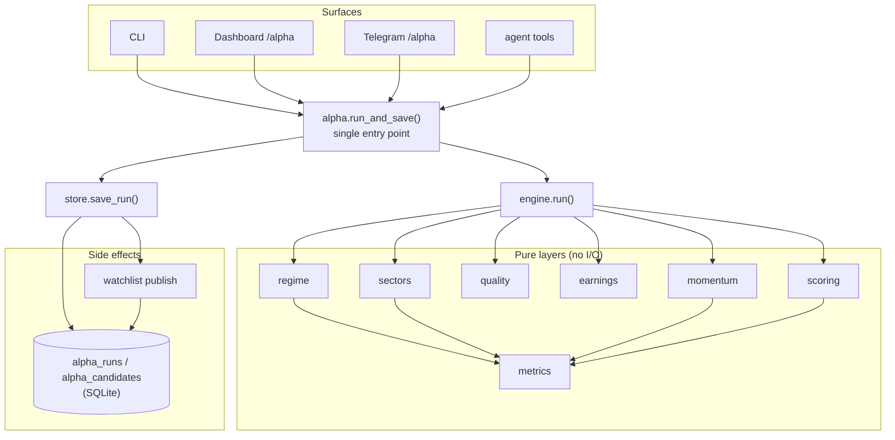

# Alpha Hunter — Technical Report

Status: shipped. Author: Arch. Scope: complete technical reference for the Alpha
Hunter subsystem (`cio/alpha/`). Companion docs: `ALPHA-HUNTER-PRD.md` (contract),
`ALPHA-HUNTER-TEST-PLAN.md` (coverage), and the `docs/alpha-hunter/` diagram set
(architecture, activity, control-flow, data-flow, sequence).

---

## 1. Overview

Alpha Hunter is a **repeatable, deterministic NASDAQ swing-selection engine**. It runs
a fixed five-layer funnel — **Market → Sector → Quality → Earnings → Momentum →
Ranking** — over a configurable ticker universe and publishes a **threshold-selected
watchlist** (Final ≥ a configurable score, default 80) of names the market is
re-pricing higher.

It is a **compute layer**, not a predictor and not an agent:

- **Zero LLM cost.** No model call anywhere in the funnel (same discipline as TIRF).
- **Deterministic.** Same inputs → same ranking. No randomness, no model variance.
- **Offline-safe.** Any data-source failure degrades a ticker or the regime; the run
  never raises.
- **Reuses existing data.** OHLCV + fundamentals from `cio.stock.data` (yfinance),
  earnings surprises from `cio.data.finnhub`. Nothing new to provision except an
  optional `FINNHUB_API_KEY`.

Implements `Alpha_Hunter_Proposal.md` ("NASDAQ 波段選股系統").

---

## 2. The candidate universe — `config/alpha_universe.txt`

### Purpose

This file **is the input list of stocks Alpha Hunter scans.** The funnel does not
discover tickers on its own; it evaluates exactly the names in this universe. It is
the throttle on both *what* gets considered and *how long* a run takes (run time is
≈ O(N) network fetches, cached after the first run).

It ships with ~40 liquid large/mid-cap NASDAQ swing names (AAPL, MSFT, NVDA, …).

### Format

- One ticker per line.
- Blank lines and lines beginning with `#` are ignored (comments).
- Surrounding whitespace is stripped; tickers are upper-cased.
- Order-preserving de-duplication is applied.
- Every token is **sanitized** (`watchlist._safe_symbol`) before any use — illegal/
  path characters are stripped, so a hostile line can never escape the cache dir or
  name a DB row. e.g. a line `../../etc/passwd` collapses to a harmless `ETCPASSWD`.

### How to use it

**Edit the default list** — add/remove tickers in `config/alpha_universe.txt`. Keep it
focused; a bigger universe means a longer scan.

**Override per-run without editing the file:**

```bash
# CLI flag (highest precedence)
python -m cio.alpha --universe /path/to/my_universe.txt

# Environment variable (applies to CLI, dashboard, Telegram, agent tool)
export CIO_ALPHA_UNIVERSE=/path/to/my_universe.txt
```

**Resolution order** (`cio/alpha/universe.py`): explicit `--universe` path → env
`CIO_ALPHA_UNIVERSE` → bundled `config/alpha_universe.txt` → small built-in fallback
list (used only if no file is readable, so a stripped deploy still runs).

> Note: the universe is the *candidate pool*. It is unrelated to your **watchlists**
> (the lists Alpha Hunter *produces*). Editing the universe changes what gets scanned;
> it does not touch any existing `Alpha-yyyy-mm-dd` list.

---

## 3. Architecture



- **Pure layers** take in-memory data and return plain numbers/dicts — unit-testable
  offline.
- **`engine.run()`** is the only place that fetches per-ticker data; it fetches each
  ticker's OHLCV **once** and feeds every layer.
- **`store`** is the only writer (DB + watchlist mutation).
- **Surfaces** never call layers directly — all go through `run_and_save()` so there
  is one funnel definition.

Module map (`cio/alpha/`):

| File | Role |
|------|------|
| `__init__.py` | `run`, `run_and_save`, re-exports `store`/`report` |
| `metrics.py` | pure series math: SMA, returns, slope, 0–100 scaling |
| `regime.py` | L0 market light |
| `sectors.py` | L1 sector RS ranking + stock→sector tag |
| `quality.py` | L2 fail-closed quality gate |
| `earnings.py` | L2.5 earnings score |
| `momentum.py` | L3 RS + trend template |
| `scoring.py` | L4 weighted final score |
| `universe.py` | candidate ticker list loader |
| `engine.py` | funnel orchestrator → `AlphaResult` |
| `store.py` | persistence + watchlist publishing + dashboard reads |
| `report.py` | Telegram text rendering |
| `__main__.py` | CLI |

---

## 4. The funnel layers

### Layer 0 — Market Regime (`regime.py`, FR-001)

Input: QQQ daily close (~400 calendar days). Indicators: 50-day SMA, 200-day SMA,
50-day SMA slope (now vs 10 bars ago).

| Regime | Rule |
|--------|------|
| 🟢 GREEN | QQQ > 50MA **and** 50MA > 200MA **and** 50MA rising |
| 🔴 RED | QQQ < 200MA |
| 🟡 YELLOW | otherwise (above 200MA but not a full uptrend) |
| ⚪ UNKNOWN | < 200 bars / QQQ fetch failed |

The regime is reported as context and tags every candidate. It does **not** hard-gate
candidate output in v1 (the operator decides whether to act in YELLOW/RED).

### Layer 1 — Sector Ranking (`sectors.py`, FR-002)

Universe: QQQ, SMH, IGV, HACK, BOTZ. For each:

```
RS = 0.5 × 3M_return + 0.5 × 6M_return
```

Ranked descending. ETFs that fail to fetch are dropped. Each candidate stock is tagged
with a coarse sector ETF (`SECTOR_OF`, semis→SMH / software→IGV / cyber→HACK, else
QQQ) for the report column. Sector RS is reported context — it does not gate scoring
in v1.

### Layer 2 — Quality Filter (`quality.py`, FR-003)

**Fail-closed gate.** ALL minimums must hold to PASS; a field that can't be measured
fails the gate (we never pass on missing data).

| Minimum | Source |
|---------|--------|
| Market cap > $2B | `fundamentals.market_cap` |
| 20-day avg $-volume > $50M | `mean(Close × Volume)` over 20 bars |
| Revenue growth > 15% | `fundamentals.revenue_growth_pct` |
| Forward EPS growth > 15% | `(forward_eps − eps) / |eps|`, needs trailing `eps > 0` |
| Free cash flow > 0 | `fundamentals.free_cash_flow` |

Output: `{pass, market_cap, dollar_vol, revenue_growth, fwd_eps_growth,
free_cash_flow, reasons}`. Only PASS names are ranked.

### Layer 2.5 — Earnings Engine (`earnings.py`, FR-003A)

```
Earnings Score = 0.40 × fwd_eps_component + 0.40 × revision_signal + 0.20 × surprise
```

- **Forward EPS growth (40%)** — scaled 0–100 (`scale(fwd_growth, full_at=50, floor=0)`;
  15% ≈ 30, 50%+ = 100).
- **EPS revision, Lite mode (40%)** — a recent **earnings gap-up > 5% that stayed
  unfilled for 10 trading days** = 100, else 0. Detected from price alone (no analyst
  feed): scan the last ~40 bars for an open-gap > 5% over the prior close, then confirm
  the gap's pre-gap close was not breached for the following 10 sessions. (Pro mode =
  analyst consensus revision; deferred.)
- **Surprise (20%)** — last-4-quarter beat ratio → 100/75/50/25/0, from
  `finnhub.earnings_surprises`. Returns 0 (not None) when finnhub is disabled, so the
  layer never hard-fails on it.

### Layer 3 — Momentum Engine (`momentum.py`, FR-004)

- **Relative strength**: `rs_pass` = (stock 3M return > QQQ 3M) **and** (stock 6M > QQQ 6M).
- **Momentum score (0–100)**: from average excess return vs QQQ — `−25% → 0`, `0 → 50`,
  `+25% → 100` (clamped).
- **Trend template**: price > 50MA, 50MA > 150MA, 150MA > 200MA. **Trend score** =
  fraction of the 3 conditions met → 0 / 33 / 67 / 100.

`rs_pass` is reported; it does not hard-exclude in v1 (it surfaces in the candidate
row so the operator sees strength relative to the index).

### Layer 4 — Candidate Ranking (`scoring.py`, FR-005)

```
Final = 0.30 × Momentum + 0.20 × Trend + 0.30 × Earnings
      + 0.10 × RevenueGrowth(scaled) + 0.10 × VolumeExpansion(scaled)
```

- **RevenueGrowth scaled**: 0% → 0, 50%+ → 100.
- **VolumeExpansion**: latest volume vs 20-day average — 1× → 0, 2×+ → 100.

All five sub-scores are 0–100 and the weights sum to 1.0, so **Final is bounded
0–100**. Only quality-PASS names are ranked; sorted descending; ranks assigned 1..N.

**Selection (threshold, not Top-N).** From the ranked list, every candidate with
**Final ≥ threshold** is selected for the watchlist. The threshold is operator-
configurable (dashboard field, persisted in the `meta` table, key `alpha_threshold`),
**default 80**, clamped 0–100. `AlphaResult.select(threshold)` returns the qualifying
prefix; `store.get_threshold()` / `set_threshold()` read/write it. A run may therefore
publish more or fewer than 20 names depending on how many clear the bar.

---

## 5. Output: watchlist publishing & naming (FR-006, PRD §5)

A run produces an `AlphaResult` (regime + sectors + ranked candidates). `store.save_run`
then:

1. Takes the **threshold-selected** candidates (Final ≥ the configured threshold,
   default 80).
2. Creates or **refreshes** a watchlist named **`Alpha-yyyy-mm-dd`** (the run date) —
   the naming rule. A same-day re-run reuses the same list (`find_by_name`) and
   **replaces its contents in place** (`set_symbols`), so there are never duplicate
   dated lists.
3. Keeps the **`^IXIC` benchmark floor** (seeded first, can't be removed).
4. **Sets the list active**, so Telegram `/watchlist` and the `watchlist_prices` tool
   show it immediately.
5. Persists one `alpha_runs` row + the ranked `alpha_candidates` rows.

After a run the operator can **operate** on the list from Telegram via existing
`/watchlist` (prices) plus the agent tools `list_watchlists`, `watchlist_add`,
`watchlist_remove`, `watchlist_activate`.

---

## 6. Persistence

Two tables (`cio/db.py`):

- **`alpha_runs`** — `id, run_date, regime, regime_detail, sectors_json,
  candidate_count, universe_size, watchlist_id, watchlist_name, created_at`.
- **`alpha_candidates`** — `run_id, rank, ticker, sector, momentum, trend, earnings,
  revenue_growth, fwd_eps_growth, surprise, volume_expansion, final, quality_pass`
  (PK `(run_id, ticker)`).

`store.latest_run()` / `store.list_runs()` drive the dashboard.

**Figures-firewall note**: these tables store a **point-in-time snapshot** of one scan.
The published watchlist holds **symbols only** — its prices are always fetched live by
the watchlist price path, never read back from these snapshot rows.

---

## 7. Surfaces

| Surface | Trigger | Behaviour |
|---------|---------|-----------|
| **CLI** | `python -m cio.alpha [--universe FILE] [--threshold N] [--no-publish] [--json]` | run funnel, print table/JSON, publish unless `--no-publish` |
| **Dashboard** | tab **Alpha Hunter** `/alpha`, "Run" button (POST `run_hunter`) + threshold field (POST `set_threshold`) | synchronous run; renders regime light, sector table, selected-candidate table, run history, link to the published list |
| **Telegram** | `/alpha` command + inline button | heads-up message, runs in a worker thread, replies regime + selected candidates + published-list note |
| **Agent tools** | `run_alpha_hunter`, `market_regime` (+ `list_watchlists`, `watchlist_add`, `watchlist_remove`, `watchlist_activate`) | conversational run, regime check, and watchlist operation |

`market_regime` returns the GREEN/YELLOW/RED light (Layer 0) on its own — the operator
can ask "what's the market regime" in Telegram without a full scan.

CIO_TOOLS total is **41** (the 6 alpha/watchlist tools are new; guarded by a count test).

---

## 8. Configuration & data sources

| Knob | Effect |
|------|--------|
| `config/alpha_universe.txt` | default candidate universe |
| `CIO_ALPHA_UNIVERSE` (path) | override the universe (all surfaces) |
| `--universe FILE` (CLI) | override the universe (one run) |
| selection threshold | dashboard field / `meta.alpha_threshold` (default 80); `--threshold` (CLI) overrides one run |
| `FINNHUB_API_KEY` | enables the earnings-surprise component (else surprise = 0) |
| `CIO_HTTP_TIMEOUT` | read/connect timeout (s) for cio.data GETs (default 15) |
| `CIO_STOCK_CACHE_DIR` | OHLCV cache dir (shared with the rest of the app) |

Data sources: **yfinance** (OHLCV + `.info` fundamentals: market cap, forward/trailing
EPS, free cash flow, revenue growth) via `cio.stock.data`; **finnhub**
(`/stock/earnings`) via `cio.data.finnhub.earnings_surprises`. Both are cached and
offline-safe.

`cio.stock.data.fundamentals()` was extended with `forward_eps`, `free_cash_flow`,
`revenue_growth_pct`, `earnings_growth_pct` for this subsystem.

---

## 9. Offline-safety & error handling

Every external call is guarded; control always continues with a degraded value:

- QQQ fetch fails → regime `UNKNOWN`, QQQ returns `None` (momentum RS just can't pass).
- A sector ETF fails → dropped from the ranking.
- A ticker's OHLCV fails → ticker dropped (no candidate).
- Fundamentals fail → empty dict → quality **fails closed**.
- Surprises fail / finnhub disabled → surprise score 0.
- Dashboard/bot handlers catch everything → flash/reply an error, never 500/crash.

Net: a run with no network still returns a well-formed result (regime UNKNOWN, empty
candidates).

---

## 10. Testing

- `tests/test_alpha.py` — 19 unit tests (metrics + every layer, synthetic data).
- `tests/test_alpha_integration.py` — 31 integration/edge/security tests (engine
  orchestration, store + watchlist side effects, idempotency, top-N cap, universe
  fallback/sanitization, index-floor invariant, naming rule).
- All offline (injected fetchers), deterministic, no network/LLM. **50/50 pass; full
  suite 869 pass.** A real-data smoke (`python -m cio.alpha AAPL NVDA`) validates the
  live yfinance/finnhub path.

See `ALPHA-HUNTER-TEST-PLAN.md` for the full case matrix.

---

## 11. Limitations & deferred (v1)

- Earnings **Pro mode** (analyst-consensus revision) — Lite price-gap proxy only for now.
- Regime / RS are **reported, not hard-gating** — the operator decides whether to act
  in YELLOW/RED or on names that lag QQQ.
- **No auto-schedule** — runs are operator-triggered (dashboard / `/alpha`). The
  proposal's weekly workflow is a candidate for a future scheduler job.
- **No position sizing / risk rules / post-trade review** — those proposal sections are
  operator discipline, not engine outputs. The funnel emits research only.
- Sequential per-ticker scan — run time scales with universe size.

---

## 12. File index

```
cio/alpha/{__init__,metrics,regime,sectors,quality,earnings,momentum,scoring,
           universe,engine,store,report,__main__}.py
config/alpha_universe.txt
cio/db.py                      # alpha_runs, alpha_candidates
cio/watchlist.py               # find_by_name, set_symbols (publish helpers)
cio/stock/data.py              # extended fundamentals()
cio/data/finnhub.py            # earnings_surprises()
cio/dashboard/{server,views}.py# /alpha tab
cio/bot.py                     # /alpha command + inline button
cio/agent.py                   # run_alpha_hunter + 4 watchlist-ops tools
tests/test_alpha.py, tests/test_alpha_integration.py
docs/ALPHA-HUNTER-PRD.md, docs/ALPHA-HUNTER-TEST-PLAN.md,
docs/ALPHA-HUNTER-TECHNICAL-REPORT.md, docs/alpha-hunter/*.md
```
