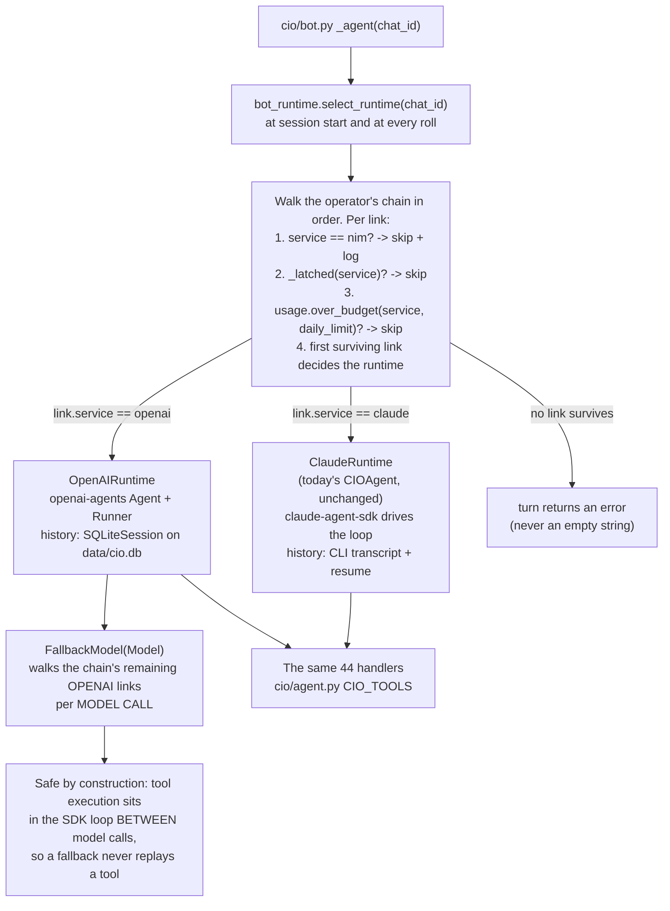

# Bot Chat → OpenAI Agents SDK — Migration Plan

*Status: BUILT. OpenAI API runtime completed 2026-07; ChatGPT-subscription Codex
runtime added 2026-08-09.*
*Original scope: general Telegram bot chat. A 2026-08-09 follow-up also added the
ChatGPT-subscription Codex backend to the shared committee/WMA agent dispatcher.*

> 2026-08-09 addendum: sections below describe the original two-runtime migration.
> Bot chat now has a third whole-turn runtime, `CodexRuntime` (`cio/agent_codex.py`),
> hosted by Codex app-server and authenticated with `codex login`. It reuses the same
> CIO handlers through app-server dynamic tools. `openai` remains the API-key service;
> `codex` is the separately attributed ChatGPT-subscription service. See
> `docs/OPENAI-SUBSCRIPTION.md` for the operational contract.
>
> Follow-up: `committee.engine.ask_role` now dispatches `service: codex` through
> app-server as isolated, tool-free, ephemeral turns. This covers specialists,
> debate, moderator, CIO, WMA, macro snapshots, note sanitization, and translation.
>
> The historical examples below describe the original OpenAI API/Claude migration. For
> current chain order, Codex thinking levels, authentication, and agent coverage, use
> `docs/OPENAI-SUBSCRIPTION.md` and `config/committee_models.yaml`.

---

## 1. Problem

`engine.ask_role` is the single LLM entry point for every other feature in CIOAgent, so the
named fallback chains (`docs/FALLBACK-CHAINS.md`) cover all of them: committee specialists,
debate, moderator, CIO, note sanitizer, translator, WMA. One caller is missing from that
diagram — **the general bot chat**.

Bot chat runs on `claude-agent-sdk` and cannot participate:

| Concern | Today |
|---|---|
| Backend | hardwired `ClaudeSDKClient` (`cio/agent.py:1392`) |
| Fallback when Claude is limited | none — the turn fails |
| Daily budget accounting | every chat turn recorded as `claude` (`cio/agent.py:1484`), regardless |
| Dev-dashboard transcript | every chat call labelled `claude` (`cio/agent.py:1464`) |
| `/configure` chain selection | accepted, then silently ignored unless the chain contains a `claude` link (`cio/committee/models.py:454-460`) |

The last row is a live bug: an operator who picks an OpenAI-only chain for bot chat sees the
setting saved and nothing happens.

This plan makes bot chat a chain-routed agent like every other role, **without giving up the
Claude subscription that pays for chat today**.

---

## 2. What survives the migration, and what does not

Investigated before planning. The conclusion drives everything below.

### 2.1 Provider-agnostic already — zero changes

| Layer | File | Why it is safe |
|---|---|---|
| Durable memory: notes, digests, turns, playbooks, profile, tiers, TTL, eviction, `promote_hot`, `maintain` | `cio/memory.py` | pure SQLite; no LLM dependency |
| Hybrid recall: semantic + FTS + RRF | `cio/recall.py` | local fastembed ONNX + sqlite-vec; **no API key, no network** |
| Injection budget + system-prompt composition | `cio/context.py` | tiktoken is already only an approximation of Claude's tokenizer (`context.py:18`) |
| Day-boundary roll, checkpoint digest, monthly rollup | `cio/agent.py:1488-1650` | app logic over the memory tables |
| Figures firewall | `cio/memory.py:86` | deterministic regex |

**Switching providers does not degrade long-term memory or context management.** That was the
open question; it is answered. The memory subsystem never talked to Anthropic.

### 2.2 Vendor-locked — must be replaced on the OpenAI path

1. **In-session transcript.** `client.query(prompt)` sends only the new turn; the Claude Code
   CLI holds the history.
2. **`resume`** (`cio/agent.py:1385-1412`) — cross-restart thread continuity via the CLI's
   on-disk transcript.
3. **Auto-compaction + the `PreCompact` hook** (`cio/agent.py:1375-1383`).
4. **The tool loop**, plus `allowed_tools` / `disallowed_tools` / `permission_mode`.

Note the raw conversation is *already* mirrored into `conv_turns` (`cio/bot.py:255` →
`cio/memory.py:380`), embedded and FTS-indexed. Rebuilding a session layer is wiring, not new
storage.

### 2.3 MCP is not a requirement

`create_sdk_mcp_server("cio", …)` (`cio/agent.py:1252`) is an **in-process** shim — no
subprocess, no socket. It exists only because the Claude Code CLI reaches tools over the MCP
wire format. `.mcp.json` in the repo root is the developer's Claude Code config (context7),
not a CIOAgent runtime dependency.

What bot chat actually needs is **tool calling over 44 typed handlers**, which OpenAI provides
natively. And the port is mechanical, because `SdkMcpTool` is a plain dataclass:

```python
@dataclass
class SdkMcpTool(Generic[T]):
    name: str
    description: str
    input_schema: type[T] | dict[str, Any]      # NOT JSON Schema for most tools -- see §4.1
    handler: Callable[[T], Awaitable[dict[str, Any]]]
```

That maps 1:1 onto an OpenAI Agents SDK `FunctionTool` (§4). **Both runtimes call the same
handler objects. No tool is implemented twice.**

The OpenAI Agents SDK does support MCP (`MCPServerStdio`, `MCPServerStreamableHttp`,
`HostedMCPTool` — the hosted one being remote-HTTPS only), but it has **no in-process MCP
server**. Re-hosting our tools as a FastMCP subprocess just to use MCP would add a process and
a serialization hop for nothing. Out of scope — see §10.

---

## 3. Design

### 3.1 Why there are two runtimes

The single most confusing part of this plan, so it comes first.

**A runtime is whoever drives the tool loop.**

```
Chain link "openai gpt-5.6-terra"            Chain link "claude claude-opus-4-8"
  → OpenAIRuntime                              → ClaudeRuntime

  you  → prompt + 44 tool schemas → API        you  → prompt → Claude Code CLI
  API  → "call portfolio_summary"              CLI  → picks tools, invokes your
  you  → run handler, append result                   handlers over in-process MCP,
  you  → call API again                               loops internally
  API  → final text                            CLI  → final text

  loop runs in YOUR process                    loop runs in the CLI
  history lives in SQLiteSession               history lives in the CLI transcript
```

`claude-agent-sdk` is not an API client — **it is an agent**. It never returns "call this
tool" for someone else's loop to act on; you hand it a task and it hands back a finished
answer. That is the entire reason two loop drivers exist, and the entire reason failover
between them happens at a session boundary rather than mid-loop: the half-finished loop state
lives in two different places, and there is no supported way to hand it across.

The alternative — reaching Claude through the raw Messages API so it returns `tool_use` blocks
our own loop executes — would collapse this to one runtime. It was considered and **rejected**
(D2): it bills per token, abandoning the subscription that makes chat effectively free today.

### 3.2 Locked decisions

| # | Decision | Rationale |
|---|---|---|
| **D1** | Bot chat supports **`claude` and `openai` only**. No LiteLLM, no NIM. A `nim` link inside a shared chain is logged and skipped. | 45 tools is a wide surface; a weak tool-caller burns whole turns. NIM stays a committee backend where output is prose. |
| **D2** | The Claude link is served by **`claude-agent-sdk`**, unchanged, subscription-billed. | Preserves today's cost model. |
| **D3** | `claude-agent-sdk` therefore plugs in as a **whole-turn runtime**, never as an Agents SDK `Model`. | Forced by D2 — see §3.1. |
| **D4** | **Runtime is selected at session start / roll, then pinned** for that session window. | The two transcripts never interleave → no history sync, no turn replay, no side-effect ledger. |
| **D5** | Chain and order come from the operator's `/configure` selection (`cio/dashboard/settings.py:92`). Nothing hardcoded. | Same control surface as every other agent. |
| **D6** | Both runtimes ship permanently — that *is* the architecture. `CIO_BOT_ENGINE=claude\|openai` is a debugging override, not a migration flag. | |

**D4's cost, stated plainly:** a limit hit partway through a session window ends that turn
with an error rather than falling through to the other runtime. Fallback still fires at every
roll and at the start of any turn where the current link is latched or over budget.

The upgrade path, if that gap ever bites: per-turn runtime switching plus a **mutating-tool
ledger**, so a failed turn replays on the next link only when nothing irreversible ran.
Roughly ten of the 45 tools mutate — `ingest_transactions_csv`, `set_price`, `remember`,
`forget`, `save_playbook`, `add_econ_event`, `watchlist_add/remove/activate`,
`run_alpha_hunter`, and `run_committee` (~20 LLM calls, KG-7). Replaying a turn without that
ledger would double-execute them. **Do not add per-turn switching without the ledger.**

### 3.3 Control flow



Chain **policy** is shared with the committee. Chain **transport** is not: `engine._dispatch`
and the `_ask_*` functions keep their `(system, user) -> text` shape and are not touched — they
cannot carry tool calls, which is why bot chat needs its own transport.

### 3.4 Reused as-is — do not reimplement

| Function | File | Used for |
|---|---|---|
| `resolve_chain`, `chains`, `chain_names` | `cio/committee/models.py:272-357` | chain resolution |
| `openai_settings` | `cio/committee/models.py:223` | base_url, api_key_env, token_param, max_tokens |
| `usage.over_budget`, `usage.record` | `cio/committee/usage.py:71,118` | per-service daily budget |
| `_latch`, `_latched` | `cio/committee/engine.py:133-138` | limit cooldown (`CIO_LIMIT_LATCH_TTL`) |
| `_is_limit_notice` | `cio/committee/engine.py:105` | limit detection |
| `_capture` | `cio/committee/engine.py:57` | dev-dashboard transcript |
| `context.compose_system_prompt` | `cio/context.py:147` | memory-block injection |
| everything in `cio/memory.py` | | notes, digests, turns, playbooks |
| the `/configure` chain UI | `cio/dashboard/` | unchanged |

---

## 4. Tool bridge

One adapter, no tool rewrites:

```python
# cio/agent_openai.py
import json
from agents import FunctionTool, RunContextWrapper
from cio.agent import CIO_TOOLS


def to_function_tool(t) -> FunctionTool:
    """Adapt one claude-agent-sdk SdkMcpTool to an OpenAI Agents SDK FunctionTool."""
    async def _invoke(ctx: RunContextWrapper, args: str) -> str:
        out = await t.handler(json.loads(args or "{}"))
        return "\n".join(b.get("text", "") for b in out.get("content", []))

    return FunctionTool(
        name=t.name,
        description=t.description,
        params_json_schema=_claude_schema(t),   # converted -- see §4.1, NOT t.input_schema
        on_invoke_tool=_invoke,
    )


OPENAI_TOOLS = [to_function_tool(t) for t in CIO_TOOLS]
```

**Side-effect channels keep working untouched**, because they are module globals rather than
framework state:

| Global | Purpose | Status |
|---|---|---|
| `_PENDING` | chart image paths a tool wants sent | unchanged |
| `_PENDING_DOCS` | committee PDF paths | unchanged |
| `_ACTIVE_SCOPE` | which memory namespace the memory tools read/write | unchanged; set by the runtime before the turn, exactly as `_run_query` does today (`cio/agent.py:1432`) |
| `_SOURCES`, `_ISSUER_DOMAINS`, `_SEARCHED_THIS_TURN` | citation registry for the Sources footer | unchanged |

`web_search` and `web_scrape` are **our own tools**, not the SDK's builtins (which are in
`disallowed_tools` today), so evidence integrity and source tiering carry over untouched.

### 4.1 Correction — `input_schema` is not JSON Schema

*Added 2026-07-27 during implementation (Step 12), measured against the real `CIO_TOOLS`. The
snippet above passed `t.input_schema` straight through as `params_json_schema`. That is wrong
for 44 of the 45 tools.*

Measured shapes:

| Shape | Count | Conversion |
|---|---|---|
| `{}` — no parameters | 16 | → `{"type": "object", "properties": {}}` |
| `{param: <python type>}` | 27 | → object schema; **every** key is required |
| already real JSON Schema | 1 | passed through unchanged |

Only `str`, `int`, `float` and `bool` appear. `claude_agent_sdk` performs this conversion in a
private closure inside `create_sdk_mcp_server` (`_build_schema`), which cannot be imported — so
`cio/tool_bridge.py` reimplements it, and the test asserts agreement against what the SDK itself
registers rather than against a second copy of the algorithm.

Two further findings that shaped the built code:

- `agents.strict_schema.ensure_strict_json_schema` promotes every optional parameter to
  `required` **without** making it nullable. One tool is affected
  (`harness_event_study.horizon_days`), since the `{param: type}` schemas mark all keys required
  anyway. The bridge makes such properties nullable so the model can say "not specified."
- `cio/harness/tools.py:39` reads `inp.get("horizon_days", 20)`, so a present-but-`None` key
  returns `None` rather than the default. The adapter therefore **strips `None` values before
  invoking the handler**, which restores the Claude path's semantics exactly: omitted and
  explicit-null both arrive absent.

---

## 5. Session and compaction on the OpenAI path

- **History:** `SQLiteSession(session_id=f"chat:{chat_id}", db_path="data/cio.db")` replaces the
  CLI transcript and `resume`. The Agents SDK loads history before each run and writes new
  items after it completes.
- **Compaction: keep ours, do not adopt theirs.** `OpenAIResponsesCompactionSession` is
  Responses-API-bound and would install a second compaction authority competing with the roll
  logic we already have. (This rejects OpenAI's *compaction session*, not the Responses API —
  the transport does run on `/v1/responses`; see §5.1.) Our `_checkpoint()` (`cio/agent.py:1559`) already does the right
  thing and matches OpenAI's own long-running-agent guidance — compact at workflow boundaries,
  and keep durable facts in artifacts rather than in compacted conversation state (our
  digests, notes and playbooks are exactly those artifacts, with the figures firewall making
  the separation enforceable).

  On the OpenAI path the roll becomes:

  ```
  digest turn  →  memory.add_digest()  →  promote_hot()  →  playbook distillation
               →  session.clear_session()
               →  next turn re-composes the system prompt, now including the new digest
  ```

  identical to today's fork-a-fresh-session behaviour, minus the SDK reconnect.
- **Triggers:** `PreCompact` applies only to `ClaudeRuntime`. On the OpenAI path
  `ROLL_TURNS` (default 40) and `ROLL_TOKENS` (default 16000) are the sole triggers, plus the
  day-boundary roll — which must keep working identically on both runtimes, since it is what
  fixed the memory-misattribution incident (`docs/MEMORY-MISATTRIBUTION.md`).
- **A roll is the only place the runtime may change** (D4).

### 5.1 Correction — the OpenAI path runs on `/v1/responses`

This section is written after the fact. The build shipped `FallbackModel._build_delegate`
returning an `OpenAIChatCompletionsModel`, every test passed, and the path was still broken:
**it had never once called OpenAI.** The first live turn (KG-19) failed on the first request:

```
400  Function tools with reasoning_effort are not supported for gpt-5.6-terra in
     /v1/chat/completions. To use function tools, use /v1/responses or set
     reasoning_effort to 'none'.
```

The SDK omits `reasoning_effort` for a `Model` instance, so the effort in play is the model's
own server-side default — and on Chat Completions that default is incompatible with function
tools. Bot chat presents 44 of them, so this is not an edge case; it is every turn.

The API offers two repairs and they are not equivalent:

| Repair | Cost |
|---|---|
| `reasoning_effort='none'` on Chat Completions | Turns reasoning off across a 45-tool selection surface — the judgement we least want to lose |
| **`/v1/responses`** ✅ | None. Reasoning intact, function tools supported |

Responses is also the more honest fit for what this path already produces: the `input_image`
parts `build_turn_input` emits and the item shape `SQLiteSession` stores are both
Responses-shaped and were being down-converted per call.

**One consequence to hold onto:** Responses defaults to `store=true`, Chat Completions retains
nothing. Swapping transport would therefore have started parking every chat turn — positions,
holdings, P&L — in OpenAI-side storage as an invisible side effect of a bug fix. `Agent` is
built with `ModelSettings(store=False)` (`cio/agent_openai.py`) to hold the previous
behaviour. Our `SQLiteSession` is the session of record; nothing here needs server-side state.

The generalisable lesson is not about OpenAI. Every test on this path injected a fake model,
so the suite proved the *chain-walking logic* and could never have proven the *wire format*.
A transport with no live test is unverified no matter how green the suite is.

---

## 6. Chain integration

1. Add `bot_chat` as a `role_key` so bot chat resolves like any other agent, and document a
   claude/openai-only chain in `config/committee_models.yaml`:

   ```yaml
   chains:
     bot_chat:
     - {service: claude, model: claude-opus-4-8}          # subscription head
     - {service: openai, model: gpt-5.6-terra, daily_limit: 120000}
   agents:
     bot_chat: {chain: bot_chat}
   ```

   Existing chains (`premium`, `standard`) remain selectable — their `nim` link is skipped
   with a warning.

2. **Delete the claude-link gate** in `models.bot_chat_model()`
   (`cio/committee/models.py:454-460`). It returns `None` for any chain without a `claude`
   link, which is what makes an OpenAI-only selection silently no-op today. Replace the
   function with one that returns the resolved **link** (service + model), not just a model
   string.

3. **Per-service model settings.** `max_thinking_tokens` (`claude_settings()`) is Claude-only.
   The OpenAI path takes `token_param` / `max_tokens` from `openai_settings()`
   (`cio/committee/models.py:223`) and, for reasoning models, `reasoning.effort` via
   `ModelSettings`.

4. **Limit detection differs by transport.** `_is_limit_notice` sniffs *text* returned by the
   Claude CLI; the OpenAI path raises exceptions (HTTP 429/5xx) instead. `FallbackModel` must
   latch on error **shape**, then fall through — reusing `_latch(service)` so a limited service
   is skipped by the committee too, and vice versa.

---

## 7. Feature parity matrix

| Feature | OpenAIRuntime | Note |
|---|---|---|
| 45 tools | ✅ | `FunctionTool` adapter, handler bodies unchanged |
| memory tools, notes, recall, playbooks | ✅ | SQLite + local embeddings |
| charts out, committee PDF out | ✅ | module globals |
| Sources footer, citation registry, tier stamping | ✅ | deterministic, post-text |
| HarnessX `after_model_note` processors | ✅ | post-text |
| day roll, checkpoint digest, monthly rollup | ✅ | app logic |
| `/stop` cancellation, single-flight per chat | ✅ | `cio/bot.py` task tracking is runtime-agnostic |
| **usage + transcript attribution** | ⚠️ **fix required** | `cio/agent.py:1464,1484` hardcode `"claude"` — must take the resolved service, or bot chat corrupts the committee's shared budget table |
| **image / receipt reading** | ⚠️ **gap** | the `Read` builtin (`cio/agent.py:1256`) does not exist off the Claude CLI. **A `read_image` FunctionTool cannot fix this** — see §7.1. The image must ride in as a multimodal *input part*, and the openai link must be vision-capable or receipt reading silently degrades |
| **tool-calling strength** | ⚠️ | 45 tools needs a strong tool-caller; do not put a mini model in the bot-chat chain |
| **prompt-cache warmth** | ⚠️ | the static prefix is system prompt + memory block + 44 schemas. Every runtime switch pays a cold prefix |
| **persona continuity** | ⚠️ | tone/format shifts across a switch. The committee hides this behind role reports; chat will not |
| streaming, structured output | n/a | unused today |

### 7.1 Correction — image reading is an input concern, not a tool

*Added 2026-07-27 during implementation, verified against `openai-agents` 0.19.0. The original
plan said this gap "needs a `read_image` FunctionTool." That is wrong and would have been built
wrong.*

The tool bridge (`cio/tool_bridge.py`, Step 12) returns a **string** — it joins the `text` fields
of the handler's content blocks. A tool result therefore cannot carry an image to the model, so
no `read_image` tool can close this gap no matter how it is written.

OpenAI vision takes the image as an **input content part**, not a tool result.
`Runner.run` accepts `str | list[TResponseInputItem]`, and `ResponseInputImageParam` carries an
`image_url` (a `data:` URI works). The fix therefore belongs in `OpenAIRuntime._run_query`:
when the turn references an uploaded image, build a multimodal input list instead of a plain
string.

Two consequences that were not in the original plan:

- `cio/bot.py`'s photo handler appends the literal instruction *"Use the Read tool to view it."*
  to every image prompt. That names a Claude-CLI builtin; on the OpenAI path it directs the model
  at a tool that does not exist. The prompt must become runtime-neutral.
- Vision capability varies by link. A chain whose openai link is a non-vision model degrades
  silently — the model simply never sees the receipt. Mark vision-capable links in chain config
  before relying on the OpenAI path for image work.

---

## 8. Code map

| File | Change |
|---|---|
| `cio/bot_runtime.py` *(new)* | `BotRuntime` protocol — `ask() -> (text, images, docs)`, `warm()`, `close()`, `session_id`; `select_runtime(chat_id)`; `CIO_BOT_ENGINE` override |
| `cio/agent_openai.py` *(new)* | `OpenAIRuntime`, `FallbackModel(Model)` over the chain's openai links, `to_function_tool()`, `read_image` tool |
| `cio/agent.py` | `CIOAgent` becomes `ClaudeRuntime` behind the protocol (behaviour unchanged); fix hardcoded `"claude"` at `:1464` and `:1484`; `CIO_TOOLS` exported unchanged |
| `cio/committee/engine.py` | promote `_latch` / `_latched` / `_is_limit_notice` / `_capture` to public names — **no behaviour change** |
| `cio/committee/models.py` | drop the claude-link requirement in `bot_chat_model()`; return the resolved link; add `bot_chat` to the agents map |
| `cio/bot.py` | `_agent()` (`:111-119`) returns a `BotRuntime`; `agent._session_id` (`:255`) becomes `agent.session_id` |
| `config/committee_models.yaml` | `bot_chat` chain + `agents.bot_chat.chain`, documented |
| `requirements.txt` | add `openai-agents` (**not installed today** — only raw `openai` 2.40.0). No litellm, no anthropic |
| `tests/test_bot_runtime.py` *(new)* | runtime selection + `FallbackModel` walk |

The public surface of the bot agent is only four members (`ask`, `warm`, `close`,
`session_id`), which is why the protocol seam is cheap.

### Build order

1. Protocol + `select_runtime`, with `CIOAgent` as the only implementation. **No behaviour
   change; full suite must stay green.** This step alone de-risks the rest.
2. Attribution fix (`:1464`, `:1484`) + `bot_chat_model()` gate removal + `bot_chat` chain
   config. Still Claude-only, but now honestly accounted and configurable.
3. `to_function_tool` + `OpenAIRuntime` behind `CIO_BOT_ENGINE=openai`, default off.
4. `FallbackModel` + latch/budget integration.
5. `read_image` tool + vision-capable marking.
6. Flip the default to the operator's chain.

Steps 1 and 2 are safe to ship independently and fix real bugs on their own.

---

## 9. Test plan

1. `pytest tests/ -q` — full suite green. **Acceptance criterion:** the tests that construct
   `CIOAgent` (`tests/test_memcore.py:179,292`, `tests/test_day_roll.py:54`,
   `tests/test_agent_committee.py:92`, `tests/test_temporal_simulation.py:75`) and those
   asserting on `CIO_TOOLS` / `build_options` (`tests/test_tool_wiring.py`,
   `tests/test_harness.py`, `tests/test_committee.py`, `tests/test_viz.py`) pass
   **unmodified** — they stub `_run_query`, and that seam must survive.
2. `pytest tests/test_bot_runtime.py -q` — new:
   - chain with a healthy claude head → `ClaudeRuntime`;
   - `_latch("claude")` → the same chain now selects `OpenAIRuntime`;
   - a `nim` link is skipped with a warning;
   - `usage.over_budget` on the head openai link → `FallbackModel` moves to the next openai link;
   - all links exhausted → raises; the turn surfaces an error, never an empty string.
3. **Offline safety.** With `OPENAI_API_KEY` unset, a claude-headed chain still serves a full
   chat turn — charts, memory write, committee tool. (Matches the project's standing rule that
   a missing key degrades, never crashes.)
4. **Live, both runtimes** (flip with `CIO_BOT_ENGINE`): answer lands; `portfolio_summary` and
   `allocation_chart` work end to end; a `remember` persists and appears in the next session's
   injected memory block; `data/committee.db` `token_usage` records the tokens under the
   **correct service** — the bug fix, since today every chat turn lands under `claude`.
5. **Dashboard.** `/configure` shows bot chat's chain, and an OpenAI-only chain actually takes
   effect (today it silently does nothing). The dev-dashboard transcript labels each chat call
   with the service that answered.
6. **Roll behaviour.** Set `CIO_ROLL_TURNS` low; confirm the digest is written, the session
   cleared, and a fresh thread seeded with the digest injected — **on both runtimes** — and
   that a roll is the only point where the runtime changes.
7. **Day-boundary roll** regression (`tests/test_day_roll.py`) must hold on the OpenAI path
   too; it is the fix for memory misattribution.

---

## 10. Operational notes

- After step 2 of the build order, bot chat appears in the daily budget with **honest
  per-service numbers** for the first time. Expect the `claude` row to drop and a new `openai`
  row to appear once step 6 lands — that is the accounting getting correct, not new spend.
- Chat leaves the Claude subscription only for turns that actually route to the openai link.
  Put `claude` first in the `bot_chat` chain to keep today's cost profile.
- `CIO_BOT_ENGINE=claude` is the rollback for any incident: one env var, no code change.
- A chat's runtime is visible in the log line at session start; the dev-dashboard transcript
  shows it per call.

## 11. Out of scope

Committee / WMA / Alpha Hunter transports · `.mcp.json` · NIM in bot chat · Claude via LiteLLM
· Claude via the raw Anthropic Messages API · re-hosting the 45 tools as a standalone MCP
server (worth doing only to reach them from Claude Desktop or Cursor — `FunctionTool` is
strictly better in-app) · per-turn runtime switching and the mutating-tool ledger (§3.2, the
documented upgrade path).
