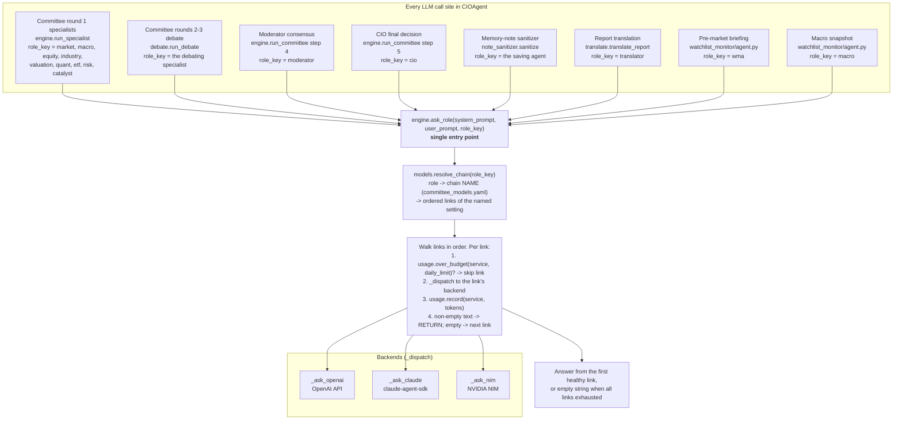

# Fallback Chain Mechanism — Technical Report

Date: 2026-06-10
Scope: `config/committee_models.yaml`, `cio/committee/models.py`, `cio/committee/engine.py`,
`cio/dashboard/views.py`, `cio/dashboard/server.py`, tests.

## 1. Problem

Before this change only `cio` and `wma` had a fallback chain (an inline 3-link list in
their agent config). The ten other committee roles (`defaults`, `market`, `macro`,
`equity`, `industry`, `valuation`, `quant`, `etf`, `risk`, `catalyst`, `moderator`) and
`translator` were pinned to a single `{service, model}` pair: when that backend was
down, rate-limited, or over budget, the role simply returned an empty answer.
The chains were also duplicated per agent — `cio` and `wma` carried identical copies.

## 2. Design

### 2.1 Named chain settings

Fallback chains are now **named, reusable settings** defined once in a top-level
`chains:` section. Every agent — including `defaults`, `cio`, and `wma` — references a
setting **by name**:

```yaml
chains:
  premium:                                  # paid head → subscription → cheap
  - {service: openai, model: gpt-5.5-2026-04-23}
  - {service: claude, model: claude-opus-4-8}
  - {service: nim, model: moonshotai/kimi-k2.6}
  standard:                                 # subscription head → paid → cheap
  - {service: claude, model: claude-opus-4-8}
  - {service: openai, model: gpt-5.5-2026-04-23}
  - {service: nim, model: moonshotai/kimi-k2.6}
  translation:                              # sonnet head (long-markdown TC)
  - {service: claude, model: claude-sonnet-4-6}
  - {service: claude, model: claude-opus-4-8}
  - {service: nim, model: moonshotai/kimi-k2.6}
defaults: {chain: standard}
agents:
  market: {chain: standard}
  # … macro/equity/industry/valuation/quant/etf/risk/catalyst/moderator: standard
  cio: {chain: premium}
  wma: {chain: premium}
  translator: {chain: translation}
```

* The operator can define **any number** of settings; each ships with 3 links
  (service + model, like the original cio/wma shape). Links accept an optional
  `daily_limit` (tokens/local-day for that service).
* Default assignments preserve previous behaviour at the head of each chain:
  specialists still hit `claude-opus-4-8` first, cio/wma still hit OpenAI first,
  translator still hits Sonnet first — they now degrade instead of failing.

### 2.2 Runtime semantics (unchanged walk, wider coverage)

`engine.ask_role(system, user, role_key=…)` is the single LLM entry point for the
entire system: every feature that needs a model answer funnels through this one
function — no caller talks to a backend (OpenAI / Claude SDK / NIM) directly.
That is why implementing the chain walk once, inside `ask_role`, automatically
gave the fallback mechanism to all agents:



Reading the diagram: the top row is *who* asks (each passes only its `role_key`);
the middle is the one shared funnel; the bottom is *how* the answer is produced.
A caller never knows or cares which service replied — `ask_role` resolves the
role's named chain and walks it. It falls through a link when:

1. the link's service is at/over its `daily_limit` for the local day
   (`usage.over_budget`, backed by the `token_usage` table in `committee.db`), or
2. the backend returns empty — missing API key, API error, timeout, or a
   rate/session-limit notice (`_is_limit_notice`).

Tokens of every attempt are recorded per service per local day (`usage.record`).
`""` is returned only when every link is exhausted. Budget accounting is
**per service**, so an over-budget `openai` is skipped in *every* chain that
references it.

### 2.3 Resolution order (`models.resolve_chain`)

1. `agents.<role>.chain: <name>` → the named setting in `chains:`
   (unknown name → warning, fall through to defaults).
2. `agents.<role>.chain: [links]` → **legacy inline chain**, still honoured.
3. `agents.<role>.{service, model}` → **legacy single-service config**, 1-link chain.
4. `defaults.chain` (name or inline list).
5. `defaults.{service, model}` (legacy), 1-link chain.
6. Hard-coded `[{claude, claude-opus-4-8}]`.

Never raises; never returns an empty list. `resolve(role)` now returns the chain's
**head link** (kept for the explicit-service override path and external callers).

### 2.4 New module API (`cio/committee/models.py`)

| Function | Purpose |
|---|---|
| `chains()` | all named settings `{name: [links]}`, normalized (missing service/model filled, `daily_limit` int-coerced, non-dict links dropped); falls back to built-ins when the section is absent |
| `chain_names()` | setting names in config order |
| `resolve_chain_name(role)` | which named setting a role uses (`None` for legacy inline) |
| `resolve_chain(role)` | the effective link list (see 2.3) |
| `new_chain_links()` | 3-link template for settings created from the UI |

The built-in `_BUILTIN` defaults mirror the new yaml schema, so the system behaves
identically with no config file at all.

## 3. Dashboard UI (`/configure`)

Rewritten around named settings:

* **Fallback chain settings** section — one editable table per setting
  (per link: service dropdown, model dropdown fed by the model catalog,
  daily token limit). Each setting has a *delete* checkbox; deletion is refused
  while any agent (or defaults) still references it. A text box adds a new
  setting by name (letters/digits/`-`/`_`), created from the 3-link template.
* **Agents** section — one row per agent (defaults + market…moderator, cio, wma,
  translator) with a **chain dropdown**. An agent still on a legacy inline config
  shows a "(legacy inline — pick a chain to convert)" placeholder: leaving it
  selected keeps the agent untouched; picking a name converts it and drops the
  stale `service`/`model` keys.
* Provider connection knobs, model catalog management, and the logging toggles
  are unchanged.

Save path (`server._configure_post`) edits the live yaml via ruamel round-trip
(comments and flow style preserved — verified byte-identical on a live
add-then-delete round trip) and clears the config cache, so the **next run**
picks the change up without a restart. Hardening added during testing: values
(`daily_limit`, provider token caps) are only cleared when their form field was
actually posted blank — a partial/scripted POST can no longer wipe them.

## 4. Code map

| File | Change |
|---|---|
| `config/committee_models.yaml` | migrated to `chains:` + per-agent `chain: <name>` |
| `cio/committee/models.py` | named-chain resolution, helpers, new built-ins |
| `cio/committee/engine.py` | logs which named setting a role resolved to; chain walk itself unchanged |
| `cio/dashboard/views.py` | `render_configure` rewritten (chain editor + per-agent dropdowns), `_chain_select` helper |
| `cio/dashboard/server.py` | `_configure_post` rewritten (link edits, add/delete settings, agent assignment, legacy conversion, partial-POST safety) |
| `cio/watchlist_monitor/agent.py` | none needed — already routes via `ask_role(role_key="wma"/"macro")` |

## 5. Test plan & results

All tests offline (backends monkeypatched, temp SQLite, temp yaml via
`CIO_MODELS_CONFIG`). Test policy: chain CONTENT (link order, models,
daily_limit values) is operator-tunable from the dashboard, so tests that read
the repo yaml assert only the MECHANISM (named resolution, structure,
3-link shape); all content/budget semantics run against pinned temp configs.

### A. Config resolution (`tests/test_fallback_chain.py`)
- repo yaml: cio→`premium` (openai/claude/nim), specialists→`standard` (claude head,
  3 links), translator→`translation` (sonnet head), unknown role→defaults chain,
  `resolve()` == chain head, `chain_names()` complete — **pass**
- temp yaml: named lookup with limits, unknown chain name → defaults fallback,
  legacy inline chain, legacy `{service, model}` agent, legacy defaults,
  empty config never yields an empty chain, link normalization (non-dict dropped,
  str limit → int) — **pass**

### B. Runtime chain walk (`TestChainSelection`, pinned temp yaml)
- fresh budget → head link; openai over budget → claude; both over → nim;
  empty result falls through; all empty → `""`; tokens recorded for the
  successful link; specialist head = claude; **specialist now degrades**
  claude→openai; explicit `service=` override bypasses the chain — **pass**

### C. Daily budget accounting (`TestUsageModule`) — unchanged semantics — **pass**

### D. Dashboard (`tests/test_dashboard.py`)
- render: chain editor inputs, delete checkboxes, add box, per-agent dropdowns,
  legacy placeholder, old per-agent service widgets gone — **pass**
- live HTTP POST round-trip: edit link model + limit, add setting (3-link
  template), reassign agent, delete unreferenced setting, **refuse** deleting a
  referenced setting, running process resolves new assignment immediately — **pass**
- legacy conversion: picking a chain converts an inline agent (drops
  `service`/`model`); placeholder leaves it untouched — **pass**
- partial-POST regression: un-posted `daily_limit` / provider caps survive — **pass**

### E. Regression
- full suite: **791 passed, 0 failed, 6 skipped**
  (committee pipeline, wma chain config test, bot, TIRF, memory, dashboards all green)

### F. Live verification (running dashboard, port 8787)
- restarted `python -m cio.dashboard` after the change (stale-process hazard, see I6)
- `/configure` 200 with chain editor + all agent dropdowns
- live add → setting renders with 3 editable links; live delete → yaml restored
  **byte-identical** (ruamel comment preservation confirmed)

## 6. Operational notes

* `daily_limit` is per **service** per local day (`CIO_TZ`), enforced across all
  chains that reference the service; blank = no cap.
* Chain edits apply to the next run — `write_doc` clears the `load_config`
  lru_cache in the dashboard process; other long-running processes (bot) read
  config through the same cache and pick changes up on restart, as before.
* Legacy configs keep working untouched (resolution order 2/3/5); the UI is the
  migration path for converting them.
* Deleting a chain setting from yaml by hand while agents reference it is safe:
  resolution warns and falls back to `defaults.chain`, then to claude.
