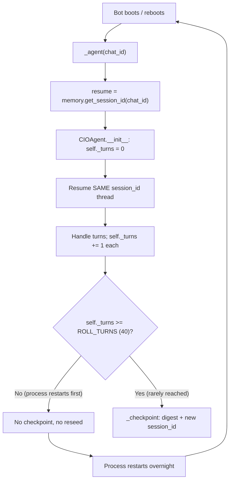
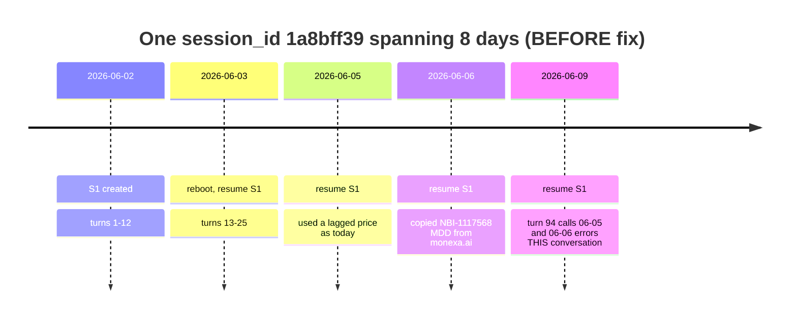
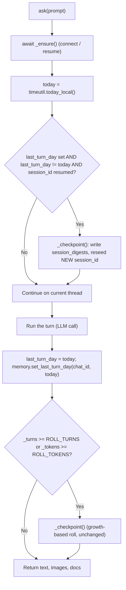
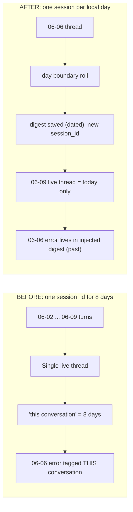

# Technical Report — Memory Misattribution: One `session_id` Spanning Many Days

**Status:** 2026-06-09; follow-on incident + operational fixes appended 2026-06-10 (§9)
**Area:** `cio/agent.py` (CIOAgent session lifecycle), `cio/bot.py` (resume), `cio/memory.py`
(`session_id` + `last_turn_day` persistence), `cio/context.py` (digest injection)
**Severity:** correctness / trust — the agent mislabeled days-old mistakes as happening
"within this conversation".

---

## 1. Symptom

On 2026-06-09 the agent answered a "who are you / what is your basis?" question (cfo.db
`conv_turns` id 94) with a self-critique section headed:

> ❌ **明確錯誤前科（這次對話內）** — *"clear track record of mistakes (within THIS
> conversation)"*

It then listed three errors that had actually occurred on **2026-06-05 and 2026-06-06**
(`conv_turns` ids 52, 82, 84, 88), not in the 2026-06-09 sitting. The mistakes were real and
honestly reported; the **time attribution** was wrong.

---

## 2. Root cause

The agent's notion of "this conversation" is the lifetime of one SDK `session_id`. Two
mechanisms combined to make a single `session_id` live for eight calendar days.

### 2.1 Resume never rotates the id

Each Telegram chat stores exactly one `session_id` in the `chats` table. On every boot the bot
reconnects with `resume=<that id>`, continuing the same SDK thread.

### 2.2 The roll that would rotate it never fired

`CIOAgent` rolls (digest + reseed a fresh session) after `ROLL_TURNS` (40) turns or
`ROLL_TOKENS` tokens. But `self._turns` is an in-memory counter reset to `0` in `__init__`.
The process restarts often (overnight, redeploy, crash); each restart rebuilds the agent and
resets the counter, so it rarely reaches 40 within one process lifetime. The checkpoint
effectively never ran — confirmed by `session_digests` being empty despite 98 turns.



**Net effect:** the loop on the left never exits to `J`, so the `session_id` is immortal.

---

## 3. Why the model mislabels the date

A resumed thread replays prior turns into the context window as one continuous conversation.
The injected `[context]` clock states *today's* date, but the **past turns carry no per-turn
date** the model can anchor a memory to. So it cannot distinguish "earlier today" from "three
days ago" and collapses everything into "this conversation".



From the model's vantage point the whole band above is one undivided thread, so labelling a
06-06 mistake as "within this conversation" is internally consistent — and wrong for the human,
who means the 06-09 sitting.

---

## 4. The fix — a session is one local day

Add a **day-boundary roll** at the top of `ask()`. If the last persisted turn day differs from
today and a prior-day thread was resumed, digest and reseed **before** handling the turn.



Two supporting pieces make the boundary detectable across restarts:

- `last_turn_day` is stored in `meta` as `last_turn_day:<chat_id|global>` and read back in
  `__init__`, so a fresh process still knows the previous active day.
- `_DIGEST_PROMPT` now asks for a trailing `Lessons:` line, so a mistake survives into the next
  session as **injected digest** (a clearly past session), not as live "this conversation" text.

### 4.1 Guard conditions

The roll fires only when all three hold, which avoids needless or empty rolls:

| Condition | Why |
|---|---|
| `last_turn_day` is set | A brand-new chat has nothing to roll. |
| `last_turn_day != today` | Same-day turns must stay in one thread. |
| `session_id` is truthy | A failed/absent resume left no prior thread to digest. |

---

## 5. Before vs after



Worked example after the fix:

```
06-02  S1  turns ... ; last_turn_day = 06-02
06-03  first ask: 06-02 != 06-03 and S1 resumed -> _checkpoint
       -> digest(S1) saved, reseed S2 ; last_turn_day = 06-03
...    each new day reseeds a fresh session_id
06-06  S5 ; agent makes the NBI-1117568 mistake (this day's thread)
06-07  roll -> digest(S5) carries a "Lessons: NBI-1117568 is schizophrenia, not MDD" line
06-09  S8 live thread holds ONLY 06-09 turns
       -> "this conversation" = 06-09 ; the 06-06 error is past digest, correctly dated
```

---

## 6. Verification

`tests/test_day_roll.py`:

- `test_last_turn_day_roundtrip` — `meta` persistence per chat (and the `global` bucket).
- `test_rolls_on_new_day_with_resumed_session` — boundary fires `_checkpoint` once and persists
  today.
- `test_no_roll_same_day` / `test_no_roll_when_no_resumed_session` / `test_no_roll_for_brand_new_chat`
  — the three guards.

Full suite: **412 passed** (after the follow-on long-term-memory work below).

---

## 7. Residual notes

- The growth-based roll (`ROLL_TURNS` / `ROLL_TOKENS`) is retained for very long single-day
  sessions; the day roll is an additional, restart-proof trigger.
- A process that runs continuously across midnight also rolls on the first post-midnight turn,
  because the boundary is wall-clock based, not process-lifetime based.
- Prior days remain fully searchable via cold-store hybrid recall; the roll bounds the *live*
  thread, it does not delete history.

---

## 8. Follow-on: turning "this day" into long-term memory

Bounding the live thread to one day raised a follow-up: how does the agent still *know* what
happened on a prior day or month? Two additions close that gap (see
`docs/MEMORY-AND-CONTEXT.md` §6, §10, §15 for full detail):

1. **Digests are now hybrid-searchable.** Every `session_digests` row is indexed
   (`digests_fts` + `digest_vec`) and reachable as a third recall `kind` (`digest`) via the
   `memory_search` tool — so a day-bounded thread can still recall "what did we conclude last
   week/month?" by meaning. The day roll moves a day's content into a *searchable* digest, not
   out of reach.
2. **Monthly rollup (digest-of-digests).** When a day roll also crosses a month boundary,
   `CIOAgent._monthly_rollup` consolidates the month's daily digests into one durable **HOT
   note** (`monthly_rollup:<YYYY-MM>`), which is injected every session — giving always-in-
   context month-level memory. A *durable strategy* should likewise be stored as a HOT note
   (qualitative, high importance), not left to ride the daily-digest chain (only the newest
   digest is injected).

---

## 9. Follow-on incident (2026-06-10): the fix was in, the process wasn't

### Symptom

The morning after the fix landed, a routine DB inspection showed the bug *still live*:
turns at 00:00–05:05 on 06-10 went through real `ask()` calls, yet no day roll fired,
`last_turn_day` stayed `06-09`, `session_digests` stayed empty, and the SDK subprocess was
still resuming session `ed60507e…` from the previous day.

### Root cause

Not a code bug — an **operations gap**. The day-roll commit (`652e600`) landed at
**06-09 21:56**; the bot process serving the overnight turns had started *before* that.
Python does not hot-reload, so production ran pre-fix code for hours while every test of
the fix was green. The fix existed in the repo and in the test report, but not in the
running process.

### Lesson

A passing test suite verifies the code on disk, not the code in memory. "Deployed" is a
runtime property, and no test category can assert it — it has to be **observed**.

### Fixes (all landed 2026-06-10)

| Piece | What it does |
|---|---|
| `cio/version.py` boot stamp | bot startup records the commit it booted from (`meta.boot_version`, time, pid) |
| Dashboard Runtime strip | shows *running* vs *on-disk* version; red "restart needed" on mismatch |
| Invariant **I6** (`cio/invariants.py`) | nightly check: booted commit ≠ repo HEAD → reported violation |
| Invariant **I1** | detects the *consequence* independently: any recently-active session spanning >1 local day — this is the check that flagged `ed60507e` |
| `tests/test_temporal_simulation.py` | regression class for §2: virtual clock + process restarts over the real session lifecycle; the 8-day scenario fails on pre-fix code |

Verification: the first live invariant run against `cfo.db` flagged both the original 8-day
session (`1a8bff39…`) and the overnight session (`ed60507e…`) — and `committee.db` came back
clean. The I1 warnings self-clear once the sessions are >2 days inactive (`RECENT_DAYS`),
so retired history does not nag forever.

### Operational rule

After pulling or committing code that touches the bot: **restart the bot**, then confirm
the dashboard Runtime strip shows the new commit. If the strip shows a stale warning or
I1/I6 violations persist past the next day boundary, the process is not running what you
think it is.
