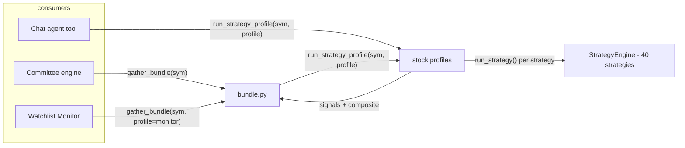

# Strategy Profiles — Situation-Specific Technical-Analysis Sets

**Date**: 2026-06-10
**Modules**: `cio/stock/profiles.py` (new), `cio/committee/bundle.py`, `cio/watchlist_monitor/agent.py`, `cio/agent.py`
**Tests**: `tests/test_profiles.py` (17 tests), full suite 776 passing

---

## 1. Problem

### 1.1 One hardcoded strategy list for every situation

`cio/committee/bundle.py` sampled a fixed set for **all** consumers:

```python
_TA_STRATEGIES = ["rsi", "macd", "stoch", "trix", "kdj"]
```

The committee (deep position decisions), the Watchlist Monitoring Agent
(cheap daily change detection), and any future short-term trading flow all
received the same five indicators, even though those situations ask different
questions of the data.

### 1.2 The set was internally redundant

`rsi`, `stoch`, and `kdj` are all short-window momentum oscillators of the
same family (KDJ literally extends Stochastic; RSI is its close cousin).
Practitioner literature calls this **indicator redundancy / multicollinearity**:
three indicators repeating one opinion creates false confidence while leaving
whole information categories (volume, volatility, regime) unobserved.

### 1.3 `ta_signals` was a dead feature (latent bug)

`bundle._latest_signal()` derived each strategy's verdict by searching for
column names containing `"buy"` / `"sell"`:

```python
buy_cols  = [c for c in row.index if "buy" in c.lower()]
sell_cols = [c for c in row.index if "sell" in c.lower()]
```

The vendored strategy engine emits `c_*_BULL` / `c_*_BEAR` columns — no
strategy has ever produced a "buy"/"sell" column. Both lists were always
empty, so every strategy reported **"neutral"** on every symbol since the
feature was introduced. The committee and WMA prompts have been receiving
`TA_SIGNALS: rsi:neutral macd:neutral ...` regardless of market conditions.

It also inspected only the **last row**: even with correct column names, an
event column (which fires on a single bar) would almost never be 1 on
precisely the latest bar — a crossover from two days ago, still actionable,
would be reported as nothing.

## 2. Research basis

Three principles, consistent across practitioner sources:

1. **One indicator per category.** Combine across trend / momentum / volume /
   volatility-regime instead of stacking within one family
   ([Tradeciety](https://tradeciety.com/how-to-choose-the-best-indicators-for-your-trading),
   [Earn2Trade](https://www.earn2trade.com/blog/avoiding-indicator-overlap/),
   [TradingStrategyGuides](https://tradingstrategyguides.com/best-combination-of-technical-indicators/)).
2. **Indicator speed must match decision horizon.** Slow, smoothed indicators
   for position decisions; fast oscillators for short-term timing — the core
   of Elder's Triple Screen
   ([QuantifiedStrategies](https://www.quantifiedstrategies.com/alexander-elder-triple-screen-strategy/)).
3. **Short-term (wave/swing) trading pairs a volatility-compression setup
   with fast timing oscillators** — TTM Squeeze plus stochastic-family /
   Fisher-type turn detectors
   ([StockCharts TTM Squeeze](https://chartschool.stockcharts.com/table-of-contents/technical-indicators-and-overlays/technical-indicators/ttm-squeeze),
   [TheRobustTrader](https://therobusttrader.com/the-best-combination-of-trading-indicators-for-swing-trading/)).

## 3. Design

### 3.1 Profiles

| Profile | Strategies | Window | Category coverage |
|---|---|---|---|
| `committee` | `trix, kst, rsi, cmf, er` | 10 bars | slow trend · long-cycle momentum · oscillator+divergence · volume flow · trend-vs-chop regime |
| `monitor` | `macd, stoch, pvo, squeeze` | 3 bars | momentum crossovers · zone exits · volume surprise · volatility compression |
| `swing` | `squeeze, kdj, fisher, efi, vidya` | 3 bars | compression setup · cross timing · turn detection · volume force · adaptive trend |

Aliases: `wave → swing`, `wma → monitor`, `watchlist → monitor`.

Per-profile rationale:

- **committee** answers *"should we own this?"* — KST (Pring's multi-ROC
  composite, designed for major cycle turns) and TRIX (triple-smoothed trend)
  set the strategic backdrop; RSI contributes divergence; CMF confirms whether
  volume flow backs the price story; ER (Kaufman efficiency ratio) tells the
  committee whether trend-following or mean-reversion evidence deserves the
  weight. A 10-bar event window suits a body that meets infrequently.
- **monitor** answers *"did anything change overnight?"* — all four
  strategies are event detectors with fast reaction; a 3-bar window keeps the
  report focused on fresh changes. PVO specifically catches volume-surprise
  days (the signature of news events), squeeze flags names coiling for a move
  — both useful escalation context for the WMA.
- **swing** answers *"is there a tradeable wave right now?"* — squeeze
  provides the setup, KDJ (J-line-confirmed crosses) the entry timing, Fisher
  the turn detection, EFI (with its built-in consolidation filter) the volume
  confirmation, VIDYA the adaptive trend rail to ride.

### 3.2 Verdict derivation (replaces `_latest_signal`)

`profiles.summarize_signals(df, window)`:

1. Count `c_*_BULL` vs `c_*_BEAR` events over the last *window* bars
   (events fire on one bar; the window catches recent-but-not-today signals).
2. Feature-only strategies (e.g. `fisher`, which emits just `f_FISHER_CSLS`)
   fall back to the sign of their signed `f_` features on the last bar.
3. Verdict: `bull` / `bear` / `neutral` by majority, plus the list of firing
   columns for explainability.

`profiles.profile_signals(symbol_or_df, profile)` runs the profile's
strategies (each guarded — a failing strategy is omitted, never raises for
data errors) and adds a **composite** verdict by majority vote of
non-neutral strategy verdicts.

### 3.3 Data flow



## 4. Implementation

| Change | File | Notes |
|---|---|---|
| Profile registry, summarizer, aggregator | `cio/stock/profiles.py` | new module |
| Facade exports `list_strategy_profiles` / `run_strategy_profile` | `cio/stock/__init__.py` | lazy imports preserved |
| `gather_bundle(symbol, profile="committee")`; bundle gains `ta_profile`, `ta_composite`; removed `_TA_STRATEGIES` + `_latest_signal` | `cio/committee/bundle.py` | `ta_signals` value shape unchanged (`{name: "bull"}`) — downstream/test compatible |
| `format_bundle` renders `(composite:…, profile:…)` after TA signals | `cio/committee/bundle.py` | legacy bundles without the new keys still render |
| WMA binds the monitor profile | `cio/watchlist_monitor/agent.py` | `functools.partial(gather_bundle, profile="monitor")` — injected test `bundle_fn`s keep their 1-arg contract |
| New chat tool `run_strategy_profile` | `cio/agent.py` | CIO_TOOLS 34 → 35; both count-assertion tests updated |

### 4.1 Backward compatibility

- `gather_bundle(sym)` still works (profile defaults to `committee`) — all
  existing monkeypatched call sites in tests pass unchanged.
- `ta_signals` remains `dict[str, str]`; the richer per-strategy detail stays
  inside the profiles module and the new agent tool's `recent_events`.
- Committee prompt text changes only in which strategy names appear and the
  appended `(composite:…, profile:…)` suffix.

## 5. Verification

- `tests/test_profiles.py` — 17 tests: registry and aliases, *no
  same-family stacking* regression guard, every profile strategy registered
  in the engine, summarizer window semantics (event inside/outside window),
  feature-only fallback, garbage-input neutrality, end-to-end profile shapes
  on synthetic OHLCV, the **not-all-neutral regression** (the old bug's
  signature), bundle routing (`profile` reaches `run_strategy_profile`), and
  legacy bundle rendering.
- Full suite: **776 passed, 6 skipped** — includes committee, WMA, panel and
  tool-wiring suites that consume the bundle.

## 6. Follow-on options (not implemented)

- **Multi-timeframe profiles** — Elder's Triple Screen proper would run the
  committee profile on weekly bars and the swing profile on daily bars; the
  engine accepts any OHLCV DataFrame, so this needs only a resample step in
  `profile_signals`.
- **Backtest-driven set selection** — the engine's per-strategy parameter
  grids (`*_grid_of_parameter`) support scoring strategies per symbol;
  profiles could then be tuned per holding rather than global.
- **Weighting** — composite is currently a majority vote; category weights
  (e.g. volume confirmation worth more in monitor) are a natural extension.

## 7. References

- Tradeciety — *How To Combine The Best Indicators And Avoid Wrong Signals*: https://tradeciety.com/how-to-choose-the-best-indicators-for-your-trading
- Earn2Trade — *How to Avoid Using Similar Technical Analysis Indicators*: https://www.earn2trade.com/blog/avoiding-indicator-overlap/
- TradingStrategyGuides — *Best Combination Of Technical Indicators*: https://tradingstrategyguides.com/best-combination-of-technical-indicators/
- QuantifiedStrategies — *Alexander Elder Triple Screen Strategy (Backtest)*: https://www.quantifiedstrategies.com/alexander-elder-triple-screen-strategy/
- StockCharts ChartSchool — *TTM Squeeze*: https://chartschool.stockcharts.com/table-of-contents/technical-indicators-and-overlays/technical-indicators/ttm-squeeze
- TheRobustTrader — *Best Indicator Combination for Swing Trading*: https://therobusttrader.com/the-best-combination-of-trading-indicators-for-swing-trading/
- Strategy-level documentation: `cio/stock/engine/strategies/docs/` (one file per strategy)
