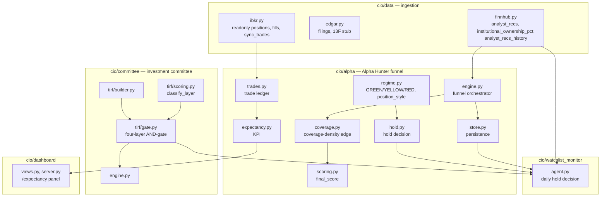
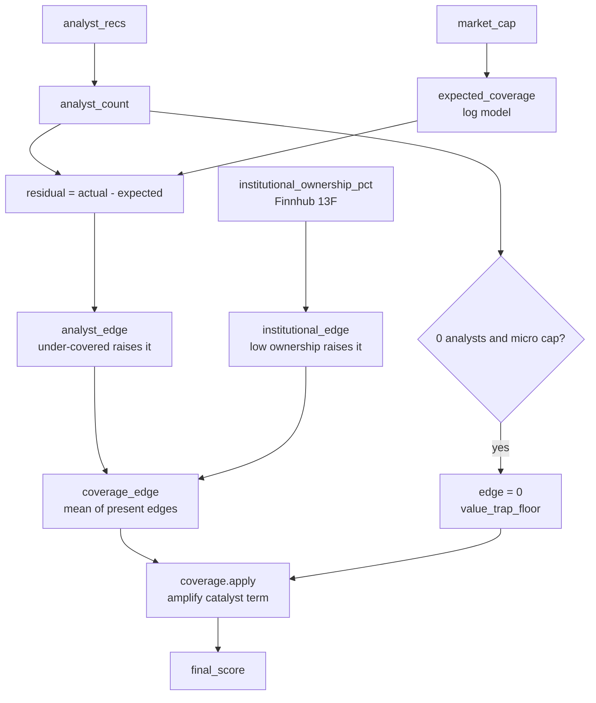
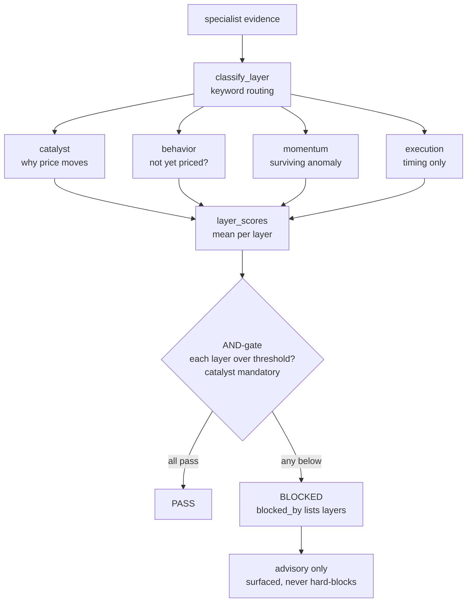
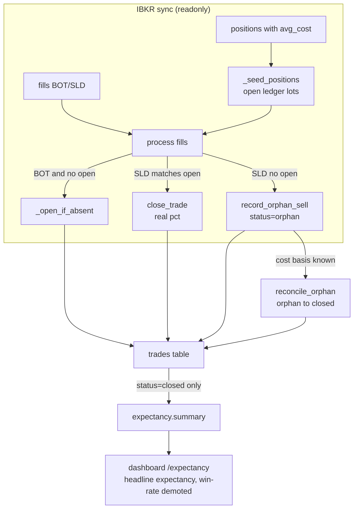
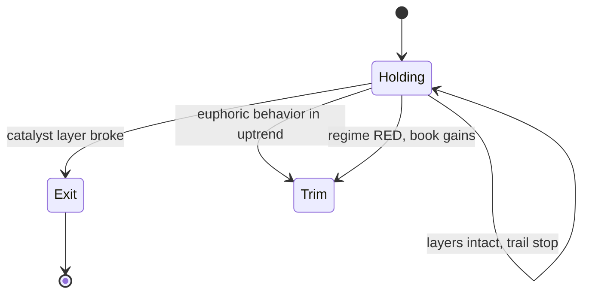
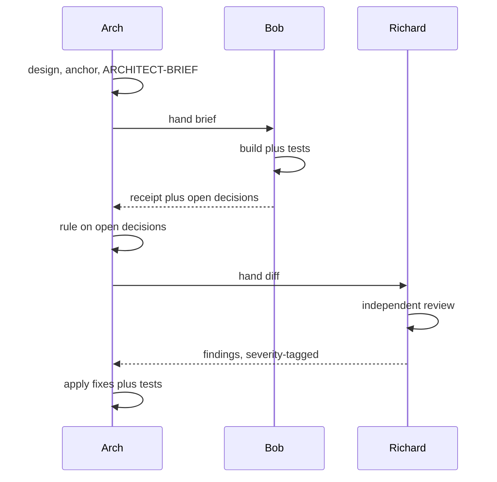

# CIOAgent Swing-Strategy Upgrades — Technical Report

**Scope:** the four-pass body of work that turned the investment-committee discussion
in `conv_turns` 280–289 (`data/cfo.db`) into shipped code across `cio/alpha`,
`cio/committee`, `cio/data`, `cio/watchlist_monitor`, `cio/dashboard`, and the schema.

**Method:** the project's "Three Man Team" methodology — Arch (architect, Opus) designs
and reviews open decisions, Bob (builder, Sonnet) implements, Richard (reviewer, Haiku)
does an independent severity-tagged review of every diff before it is accepted.

**Result:** all four original recommendations plus two follow-ups shipped, each through a
design → build → review → fix loop. 147 tests pass in the focused suites; the full suite
is 669 passed / 12 failed, where all 12 failures are a pre-existing environment gap
(`pandas_ta` not installed) unrelated to this work.

---

## 1. Background and motivation

The work originates in a committee conversation that interrogated the swing-trading
indicator set (Squeeze, KDJ, Fisher, EFI, MA, VIDYA) and reached several uncomfortable
but well-supported conclusions:

- **Indicator soup / multicollinearity.** Stacking oscillators from the same family
  re-counts one signal as if it were several. RSI, MACD, Stochastic, KDJ are all
  price-derived momentum transforms; "five confirmations" is often one dimension wearing
  five hats.
- **Data-snooping dominates EMH as the failure mode.** Sullivan, Timmermann & White
  (1999) showed the best technical rule from Brock-Lakonishok-LeBaron (1992) lost all
  significance after a data-snooping correction. A 60%+ backtest win rate produced by
  iteratively adding filters is the textbook overfit signature.
- **The surviving edge is not the indicator.** Momentum (Jegadeesh-Titman 1993) is the
  one anomaly still alive after 30 years; much of what looks like "the indicator working"
  is the momentum factor premium. The durable retail edge is structural: **Horizon**
  (ability to hold), **Liquidity / neglect** (under-covered names), and **Behavior**
  (discipline), not chart-reading.
- **Win rate is the wrong KPI.** It ignores magnitude and rewards the disposition effect
  (cut winners, hold losers). Expectancy captures both.
- **Regime sets the lever.** In a trending tape (and specifically the AI capital-cycle
  re-rating, which HFT cannot arbitrage on a multi-quarter horizon), the right posture is
  "fat" (肥) — let winners run on a trailing stop, exit when the catalyst breaks — rather
  than "diligent" (勤) high-frequency flipping that fights HFT on its own turf.

From that, the committee produced four recommendations. The fourth was explicitly
challenged by the operator and, on review, corrected:

| # | Recommendation | Disposition |
|---|----------------|-------------|
| 1 | Coverage-density filter (analyst count + institutional %) | Built (analyst live; institutional via premium Finnhub) |
| 2 | Four-layer architecture tags (catalyst / behavior / momentum / execution), scored independently | Built |
| 3 | Track expectancy = win% × avg_win − loss% × avg_loss instead of win rate | Built |
| 4 | "Win rate ≥ 60% backtest ⇒ overfit" | **Corrected** to an out-of-sample-degradation rule |

Two intermediate analyses shaped the implementation:

- A "+20–40% average winner" is optimistic for a 2–4-week swing; realistic average wins
  are nearer +10–15%, with +20–40% being the right-tail / longer-hold regime. The
  expectancy machinery was therefore designed to be measured from the operator's own
  realised distribution, not a hard-coded assumption.
- "+1.35% per trade is worse than a fixed deposit" is a units error: per-trade
  expectancy must be annualised by turnover. `(1 + 0.0135)^17 ≈ +26%/yr` for a 3-week
  hold fully deployed. The KPI module exposes that annualisation explicitly.

---

## 2. System architecture

The upgrades touch five subsystems. Coverage feeds the Alpha Hunter funnel; the
four-layer gate lives in the committee/TIRF layer and is reused by the monitor; the trade
ledger feeds the expectancy KPI and the dashboard; IBKR feeds the ledger.

---

## 3. Feature 1 — Coverage density

### Reason

The committee concluded the real liquidity edge is *neglected information*, not small
market cap. Names that few analysts cover and few institutions hold reprice slowly when a
catalyst lands; that diffusion lag is the exploitable window. The academic anchor is Hong,
Lim & Stein (2000), "Bad News Travels Slowly" — momentum and post-earnings drift are
materially stronger in low-coverage stocks.

### Method

`cio/alpha/coverage.py` converts two neglect signals into a single `coverage_edge`
(0–100, where 100 = maximally under-covered = best edge) and uses it to **amplify the
catalyst term**, never to originate a signal.

- **Analyst edge.** `expected_coverage(market_cap)` models how many analysts a stock of a
  given size should attract (`3 + 8·log10(mktcap/300)`, clamped 2–45). The residual
  `analyst_count − expected` measures neglect relative to size; `analyst_edge =
  clamp(50 − 2.5·residual, 0, 100)`. A `$30B` name with 4 analysts is genuinely
  under-covered; a `$200M` name with 4 is normal.
- **Institutional edge.** `institutional_edge = 100 − institutional_pct` (low ownership =
  neglected = high edge).
- **Blend.** When both are present they are averaged — genuine edge needs neglect on
  *both* dimensions. A 0-analyst micro-cap is a value trap, not edge, so a
  `value_trap_floor` short-circuits the edge to 0.
- **Amplifier, not signal.** `apply(earnings_score, coverage_edge)` returns
  `earnings_score × (1 + 0.3·(edge − 50)/50)`, clamped 0–100. Because the multiplier rides
  on the catalyst score, a zero catalyst stays zero — coverage can never manufacture a
  reason to buy.

The funnel (`engine.py`) injects `recs_fn` (default `finnhub.analyst_recs`) and
`institutional_fn` (default `finnhub.institutional_ownership_pct`); both degrade to a
neutral edge of 50 — i.e. no effect — when data is unavailable, so `coverage_edge=None`
reproduces the legacy score exactly.

### Effect

Under-covered names with a real catalyst now out-rank saturated ones; saturated names are
damped. The ranking change is fully back-compatible (the amplifier is identity when no
coverage data is present), and the per-candidate coverage fields are persisted for later
analysis of whether coverage actually predicts outcomes.

---

## 4. Feature 2 — Four-layer architecture and gate

### Reason

The committee's central error (the "ROKU" case) was a blended composite that let a
full-bull *execution* layer (every oscillator green, right after an exhausting spike) mask
a spent *catalyst*. Conflating "why price will move" with "math left after it moved" is the
indicator-soup trap.

### Method

Evidence is tagged into four causal layers and each is scored independently, then
AND-gated so no layer can compensate for another.

- `cio/committee/tirf/models.py` — `EvidenceItem.layer` and
  `SpecialistResearch.layer_scores`.
- `cio/committee/tirf/scoring.py` — `classify_layer()` keyword-routes each item to
  catalyst / behavior / momentum / execution (execution checked first so a named
  oscillator tags as the timing tool it is). `score_specialist` fills the per-layer means.
- `cio/committee/tirf/gate.py` — `layer_scores()` averages item scores per layer;
  `evaluate()` requires every present layer to clear its own threshold *and* the catalyst
  layer to be present (mandatory). It is advisory: surfaced in the dossier and committee
  report, it never hard-blocks the committee's decision.
- `cio/committee/tirf/builder.py` — aggregates all specialists' evidence and stashes the
  gate verdict in `report.review["four_layer_gate"]`. This routes through the existing
  `review_json` blob column, so it persists with **zero schema drift**.
- `cio/stock/profiles.py` — the TA profiles are explicitly tagged the execution layer:
  timing tools, never signal generators.

### Effect

A report whose catalyst layer is red is flagged even when execution is green — the exact
ROKU failure is now visible at decision time. Trades are accounted honestly: a strong
execution read cannot inflate a missing "why" into a buy.

---

## 5. Feature 3 — Expectancy KPI and trade ledger

### Reason

Win rate ignores magnitude. A 65%-win book can lose money; a 45%-win book can compound.
Worked from the committee's own example:

| Strategy | Win rate | Avg win | Avg loss | Expectancy / trade |
|----------|----------|---------|----------|--------------------|
| A | 65% | +6% | −12% | 0.65·6 − 0.35·12 = **−0.30%** |
| B | 45% | +20% | −7% | 0.45·20 − 0.55·7 = **+5.15%** |

Win rate ranks A above B; expectancy correctly ranks B far above A. This is asserted as a
live unit test.

### Method

The codebase had no record of realised trade outcomes, so two modules were created.

- `cio/alpha/trades.py` — a self-initialising SQLite ledger (`CREATE TABLE IF NOT
  EXISTS`). One row per position with entry/exit, stop, the four-layer scores and regime
  captured at entry, and `status` in `open | closed | orphan`. `open_trade`,
  `close_trade` (computes pct and R-multiple), `record_orphan_sell`, `reconcile_orphan`,
  and read helpers `list_open / list_closed / list_orphans`.
- `cio/alpha/expectancy.py` — `expectancy()` (win/loss rates, averages, expectancy,
  profit factor, payoff ratio), `annualized()` (compounds per-trade expectancy by
  turnover — the "+1.35%/trade is not a CD" fix), `sqn()` (System Quality Number),
  `oos_check()` (the teeth behind the corrected rule 6), and `summary()` for the
  dashboard with win rate explicitly demoted to a sub-stat.

### Effect

The system can now measure the metric that actually matters, annualise it for comparison
against buy-and-hold, and flag overfit by out-of-sample expectancy decay. The dashboard
surfaces it with win rate deliberately de-emphasised.

---

## 6. Feature 4 — ROKU rule 6 (corrected) and the hold-management posture

### Rule 6

The original proposal — "any backtest with win rate ≥ 60% is presumed overfit" — was
rejected because it contradicts Feature 3 (win-rate level says nothing about edge) and
mis-fires both ways. `docs/ROKU-IRON-RULES.md` codifies the corrected rule: out-of-sample
/ walk-forward validation is mandatory for *every* strategy, and overfit is flagged when
**OOS expectancy < 50% of in-sample expectancy** (enforced by `expectancy.oos_check`),
with a minimum-sample guard and a trials/data-snooping caveat.

### Hold management (肥 / 勤)

`cio/alpha/regime.py::position_style` maps the QQQ regime to a posture (GREEN → 肥, trailing
stop, run winners; RED → 勤, tight stop, book gains; YELLOW → neutral).
`cio/alpha/hold.py::hold_decision` then implements "fat with a guard": ride the trend on a
trailing stop while the layers stay green, trim into euphoria, and — overriding everything,
even a green execution layer — exit the moment the catalyst layer breaks.

This is the structural implementation of the "肥 for the AI boom" conclusion: capture the
multi-quarter right tail HFT cannot arbitrage, but never buy-and-forget.

#### Action set: hold / trim / exit — and deliberately no "add"

`hold_decision` returns one of three actions — `hold`, `trim`, `exit` — and intentionally
has no "add" / pyramid action. Two reasons:

- **Separation of concern.** `hold_decision` is a *risk-management* function over an
  already-open position. Adding size is an *entry* decision, and entry is the Alpha Hunter
  funnel's job: a candidate to add to is scored from scratch (coverage-amplified
  `final_score`, four-layer gate) exactly like any new name. Routing "add" through the hold
  manager would duplicate that logic with none of its gating.
- **It contradicts the edge thesis.** The exploitable edge is *neglect* — information not
  yet priced (Hong, Lim & Stein 2000). The hold logic encodes this directly: when the
  behavior layer reaches euphoric (`behavior ≥ BEHAVIOR_EUPHORIC = 85`) in a live uptrend,
  the action is **trim**, because the crowd has arrived and the edge is gone. Adding into
  that strength is the precise opposite of the strategy; pyramiding also concentrates risk
  into an already-extended position right where the catalyst-break guard exists to *reduce*
  exposure.

#### The stop is a posture, not a price

`stop_mode` is an advisory **label** — `trailing` (GREEN/肥), `standard` (YELLOW), or
`tight` (RED/勤) — not a computed stop price. `hold_decision` deliberately emits no number:
there is no ATR, high-water-mark, or chandelier-exit calculation anywhere in `cio/alpha`,
and none is persisted per position. The system tells the operator *what posture to hold the
stop at*, not *where to place it*. This is consistent with the readonly IBKR integration
(`ib_async` readonly): even a computed price could not be sent as an order, so the system
stays report-only and the operator sets and manages the actual stop. See §11.

---

## 7. Methodology — the Three Man Team loop

Every pass ran the same loop. Arch (Opus) designed, gathered context, wrote a durable
ARCHITECT-BRIEF, and wired the load-bearing "anchor" piece. Bob (Sonnet) built the rest.
Richard (Haiku) reviewed the diff independently and returned one-line, severity-tagged
findings. Arch ruled on open decisions and applied fixes. The reviewer's output is
caveman-compressed, which keeps the main thread's context small across a long session.

The value of the separation showed up every pass: Richard caught a real defect each time
that the builder had missed.

---

## 8. Pass-by-pass log, with repairs

```mermaid
flowchart LR
    P1["Pass 1<br/>5 upgrades"] --> R1["Richard:<br/>store drift"]
    R1 --> F1["fix: persist coverage cols<br/>+ migration"]
    F1 --> P2["Pass 2<br/>4 live wires"]
    P2 --> R2["Richard:<br/>orphan pct=0 pollutes KPI"]
    R2 --> F2["fix: record_orphan_sell<br/>status=orphan"]
    F2 --> P3["Pass 3<br/>institutional, IBKR, monitor"]
    P3 --> R3["Richard:<br/>BOT duplicate lot"]
    R3 --> F3["fix: _open_if_absent guard"]
    F3 --> P4["Pass 4<br/>Finnhub 13F, analyst delta"]
    P4 --> R4["Richard:<br/>_consensus string crash"]
    R4 --> F4["fix: _num isinstance guard"]
    F4 --> P5["Pass 5<br/>surface gaps: coverage cols,<br/>sync button, hold posture"]
    P5 --> R5["Richard:<br/>no issues"]
```

### Pass 1 — the five upgrades (logic + data model)

Built `coverage.py`, the four-layer model fields and `gate.py`, the trade ledger,
`expectancy.py`, the hold/regime helpers, and the corrected rule-6 doc; wired coverage
live into the funnel.

- **Richard finding (real):** `store.py` emitted four new coverage fields on each
  candidate but the `alpha_candidates` INSERT dropped them — a silent persistence drift.
- **Repair:** added the four columns to the schema, a guarded `_migrate_alpha_coverage`
  for existing databases, and extended the INSERT. Two regression tests (round-trip
  persist + legacy-table migration).

### Pass 2 — live wiring

Surfaced the gate in the dossier/report, added the `/expectancy` dashboard panel, wired
the monitor hold call, and added IBKR fills auto-logging.

- **Richard finding (real):** an IBKR sell with no matching open was recorded as a
  `pct=0` closed trade, which pollutes expectancy (a zero is counted in `n` but is neither
  a win nor a loss, diluting both rates).
- **Repair:** `record_orphan_sell` writes the fill as `status='orphan'` with NULL pct, so
  `list_closed` (and therefore the KPI) never sees it, while the row survives for
  reconciliation. Regression test proves win rate is not diluted.

### Pass 3 — institutional signal, IBKR reconciliation, real monitor layers

Added the institutional-% blend (Arch anchor), an EDGAR 13F stub, IBKR position-seeding +
`reconcile_orphan`, and replaced the monitor's LLM-derived execution proxy with real
TA-derived layers.

- **Richard finding (real):** a BOT fill for an already-seeded symbol created a duplicate
  open lot (double-count), because the BOT path lacked the idempotency check the seeding
  path had.
- **Repair:** `_open_if_absent` guard — open only when the symbol has no open lot.
- **Open decisions ruled by Arch:** EDGAR 13F is filer-side and cannot answer
  "who owns ticker X", so the stub returns None (safe) and the work moved to Finnhub
  (pass 4); the monitor momentum layer was wired to the funnel's already-persisted
  `alpha_candidates.momentum` (zero extra fetch) rather than left omitted.

### Pass 4 — verified Finnhub institutional fetch, analyst-delta behavior

- **Item 1:** the Finnhub `/stock/ownership` endpoint was verified from the API docs
  (13F-sourced, per-holder `percentage`). It is a premium endpoint, so on the operator's
  free tier it returns 403 and `institutional_ownership_pct` degrades to None — identical
  to the prior stub, but it activates automatically on a paid tier. The engine default was
  repointed from the EDGAR stub to Finnhub. The parser is unit-tested against the
  documented response shape.
- **Item 2 (closes the deferred OD-4):** Finnhub returns several months of recommendation
  counts in one response, so the period-over-period analyst trend needs no cache.
  `analyst_recs_history` reuses the cached payload; `_behavior_score_with_trend` nudges
  the behavior layer by half the latest-vs-prior consensus delta, so net upgrades lift it
  and downgrades cut it.
- **Richard finding (real):** `_consensus` did arithmetic on raw `.get()` values; a string
  count from the API would crash on the subtraction.
- **Repair:** `_num` coerces non-numeric inputs to 0 (matching the `analyst_count`
  pattern). Regression test with string and mixed counts.
- **Operational follow-up:** after deployment the premium `/stock/ownership` endpoint was
  seen to 403 once per ticker on the free tier (the pass-4 default called it for every
  symbol). Institutional fetch was made **opt-in** (`CIO_FINNHUB_INSTITUTIONAL`, off by
  default): with the flag off no call is made at all, eliminating the log spam and the
  wasted rate-limited calls; coverage falls back to the analyst signal.

### Pass 5 — surfacing the work in Telegram and the dashboard

Three operator-facing gaps were closed so the whole stack is visible end-to-end (Richard:
no issues):

- **Coverage in `/alpha`.** `render_alpha` gained three columns — analyst count, coverage
  edge, coverage flag — read from the persisted `alpha_candidates` row; legacy rows
  render "—". The operator can now see *why* a name ranked where it did.
- **Trade-ledger trigger.** `/portfolio` gained a "Sync trade ledger" button that calls
  `ibkr.sync_trades()` and flashes the counts, so `/expectancy` finally has a data source.
  No-op flash when IBKR is disabled; distinct from the existing portfolio drift sync.
- **Hold posture.** The monitor briefing's per-security block renders a "Hold posture"
  line from `assessment["hold_decision"]` (action / style / stop / reason), so Telegram
  `/briefing` shows the 肥/勤 call. Guarded against missing/partial decisions.

See `docs/SWING-UPGRADES-USAGE-GUIDE.md` for the operator-facing detail.

---

## 9. Consolidated record of repairs and improvements

### Improvements (new capability)

- Coverage-density ranking edge (analyst + institutional neglect) feeding the funnel.
- Four-layer causal model with an independent AND-gate, persisted and rendered.
- A trade-outcome ledger and an expectancy KPI stack (expectancy, annualised, profit
  factor, payoff, SQN, OOS overfit check).
- Regime-matched hold management with a catalyst-break exit.
- Real TA / analyst-trend / momentum layers in the daily monitor.
- IBKR readonly auto-logging with position seeding and orphan reconciliation.
- Codified ROKU iron rules with a corrected, expectancy-based rule 6.
- Operator surfaces (pass 5): coverage columns in `/alpha`, a "Sync trade ledger" trigger
  on `/portfolio`, and the hold posture in the `/briefing` monitor report.

### Repairs (defects fixed in review)

| Pass | Defect | Severity | Fix |
|------|--------|----------|-----|
| 1 | `alpha_candidates` INSERT dropped new coverage columns (persistence drift) | High | schema + guarded migration + INSERT |
| 2 | Orphan sell logged as `pct=0`, polluting expectancy | High (KPI integrity) | `status='orphan'`, excluded from `list_closed` |
| 3 | BOT fill after seed created a duplicate open lot | Medium | `_open_if_absent` idempotency guard |
| 4 | `_consensus` crashes on string rec counts | Medium | `_num` isinstance coercion |

A recurring theme — "if you add a stored key/column, make sure the store writes it" — was
turned into a standing invariant in every ARCHITECT-BRIEF after pass 1.

---

## 10. Testing

- `tests/test_swing_upgrades.py` is the dedicated suite, growing from the initial set to
  cover all four passes and every review fix. It includes the A/B expectancy assertion,
  the annualisation sanity check, the gate's no-cross-compensation behavior, the orphan
  exclusion, the BOT duplicate-lot guard, the institutional parser, and the string-count
  defense.
- Focused suites (`test_swing_upgrades`, `test_alpha`, `test_tirf`, `test_watchlist_monitor`,
  `test_data_sources`) pass at 147.
- Full suite: 669 passed / 12 failed. All 12 failures are the absence of `pandas_ta` in
  this environment (`test_strategy_engine`, `test_viz`, `test_stock`, and the
  empty-signal cascade in `test_profiles`); this was proven pre-existing by reverting the
  one edited file and observing identical failures. No failure is attributable to this
  work.

---

## 11. Limitations and deferred items

- **Institutional %** is **off by default** (`CIO_FINNHUB_INSTITUTIONAL=1` to enable),
  because `/stock/ownership` is a premium Finnhub endpoint. With the flag off the free tier
  makes no call at all and the coverage blend falls back to the analyst signal; a real
  number requires a paid tier — a billing decision, not a build task. (The flag was added
  after the initial pass-4 default — which called the endpoint on every ticker — was seen
  to 403 once per symbol on the free tier, spamming the log and wasting rate-limited calls.)
- **IBKR backfill accuracy.** Seeded positions use today's date as a proxy entry date, so
  hold-period analytics are approximate until `reconcile_orphan` supplies a real entry;
  per-trade pct magnitude is correct.
- **Hold stops are advisory labels, not prices.** `hold_decision.stop_mode` emits
  `trailing` / `standard` / `tight` as a posture only; no trailing-stop *price* is computed
  (no ATR / high-water-mark / chandelier-exit math exists) or persisted. Because IBKR is
  readonly, the system could not place a stop order even if it computed one, so it stays
  report-only — the operator sets and manages the actual stop. A future enhancement could
  emit a concrete `stop_price` (e.g. `peak_high − k·ATR`) for display next to the posture,
  requiring per-position high-water tracking + ATR; this is deferred by design, not a defect.
- **Environment.** `pandas_ta` is not installed here, so the strategy-engine and
  visualization suites cannot run locally.

---

## 12. File inventory

**New (10):** `cio/alpha/coverage.py`, `cio/alpha/expectancy.py`, `cio/alpha/hold.py`,
`cio/alpha/trades.py`, `cio/committee/tirf/gate.py`, `tests/test_swing_upgrades.py`,
`docs/ROKU-IRON-RULES.md`, `docs/PASS2-ARCHITECT-BRIEF.md`,
`docs/PASS3-ARCHITECT-BRIEF.md`, this report.

**Modified (17):** `cio/alpha/engine.py`, `cio/alpha/regime.py`, `cio/alpha/scoring.py`,
`cio/alpha/store.py`, `cio/committee/report.py`, `cio/committee/tirf/builder.py`,
`cio/committee/tirf/dossier.py`, `cio/committee/tirf/models.py`,
`cio/committee/tirf/scoring.py`, `cio/dashboard/server.py`, `cio/dashboard/views.py`,
`cio/data/edgar.py`, `cio/data/finnhub.py`, `cio/data/ibkr.py`, `cio/db.py`,
`cio/stock/profiles.py`, `cio/watchlist_monitor/agent.py`.

---

## Appendix — key formulas

- **Expectancy:** `E = win% · avg_win − loss% · avg_loss` (per trade).
- **Annualised:** `(1 + E)^turns − 1`, with `turns = 365 / avg_hold_days · deployment`.
- **SQN:** `mean(R) / stdev(R) · sqrt(n)`.
- **OOS overfit flag:** `OOS_expectancy < 0.5 · IS_expectancy`, or OOS ≤ 0 while IS > 0.
- **Expected analyst coverage:** `3 + 8 · log10(market_cap / 300)`, clamped 2–45.
- **Analyst edge:** `clamp(50 − 2.5 · (analyst_count − expected), 0, 100)`.
- **Institutional edge:** `100 − institutional_pct`.
- **Coverage edge:** mean of the present edges (analyst, institutional).
- **Coverage amplifier:** `earnings · (1 + 0.3 · (edge − 50) / 50)`, clamped 0–100.
- **Behavior trend:** `latest_consensus + 0.5 · (latest_consensus − prior_consensus)`.
