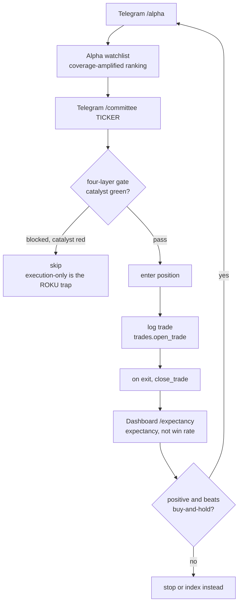
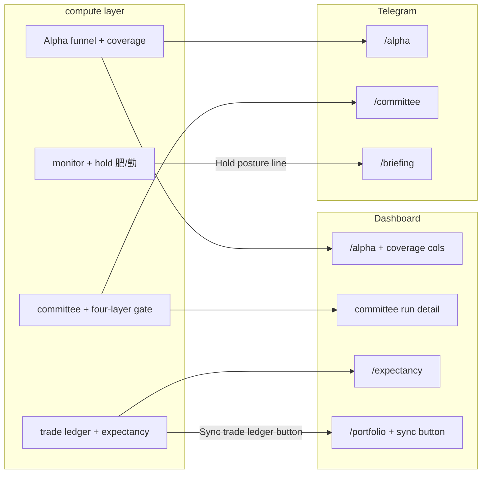

# Swing Upgrades — Operator Usage Guide (Telegram & Dashboard)

How the pass-1→4 swing work is used from the two operator surfaces: the Telegram bot
(`cio/bot.py`) and the local dashboard (`cio/dashboard/`). It states what is **live now**,
what **data prerequisites** apply, and the three **gaps** where a feature is computed but
not yet displayed (with the wiring needed to close them).

---

## 1. Feature → surface map

| Feature (pass) | Telegram | Dashboard | State |
|----------------|----------|-----------|-------|
| Coverage density — analyst + institutional (1, 3, 4) | `/alpha` ranking | `/alpha` ranking + table columns | Live; itemized in the `/alpha` table (Anlst / CovEdge / CovFlag) since pass 5 |
| Four-layer gate (2) | `/committee` PDF | `/committee/<run_id>` | Live |
| Expectancy KPI (3) | — | `/expectancy` tab | Live; populate the ledger via the Sync button below |
| Trade ledger / IBKR sync (2, 3) | — | `/portfolio` "Sync trade ledger" button | Trigger wired (pass 5); needs `CIO_IBKR_TWS` |
| Hold management 肥/勤 (3, 5) | `/briefing` (Hold posture line) | — | Surfaced in the monitor briefing since pass 5 |
| Rule 6 / OOS check (4) | — | — | Analytic helper (`expectancy.oos_check`); documented only |

---

## 2. Telegram usage

Commands registered in `cio/bot.py`: `/watchlist`, `/alpha`, `/committee`, `/briefing`,
`/playbooks`, plus `/start`, `/help`, `/subscribe`, `/unsubscribe`, `/stop`.

### `/alpha`
Runs the Alpha Hunter funnel (`cio.alpha.engine.run`) and publishes the
`Alpha-yyyy-mm-dd` watchlist. The **coverage-density** work is live here: under-covered
names that also carry a real catalyst rank higher, because `coverage.apply` amplifies the
earnings/catalyst term inside `final_score`. Analyst count is live on the free Finnhub
tier; institutional ownership only contributes on a premium key (otherwise None, no
effect — see Section 5).

### `/committee SYMBOL [zh]`
Runs the committee and returns the report as a PDF (`zh` for Traditional Chinese). The
**four-layer gate** is live here: the report and dossier carry the `four_layer_gate`
block — per-layer catalyst / behavior / momentum / execution scores plus `blocked_by`. It
makes the ROKU failure visible: a green execution layer can no longer hide a dead
catalyst. The gate is advisory; it annotates, it does not block the CIO vote.
(PDF rendering needs `markdown` + `weasyprint` installed.)

### `/watchlist`
Latest prices for the active watchlist — typically the list `/alpha` just published.

### `/briefing [SYMBOL…] [zh]`
Runs the Watchlist Monitoring Agent and returns the pre-market briefing (PDF). Since
pass 5 each per-security block carries a **Hold posture** line — the 肥/勤 hold decision:
`HOLD / TRIM / EXIT (style, stop mode) — reason`. EXIT fires when the catalyst layer
breaks (thesis gone) even if the chart still looks green; TRIM on euphoric behavior in an
uptrend or a defensive (RED) regime; HOLD while the layers stay intact. The posture is
omitted for a name with no hold decision (degrades cleanly).

---

## 3. Dashboard usage

Routes are in `cio/dashboard/server.py`; the nav bar is `views._NAV`
(Committee, Watchlist, **Alpha Hunter**, **Expectancy**, Portfolio, …).

### `/alpha`
`render_alpha(latest_run, list_runs(10), …)` shows the ranked candidates with a
run/refresh control. Since pass 5 the candidate table itemizes the coverage signal in
three columns — **Anlst** (analyst count), **CovEdge** (0–100 coverage-density edge;
higher = more neglected), **CovFlag** (`under_covered` / `saturated` /
`value_trap_floor` / `institutionally_*`) — so you can see *why* a name ranked where it
did. Legacy rows from before the upgrade show `—` in those columns.

### `/expectancy` (added in pass 2)
Fully wired: pulls `trades.list_closed()`, derives `avg_hold_days` from the entry/exit
dates, calls `expectancy.summary(...)`, and renders the headline **expectancy** (with the
annualized figure), profit factor, SQN, and payoff ratio — with **win rate deliberately
demoted to a sub-stat**. An empty ledger renders "no closed trades yet" rather than
crashing. This is the screen that answers "is the edge real?", and it stays blank until
the ledger is fed (Gap 2).

### `/committee/<run_id>`
`render_committee_run` shows the saved transcript; the four-layer gate block is included
through `cio/committee/report.py`.

### `/portfolio`
The IBKR positions snapshot (read-only). Since pass 5 it also carries a **"Sync trade
ledger"** button: it calls `ibkr.sync_trades()` — seed open positions from broker average
cost, then log fills (orphan-safe) — and flashes "N fill(s) logged, M seeded, K skipped".
This is the trigger that populates the ledger behind `/expectancy`. With `CIO_IBKR_TWS`
unset it flashes "IBKR disabled" and does nothing. It is distinct from the existing
"Sync from IBKR" drift/marks button.

---

## 4. Operator daily workflow (today)

---

## 5. Data prerequisites

- **Finnhub key (`FINNHUB_API_KEY`).** Free tier powers analyst counts and recommendation
  trends. **Institutional ownership %** uses `/stock/ownership`, a premium endpoint, and is
  therefore **off by default**: set `CIO_FINNHUB_INSTITUTIONAL=1` to enable it once your
  key has institutional-data access. Left off (the default), `institutional_ownership_pct`
  returns None *without making any call* — so the free tier is never slowed by, nor spams
  the log with, the guaranteed 403 on that endpoint; the coverage blend simply falls back
  to the analyst signal. Enabling it on a non-premium key will 403 and still degrade to
  None safely.
- **IBKR (`CIO_IBKR_TWS`).** Read-only TWS/Gateway socket. Unset = disabled: every IBKR
  function returns its empty value with no network call.
- **PDF (`/committee` PDF, dashboard committee export).** Needs `markdown` + `weasyprint`.

---

## 6. Surfacing — closed in pass 5

All three display/trigger gaps from the first cut are now wired end-to-end and tested.
Each shipped through the Arch → Bob → Richard loop (Richard's verdict: no issues). Kept
here for history.

### Gap 1 — coverage itemized in `/alpha` ✓
`render_alpha` now renders three columns — **Anlst / CovEdge / CovFlag** — from the
persisted `alpha_candidates` row, so the operator can see *why* a name ranked where it
did. Legacy rows show `—`. (Closed pass 5.)

### Gap 2 — trade-ledger sync trigger added ✓
`/portfolio` now has a **"Sync trade ledger"** button → `ibkr.sync_trades()` (seed
positions from broker average cost → log fills, orphan-safe, read-only), flashing the
counts. `/expectancy` populates from it. No-op flash when `CIO_IBKR_TWS` is unset.
(Closed pass 5.) A cron/CLI trigger remains available as an alternative.

### Gap 3 — hold decision surfaced ✓
The monitor briefing's per-security block (`_security_block`) now renders a **Hold
posture** line from `assessment["hold_decision"]` — action + style + stop + reason — so
Telegram `/briefing` shows the 肥/勤 call. (Closed pass 5.) A dedicated `/monitor`
dashboard tab remains a future option but is not required.

---

## 7. Command and route reference

| Surface | Entry point | Backed by |
|---------|-------------|-----------|
| Telegram | `/alpha` | `cio.alpha.engine.run` + `coverage` |
| Telegram | `/committee SYMBOL [zh]` | committee + `tirf.gate` (four-layer) |
| Telegram | `/watchlist` | active watchlist prices |
| Telegram | `/briefing [SYMBOL…] [zh]` | monitor + Hold posture (`hold.hold_decision`) |
| Dashboard | `/alpha` | `views.render_alpha` (+ coverage columns) |
| Dashboard | `/expectancy` | `trades.list_closed` + `expectancy.summary` |
| Dashboard | `/committee/<run_id>` | `views.render_committee_run` + `report` |
| Dashboard | `/portfolio` | `ibkr` positions + `sync_trades` button |

---

## 8. Status — pass 5 complete

All three gaps in Section 6 are closed: coverage columns in `/alpha`, the
"Sync trade ledger" trigger on `/portfolio`, and the Hold-posture line in the
`/briefing` monitor report. Each shipped through the Arch → Bob → Richard loop with a
clean review. The full pass-1→5 stack is now visible from both surfaces. A dedicated
`/monitor` dashboard tab is the only remaining optional enhancement (not required — the
hold posture already rides in `/briefing`).
