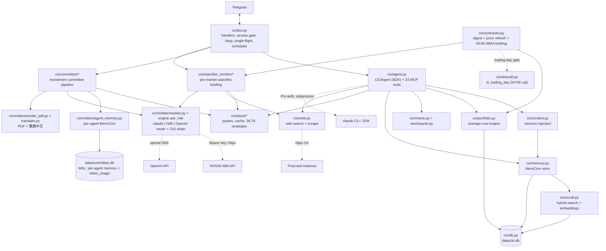
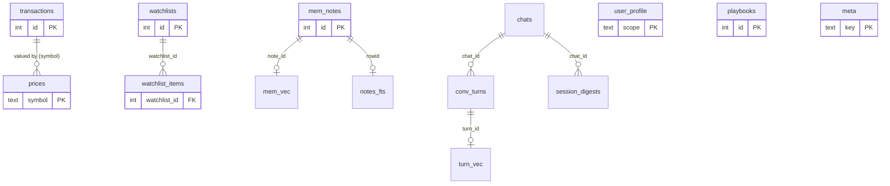
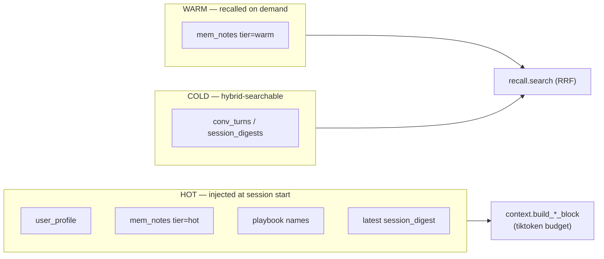
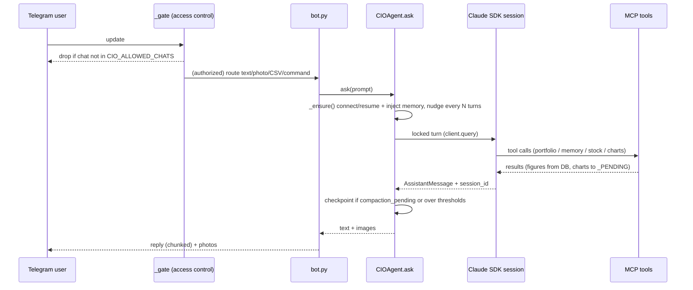
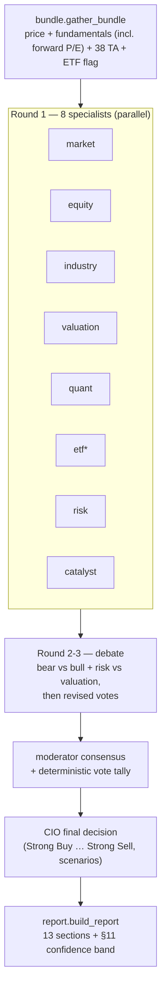
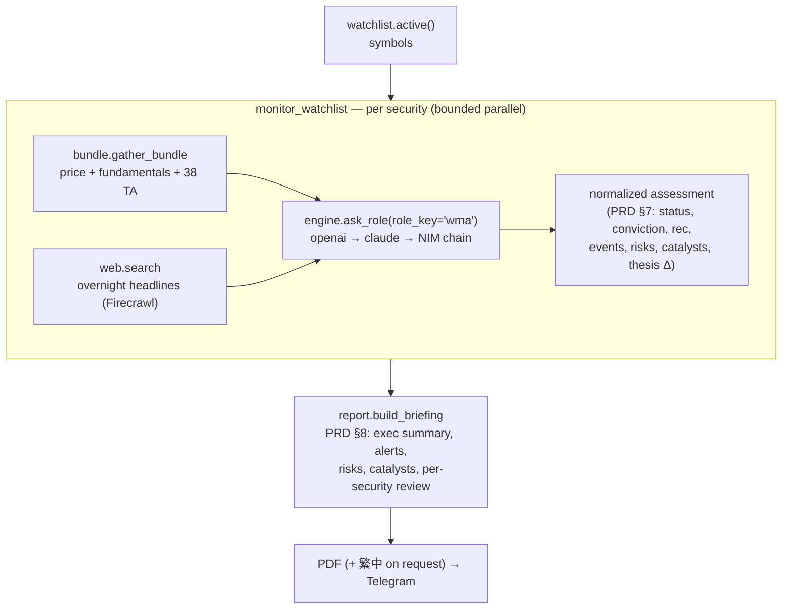

# CIO Agent — Technical Report

**AI Investment Committee Agent System (AICAS).** A personal investment agent for a
solo operator. Over Telegram it answers stock-portfolio questions, imports CSVs,
renders charts, fetches live quotes / runs 38 technical strategies, and — on demand —
convenes a **multi-agent investment committee** that produces an institutional-grade
research report. A scheduled **Watchlist Monitoring Agent** delivers a pre-market
briefing on the watchlist every trading morning. It runs 24/7 with a tiered,
self-improving memory layer (MemCore).

The conversational agent is built on `claude-agent-sdk` using **Claude Code Pro
authentication — no `ANTHROPIC_API_KEY`**. Embeddings and search are fully local. The
committee's agents are pluggable per-role across three backends — the **Claude
subscription**, **NVIDIA NIM** (OpenAI-compatible, e.g. `minimax-m2.7`), and the
**OpenAI API** — and the CIO runs a daily-token-budget fallback chain across them. The
final report is delivered as a **PDF**, with an on-request **Traditional Chinese** version.

- **Stack**: Python 3.12, `claude-agent-sdk`, `openai`, `python-telegram-bot`,
  `httpx` (NIM + Firecrawl web), `weasyprint` + `markdown` (PDF), pandas / numpy (`<2.3`),
  `pandas_ta` + a vendored TA engine, SQLite (+ `sqlite-vec`), `fastembed` (ONNX),
  `tiktoken`, APScheduler, `pandas_market_calendars` (NYSE trading-day calendar),
  matplotlib, `yfinance`, PyYAML.
- **Source of truth**: the `transactions` and `prices` tables. All portfolio figures
  are *derived* and recomputed, never cached.
- **Process model**: one long-lived asyncio process (the Telegram bot) that owns one
  `CIOAgent` (SDK session) per chat; the committee runs as an in-process pipeline.

> Heritage: the project was renamed from **CFOAgent → CIOAgent**. Env vars use the
> `CIO_*` namespace with a `CFO_*` fallback; the db defaults to `data/cio.db` but falls
> back to an existing `data/cfo.db`. The vendored TA engine under `cio/stock/engine/`
> retains a `cfo` token — that is the *Chande Forecast Oscillator* indicator, unrelated
> to the project name.

---

## 1. Component architecture

| Module | Responsibility |
|---|---|
| `bot.py` | Telegram I/O; **access-control gate**; routes text/photo/CSV to the per-chat agent; `/committee`, **`/briefing`**, `/subscribe`, **`/stop`**; **per-chat single-flight** (block=False long handlers); boot reindex, scheduler start, eager pre-warm |
| `agent.py` | `CIOAgent` wraps one SDK session; 23 in-process MCP tools (incl. `web_search`/`web_scrape`/`watchlist_prices`); rolling sessions, PreCompact hook, nudge, reflection loop |
| `web.py` | Firecrawl-backed `search` / `scrape` (async `httpx` → `/v2`); output-capped, offline-safe; powers the agent's web tools |
| `context.py` | Assembles the injected "hot" memory block within a token budget (`build_memory_block` chat-scoped, `build_scope_block` arbitrary-scoped) |
| `recall.py` | fastembed embeddings + `sqlite-vec` ANN + FTS5, fused with RRF; strict-scope recall (`include_global`) |
| `memory.py` | Tiered note store, profile, digests, playbooks, eviction, chat registry, **figures firewall** |
| `portfolio.py` | Average-cost basis, positions, realized P&L, summary; idempotent CSV ingest; live-price refresh |
| `charts.py` / `stock/panel.py` | Allocation pie / P&L bar PNGs; one-stop single-stock panel image |
| `scheduler.py` | APScheduler daily digest + EOD price-refresh + **06:00 watchlist briefing** (DB-direct, idempotent, reboot catch-up); WMA job is **trading-day gated** via `timeutil.is_trading_day` |
| `timeutil.py` | Local-TZ helpers + **`is_trading_day`** — Nasdaq trading-day check via the NYSE calendar (`pandas_market_calendars`), weekday fallback if the lib is absent |
| `watchlist_monitor/*` | Watchlist Monitoring Agent (WMA) — per-security overnight assessment + consolidated morning briefing (see §7) |
| `db.py` | SQLite schema, `sqlite-vec` loader, dim-migration, legacy migration; self-initializes any db path |
| `stock/data.py` | yfinance fetch + per-symbol cache (**sanitized paths**) + fundamentals (incl. **forward P/E**) + symbol normalization |
| `stock/engine/**` | Vendored TA engine: 38 strategies + indicators (pandas 3 / numpy 2 refactor) |
| `committee/*` | The investment committee (see §6) |

---

## 2. Data model

Two SQLite files. **`cio.db`** holds the portfolio + conversational MemCore.
**`committee.db`** holds the committee's per-agent memory (WAL mode), kept separate so
the agents' accruing notes + 768-dim vectors never bloat the portfolio db. The
**figures firewall** keeps monetary numbers out of every memory domain.

**Financial domain (figures — source of truth, `cio.db`):**
- `transactions` — every BUY/SELL/DIV; positions and P&L derive from this.
- `prices` — latest close per symbol (manual or refreshed).
- `imported_files` — sha256 of each ingested CSV (idempotency ledger).
- `watchlists` / `watchlist_items` — named symbol lists (one `is_active` at a time) and
  their members. `watchlist_items.position` holds the drag-to-reorder display order
  (`ORDER BY position, symbol`); items are not financial figures, so they live here as
  plain membership. Single-active is enforced in `watchlist.set_active()` (clears all
  other rows in one txn — SQLite can't express "at most one active"); every list is
  seeded with the NASDAQ Composite `^IXIC`, which `remove_symbol` refuses to drop. The
  `position` column is back-filled on existing DBs by an `ALTER TABLE` migration in
  `db.connect()` (idempotent; `CREATE TABLE IF NOT EXISTS` can't add a column).

**MemCore domain (qualitative — never figures):**
- `mem_notes` — tiered notes (`scope`, `tier` hot/warm, `importance`, `hits`, `source`).
- `user_profile`, `session_digests`, `conv_turns`, `playbooks`.
- `notes_fts` / `turns_fts` — FTS5 keyword indexes (trigger-synced).
- `mem_vec` / `turn_vec` — `sqlite-vec` `vec0` tables, `float[768]` embeddings.
- `conv_turns` — COLD store of every Telegram user/assistant turn (`bot._run` →
  `memory.log_turn`); feeds hybrid recall and the dev dashboard (§8). Gated by capture level.
- In **`committee.db`**: the same `mem_notes` / `mem_vec` / `notes_fts` tables, scoped
  `committee:{role}` — one logical namespace per agent (see §6.6) — plus `token_usage`
  (`service`, `day`, `tokens`) for the CIO fallback chain's daily budget (§6.4), and
  `committee_transcript` (every LLM call's sent prompt + returned text, grouped by `run_id`)
  for the dev dashboard (§8).

**Runtime:** `chats` (per-chat SDK `session_id` + digest/briefing subscription flag),
`meta` (`embed_dim`, migration flags, and the per-day idempotency stamps
`last_digest_date` / `last_wma_date` so a same-day reboot never re-sends).

---

## 3. Memory & context (MemCore)

Three tiers by access pattern. The same machinery serves the conversational agent
(scopes `global` / `chat:{id}`) and each committee agent (scope `committee:{role}`).

### 3.1 Write path & figures firewall
`memory.remember(value, scope, tier, source)` rejects any value containing a currency
amount (`$123`) or a number adjacent to a valuation keyword (`worth`, `price`, `P&L`,
…) via `_guard_figures` → `FiguresFirewallError`. A qualitative note is upserted (FTS5
synced by trigger), embedded into `mem_vec`, and eviction runs if the scope exceeds the
cap. **A number can never become stale "memory."**

### 3.2 Injection at session start
`context.build_memory_block` packs **profile → hot notes (importance × recency) →
playbook names → latest digest** into a `tiktoken` budget (`DEFAULT_BUDGET = 1000`,
hard bound). `build_scope_block(scope, budget)` does the same for a single arbitrary
scope (no global, no chat) — the committee uses it for per-agent injection.

### 3.3 Hybrid recall (RRF)
`recall.search(query, k, scope, kinds, include_global)` fuses a `sqlite-vec` KNN over
768-d embeddings with FTS5 bm25 via Reciprocal Rank Fusion (`K = 60`). `include_global`
(default True) lets committee callers pass **False** for strict per-agent isolation.

### 3.4 Bounding for 24/7
- **Eviction**: when a scope exceeds `MAX_NOTES_PER_SCOPE` (500), the lowest-scoring
  warm, non-user notes drop (`importance × (1+log1p(hits)) × 0.5^(age/30d)`); vectors
  removed in sync. Hot and user notes are never evicted.
- **Rolling sessions** (`CIOAgent._checkpoint`): bound transcript growth (digest +
  reseed; digest written *before* the fork, so a crash mid-fork loses nothing).

### 3.5 Durability & self-improvement
PreCompact hook + periodic nudge + deterministic auto-capture persist facts across
lossy boundaries. At each checkpoint: **auto-promote** warm notes with `hits ≥
PROMOTE_HITS` (3) to hot; **auto-distill** a repeatable procedure into a (figure-free)
playbook.

---

## 4. Stock subsystem (`cio/stock/`)

- **`data.py`** — `load_or_download_stock_data` fetches OHLCV from yfinance and caches
  one joblib pickle per symbol under `data/stock_cache/`. **Cache paths are sanitized**
  (`safe_symbol` + realpath containment) so a hostile ticker cannot traverse the dir or
  name an arbitrary pickle (see §9). `fundamentals()` pulls PE/**forward-PE**/PB/yield/
  EPS/ROE/margin/market-cap/52-week/quarterly-revenue + `quoteType` (ETF detection).
  `normalize_symbol` resolves a bare 4-digit code to `.TW`/`.TWO`. `latest_quote()`
  returns the latest close + OHLC/volume **and** the day change (`prev_close`, `change`,
  `change_pct`, vs the prior session's close) — used by the `/watchlist` quote-board.
- **`engine/`** — a vendored strategy engine: 38 technical strategies + indicators,
  refactored for pandas 3 / numpy 2. Exposed via the `cio.stock` facade
  (`list_strategies`, `run_strategy`).
- **`panel.py`** — `render_panel()` composes a portrait PNG (price candles + MA, basic
  fundamentals incl. **forward P/E** (`預估P/E`), quarterly revenue, links) with CJK fonts
  and TW color convention.

Agent tools: `stock_quote`, `stock_history`, `list_stock_strategies`,
`run_stock_strategy`, `refresh_prices`, `stock_panel`, `watchlist_prices`.

**Watchlists (`cio/watchlist.py`)** — named symbol lists, exactly one active (see §2 for
the schema + invariants). `prices()` is the shared read path (active list by default,
fetched via `latest_quote`, injectable `quote_fn` for tests) used by both the
`watchlist_prices` agent tool (returns JSON) and the deterministic Telegram `/watchlist`
command. The command renders a **broker-style quote-board PNG** (`charts.watchlist_table`):
Instrument / Last / Change / Change % / Volume, green/red by sign with an up/down dot, the
NASDAQ index (`^IXIC` → `COMP`) highlighted on top, K/M/B volume; it falls back to a plain
text table if rendering fails. List membership order (drag-to-reorder) is the display
order in both the board and the tool output.

### 4.1 Web access (`cio/web.py`)
`web.search(query, limit)` and `web.scrape(url)` call a Firecrawl instance's `/v2/search`
and `/v2/scrape` over async `httpx` — base URL from `CIO_FIRECRAWL_URL` (falls back to
`FIRECRAWL_API_URL`, then a self-hosted `http://localhost:3002`; optional
`FIRECRAWL_API_KEY` bearer). Markdown is capped to `CIO_WEB_MAX_CHARS` (6000) to protect
the prompt budget; both are offline-safe (any failure → empty/error result, never raises).
Exposed as the agent tools **`web_search`** / **`web_scrape`** for qualitative context
(news, analyst pages, filings) — the system prompt forbids treating web text as
authoritative figures; numbers always come from the portfolio/stock tools.

---

## 5. Control flow — a message turn

Turns are serialized per process by `_LOCK`; `_ACTIVE_SCOPE` is set under that lock so
the module-level MCP tools read/write the correct per-chat namespace. All durable state
survives reboot in SQLite; stale `session_id` degrades to a fresh session; CSV ingest is
idempotent so redelivered messages are safe.

### 5.1 Cancellation & per-chat single-flight (`/stop`)
Telegram delivers no deletion events, so a message that has reached the bot is already in
flight. To make that work cancellable, the long handlers (text/photo/document/`/committee`)
are registered **`block=False`** — the dispatcher keeps reading updates while one runs, so a
follow-up `/stop` is actually heard. `bot._running` maps `chat_id → {live handler tasks}`;
**`/stop`** cancels this chat's task(s), marking them in `_stopping` so a genuine shutdown
cancellation (not in the set) still propagates. A stopped turn is **not** logged and the
agent is reset (`close` + drop) so a half-consumed SDK stream can't corrupt the next turn;
the saved `session_id` rebuilds it lazily. `_try_acquire` enforces **per-chat single-flight**:
it claims the chat's one slot synchronously (no `await` between the busy-check and register,
so two back-to-back `block=False` handlers can't both win); a second message while one runs is
**rejected** with a notice pointing at `/stop`, rather than racing the first on the same agent.
`/stop` is exempt and frees the slot on cancel. **Caveat**: only *pending* steps halt — side
effects already committed (DB writes, spent model/NIM credits) before the stop are permanent.

---

## 6. Investment committee (`cio/committee/`)

`/committee SYMBOL [zh]` (Telegram) or `python -m cio.committee SYMBOL [zh]` (CLI) runs a
simulated buy-side process and delivers a 13-section **PDF** report (or `.md` on render
failure) to `data/reports/`; add `zh` for a **Traditional Chinese** version (§6.7).

### 6.1 Pipeline (`engine.py`)
`gather_bundle` → **Round 1** specialists (each emits role fields + `vote/confidence/
reason`; the ETF agent runs only for ETFs) → **debate** (`debate.py`, §6.2) → moderator
consensus + a deterministic Python vote tally → **CIO** final decision (5-band rating,
risk rating, horizon, bull/base/bear scenarios with probability + price target) →
report. `run_committee` never raises; missing data degrades to a clean "no data" result.
`format_bundle` surfaces `FWD_PE` (forward P/E) in the DATA block; the **valuation** and
**equity** specialists' prompts instruct them to weigh forward vs trailing P/E.

### 6.2 Debate (PRD §7.2)
`select_debate_pairs` deterministically picks the most-bearish-vs-most-bullish pair plus
a risk-vs-valuation pair (capped by `CIO_DEBATE_MAX_PAIRS`, default 2; skipped entirely
when all agents agree). Each pair runs a free-text challenge → response; then **all**
specialists may revise their vote given the transcript. Consensus, tally and CIO run on
the **revised** votes. Private agent memory (`memory_note`) is stripped from the raw
text so it cannot leak into the report or debate transcript.

### 6.3 Model services (`models.py`, `config/committee_models.yaml`)
Every call goes through `engine.ask_role(system, user, role_key)`, which resolves a
per-agent **service + model** from the config file (optional; missing → built-in
defaults) and dispatches via `_dispatch` to one of three backends:
- **`_ask_claude`** — `claude-agent-sdk` one-shot (subscription, no key).
- **`_ask_nim`** — NVIDIA NIM, OpenAI-compatible `chat/completions` via `httpx`, Bearer
  `NVIDIA_API_KEY`.
- **`_ask_openai`** — OpenAI API via the `openai` SDK (`OPENAI_API_KEY`, default model
  `gpt-5.5-2026-04-23`).
Each backend returns `(text, tokens)` — real usage from the API (`usage.total_tokens`,
`AssistantMessage.usage`), estimated via `tiktoken` only when omitted. A missing key →
`("", 0)` so the run degrades gracefully. Shipped default: 8 specialists + moderator +
translator → **NIM `minimaxai/minimax-m2.7`**; CIO → a **fallback chain** (§6.4). The
chosen service/model is logged per call (`agent <role> → <service>:<model>`).

**Output-token caps are configurable per backend** (priority **env > yaml > default**,
resolved by `models._int_setting`):
- OpenAI — value `CIO_OPENAI_MAX_TOKENS` / `openai.max_tokens` (2048), **and the param
  name** `CIO_OPENAI_TOKEN_PARAM` / `openai.token_param`: gpt-5.x requires
  `max_completion_tokens` (and only the default temperature, so no temperature override),
  older chat models want `max_tokens`.
- NIM — `CIO_NIM_MAX_TOKENS` / `nim.max_tokens` (2048).
- Claude — the agentic SDK has **no** plain output cap; its only token knob,
  `max_thinking_tokens`, is exposed via `CIO_CLAUDE_MAX_THINKING_TOKENS` /
  `claude.max_thinking_tokens` (unset → SDK default).

**Backend robustness.** `_ask_nim` parses tolerantly: reasoning models (minimax) may omit
`content` or return `null` and carry the answer in `reasoning_content`; when the cap is
spent on reasoning the response is `finish_reason="length"` with empty content. It recovers
`reasoning_content`, else returns `("", 0)` with a warning that names `finish_reason` (a cue
to raise `CIO_NIM_MAX_TOKENS`) — a malformed shape never raises.

### 6.4 CIO fallback chain (daily token budget)
The CIO is configured with a `chain` (not a single service). `ask_role` walks it in order,
skipping any link whose **daily token use** (`usage.py`, per-service, UTC-day bucketed in
`committee.db`) is at or above its `daily_limit`, and falling through to the next link on an
empty result (error / missing key). Shipped chain:
1. **OpenAI** `gpt-5.5-2026-04-23` — `daily_limit: 200000`
2. **Claude Opus** `claude-opus-4-8` — `daily_limit: 200000`
3. **NVIDIA NIM** `minimaxai/minimax-m2.7` — last resort, no limit
Limits, models, and order are all editable in `config/committee_models.yaml`. The counter
resets naturally at UTC midnight. Only the CIO uses a chain; other roles are single-service.

### 6.5 Parallel execution
`CIO_PARALLEL` (default **on**) runs the independent groups — Round-1 specialists,
debate cross-exam pairs, Round-3 revisions — concurrently under a semaphore
(`CIO_MAX_CONCURRENCY`, default 8). Moderator consensus and CIO stay serial (they
consume prior outputs). `off` = fully sequential.

### 6.6 Per-agent isolated memory
Each of the 9 agents (8 specialists + CIO) has its own MemCore namespace
`committee:{role}` in **`committee.db`** (WAL), via `agent_memory.py`:
- **recall_block** injects the agent's *own* hot block + a symbol-scoped RRF recall
  (`include_global=False`), bumping hit counts to drive promotion.
- **save_note** persists the agent's `memory_note` through the figures firewall (a
  figure is rejected, logged, never stored).
- **reflect** promotes that scope's hot notes after each run.
Isolation is proven: a note in `committee:risk` never surfaces for `committee:valuation`,
`global`, or any `chat:*`.

### 6.7 Report output — PDF + Traditional Chinese
`build_report` produces the 13-section markdown; `render_pdf.markdown_to_pdf` converts it
(`markdown` → HTML → **WeasyPrint**) to a PDF with a single CJK CSS font stack
(`Noto Sans CJK TC`) that renders English and Chinese alike (fonts embedded/subset). When
the user adds a language token (`zh`/`tc`/`中文`/`繁中`), `translate.translate_report` first
translates the report into Traditional Chinese via `ask_role(role_key="translator")` (default
NIM minimax). Two safety nets: a failed translation keeps the English markdown, and a failed
PDF render falls back to sending the `.md`.

---

## 7. Watchlist Monitoring Agent (`cio/watchlist_monitor/`)

The first layer of the architecture: before market open it scans the watchlist,
produces a one-security assessment for each name, and renders a consolidated
**morning briefing** — far cheaper than the committee (one model call per security),
so the operator can triage what deserves a full committee run.

### 7.1 Per-security assessment (`agent.py`)
`monitor_symbol` reuses the committee `gather_bundle` (price / fundamentals / TA) and
pulls overnight headlines via `cio.web.search` (offline-safe), then calls
`engine.ask_role(system, user, role_key="wma")` for a single fenced-yaml verdict that is
**normalized** into a fixed schema: `overall_status` (bullish/neutral/bearish),
`conviction_score` (0–100, clamped), `recommendation` (Buy/Add/Hold/Monitor/Reduce/Sell),
`analyst_sentiment`, `event_importance` (low/medium/high/critical),
`investment_thesis_change` (unchanged/positive/negative), and the
positive/negative-event, new-risk and upcoming-catalyst lists. Invalid model values fall
back to safe defaults; a symbol with no data is **skipped without spending a model call**.
`monitor_watchlist` fans out across the active list under a semaphore
(`CIO_WMA_CONCURRENCY`, default 4), preserving input order; it never raises.

### 7.2 Committee escalation (PRD §11)
A high/critical `event_importance` or a negative `investment_thesis_change` sets an
`escalate` flag. v1 **flags** those names in the briefing (`/committee SYMBOL`) rather than
auto-running the committee — keeping the daily briefing cheap and respecting the committee's
per-run cost ceiling.

### 7.3 Model chain
The `wma` role uses the same shape as the CIO chain (premium → premium → cheap), editable in
`config/committee_models.yaml`: **OpenAI** `gpt-5.5-2026-04-23` (daily 200k) → **Claude Opus**
`claude-opus-4-8` (daily 200k) → **NVIDIA NIM** `moonshotai/kimi-k2.6` (last resort). It runs
through the identical `ask_role` budget/fallback machinery as the committee (§6.4).

### 7.4 Scheduling — trading days only
`scheduler.watchlist_briefing` runs at **06:00 local** on stock days. APScheduler's
`day_of_week` (default `mon-fri`, `CIO_WMA_DAYS`) is a cheap pre-filter; the authoritative
gate is `timeutil.is_trading_day()`, which checks the **NYSE calendar**
(`pandas_market_calendars`, mirroring `AI4StockMarket/.../build_stocks_data.is_trading_day`)
so **Nasdaq holidays *and* weekends are skipped**; it degrades to a Mon–Fri check if the
calendar lib is unavailable. The run is **idempotent per day** (`meta.last_wma_date`, set
only after a successful send) with a boot-time catch-up if the machine was down at 06:00 on a
trading day. `CIO_WMA_HOUR=off` disables it. The briefing is pushed (PDF + short summary, `.md`
fallback) to every **subscribed** chat (`memory.subscribed_chats`, the same opt-in as the
daily digest; §8 lists subscribers).

### 7.5 Output — PDF + on-request 繁體中文 + manual invoke
`build_briefing` renders the PRD §8 markdown (executive summary with environment + bullish/
neutral/bearish counts + highest-priority pick, high/critical alerts, aggregated new risks,
upcoming catalysts, escalation list, then a priority-ordered per-security review);
`briefing_summary` is the short Telegram recap. The scheduled push is English; the manual
paths take a language token for a Traditional-Chinese briefing (reusing the committee
`translate_report` + OpenCC pipeline, §6.7): **Telegram** `/briefing [SYMBOL…] [zh]`
(no symbols = active watchlist) and **CLI** `python -m cio.watchlist_monitor [SYMBOL…] [zh]`.
Both are `/stop`-aware and under the per-chat single-flight lock (§5.1).

---

## 8. Developer dashboard (`cio/dashboard/`)

A localhost-only web view for the operator to **verify the agent is correct** — what
each model received, what it returned, token spend, and chat history. Read-only except
for `/watchlist`, the one write surface. Stdlib `http.server.ThreadingHTTPServer` (no web
framework, zero new deps), bound `127.0.0.1`. Launch: `python -m cio.dashboard`.

**Routes** (server-rendered HTML, no client JS except the one `/watchlist` drag script):
- `/usage` — tokens per backend per UTC day (`usage.recent` over `committee.db.token_usage`).
- `/telegram` — full conversation history (`memory.conv_history` over `cio.db.conv_turns`).
- `/subscribers` — chats opted in to the daily digest + 06:00 watchlist briefing
  (`memory.list_subscribers`: `chat_id` + subscribed-since), so the operator can see exactly
  who receives the scheduled pushes.
- `/watchlist` — the **write surface**: manage symbol lists (`cio/watchlist.py`).
  GET renders the manager (lists, the selected list's symbols, search, CSV-paste import);
  `do_POST` dispatches one `action` field (create/activate/rename/delete/add_symbol/
  remove_symbol/import_csv/reorder) → mutate → **303 redirect** back with a flash
  (Post/Redirect/Get, so a refresh can't resubmit). Same auth gate as GET. All
  mutations funnel through `cio/watchlist.py` (single source of truth for the
  single-active and NASDAQ-index invariants). Drag-to-reorder is one scoped vanilla
  script that writes the dragged symbol order into a hidden field and submits; with JS
  off the list still renders and every other action still works.
- `/committee` → `/committee/<run_id>` — every LLM call of a run: content **sent**
  (system + user prompt) and content **returned**, per role, in order.
- `/memory` — **per-agent / per-chat memory contents** for debugging: `memory.list_scopes`
  enumerates every scope across **both** stores (`chat:*` / `global` in `cio.db`,
  `committee:<role>` in `committee.db`); each scope lists its notes with tier, key, value,
  hits, importance, source, and update time. Read-only, like the rest of the dashboard.
- `/` — overview of all three.

**Capture funnels** (one per source, so nothing is missed and nothing is double-counted):
- Committee transcript: `engine.ask_role` is the single LLM entry point; a `_capture()`
  call sits beside each `usage.record`, tagged by a `_RUN_ID` ContextVar set at the top of
  `run_committee` (propagates into the parallel tasks). Before this, committee prompts/
  responses were persisted nowhere — `_raw` on opinion dicts is not durable.
- Telegram turns: `bot._run` is the single funnel for text/photo/document turns →
  `memory.log_turn` writes the user + assistant rows to `conv_turns` (which also,
  finally, populates the COLD recall layer that was defined but unwritten).

**Capture level** — `CIO_CAPTURE_LEVEL` (default `1`, clamped 1–3, in `cio/devcapture.py`):

| Level | Committee transcript | Telegram history |
|------:|----------------------|------------------|
| 1 | full, pruned to last `CIO_TRANSCRIPT_KEEP_RUNS` (200) | on |
| 2 | full, kept forever | on |
| 3 | full, pruned | off (committee only) |

All capture is best-effort and never raises — a logging hiccup cannot break a chat
or a committee run. Pruning runs inline on insert (level 1/3). Auth: loopback bind
needs none; an optional `CIO_DASH_TOKEN` adds a `?token=…` gate that sets a session
cookie so nav stays clean.

---

## 9. Correctness & security guarantees

| Concern | Mechanism |
|---|---|
| Stale numbers | Figures firewall: memory/playbooks/agent-notes refuse monetary values; figures recomputed from `transactions`/`prices` |
| **Unauthorized access** | `CIO_ALLOWED_CHATS` access gate (`ApplicationHandlerStop`, group −1) drops updates from any non-allowlisted chat; unset logs a startup warning |
| **Path traversal / pickle sink** | `safe_symbol()` + realpath containment on the stock cache path; `_safe_name()` on report filenames — a hostile symbol cannot escape the cache/report dir or load an arbitrary pickle |
| Tool blast radius | `disallowed_tools`: Bash/Write/Edit and the **built-in** WebFetch/WebSearch off (conversational agent); web access is only via the controlled `web_search`/`web_scrape` MCP tools (read-only public web, output-capped). Committee agents run with `allowed_tools=[]` (no tools, reason over injected DATA only) |
| SQL injection | All queries parameterized; the one dynamic-column statement (`set_profile`) whitelists columns against `_PROFILE_FIELDS` |
| Secrets | `TELEGRAM_BOT_TOKEN` / `NVIDIA_API_KEY` / `OPENAI_API_KEY` from env only; `.env` gitignored; the key *name* (not value) is the only thing logged |
| Duplicate import on replay | Content-hash idempotency ledger, atomic with row inserts |
| Transcript blowup (24/7) | Rolling sessions (digest + reseed) + importance-decay eviction; dev-dashboard committee transcript pruned to `CIO_TRANSCRIPT_KEEP_RUNS` (level 1/3) |
| Dashboard exposure | Read-only except the `/watchlist` write page; binds `127.0.0.1` by default; optional `CIO_DASH_TOKEN` cookie gate guards GET **and** POST; warns if bound off-loopback without a token. Writes go only through `cio/watchlist.py` (parameterized, invariant-enforcing); POST mutations use PRG redirects |
| Reboot data loss | All durable state in SQLite; eager resume; graceful stale-session fallback |
| Dependency CVEs | `pip-audit`: no known-vulnerable dependencies at audit time |
| Auditability | Every note carries `source` (user/agent/auto/committee/legacy) + timestamps + `importance`/`hits` |

**Residual notes.** The stock cache uses joblib *pickle* files; the traversal guard
plus app-only writes bound the risk, but a switch to a non-executable cache format
(parquet/csv) would remove pickle deserialization entirely. NIM's `base_url` comes from
the local (trusted) config, not user input, so it is not an SSRF vector. The web tools'
`web_scrape` URL, by contrast, originates from the model and is fetched by the Firecrawl
instance — a potential SSRF reach into internal services; it is mitigated by pointing
`CIO_FIRECRAWL_URL` at an isolated/egress-filtered Firecrawl deployment and by the
allowlisted-chat gate that bounds who can drive the agent at all.

---

## 10. Configuration (environment)

All `CIO_*` vars honor a `CFO_*` fallback for back-compat.

| Var | Default | Purpose |
|---|---|---|
| `TELEGRAM_BOT_TOKEN` | — | Bot token (required) |
| `CIO_ALLOWED_CHATS` | unset (open) | Comma-separated chat ids allowed to use the bot — **set this** |
| `NVIDIA_API_KEY` | — | NVIDIA NIM key (required for `service: nim` agents) |
| `OPENAI_API_KEY` | — | OpenAI key (CIO chain's first link; absent → CIO falls to Opus) |
| `CIO_OPENAI_TOKEN_PARAM` | `max_completion_tokens` | OpenAI output-cap param name (`max_tokens` for older models); also `openai.token_param` in yaml |
| `CIO_OPENAI_MAX_TOKENS` | `2048` | OpenAI output-cap value; also `openai.max_tokens` in yaml |
| `CIO_NIM_MAX_TOKENS` | `2048` | NIM output-cap value; also `nim.max_tokens` in yaml |
| `CIO_CLAUDE_MAX_THINKING_TOKENS` | SDK default | Claude thinking-token budget (no plain output cap in the agentic SDK); also `claude.max_thinking_tokens` in yaml |
| `CIO_MODELS_CONFIG` | `config/committee_models.yaml` | Per-agent service/model map + CIO chain + daily limits |
| `CIO_PARALLEL` | `on` | Committee parallel vs sequential execution |
| `CIO_MAX_CONCURRENCY` | `8` | Parallel agent semaphore |
| `CIO_DEBATE` / `CIO_DEBATE_MAX_PAIRS` | `on` / `2` | Debate toggle + pair cap |
| `CIO_COMMITTEE_DB` | `data/committee.db` | Per-agent memory db path |
| `CIO_AGENT_MEM_BUDGET` | `400` | Token budget for per-agent memory injection |
| `CIO_MODEL` | SDK default | Pin the conversational / Claude default model |
| `CIO_DIGEST_HOUR` / `_MINUTE` | `8` / `0` | Daily digest time (`off` to disable) |
| `CIO_PRICE_REFRESH_HOUR` / `_MINUTE` | `17` / `0` | EOD price refresh (`off` to disable) |
| `CIO_WMA_HOUR` / `_MINUTE` | `6` / `0` | Watchlist briefing time, local TZ (`off` to disable) |
| `CIO_WMA_DAYS` | `mon-fri` | Cron `day_of_week` pre-filter (Nasdaq holidays/weekends always skipped) |
| `CIO_WMA_CONCURRENCY` | `4` | Securities assessed in parallel per briefing |
| `CIO_TZ` | `America/Vancouver` | Local timezone for schedule times + the token-usage day boundary |
| `CIO_ROLL_TURNS` / `_TOKENS` | `40` / `16000` | Rolling-session checkpoint thresholds |
| `CIO_NUDGE_TURNS` | `8` | Persist-reminder cadence |
| `CIO_MAX_NOTES` | `500` | Per-scope note cap (eviction) |
| `CIO_PROMOTE_HITS` | `3` | Hit count that promotes a warm note to hot |
| `CIO_STOCK_CACHE_DIR` | `data/stock_cache` | Stock OHLCV cache dir |
| `CIO_FIRECRAWL_URL` | `http://localhost:3002` | Firecrawl base URL for the web tools (falls back to `FIRECRAWL_API_URL`) |
| `FIRECRAWL_API_KEY` | unset | Firecrawl bearer token (cloud / authed instances; self-hosted needs none) |
| `CIO_WEB_MAX_CHARS` | `6000` | Per-result web-markdown cap (prompt-budget guard) |
| `CIO_WEB_TIMEOUT` | `45` | Web request timeout (seconds) |
| `CIO_CAPTURE_LEVEL` | `1` | Dev-dashboard capture scope 1–3 (§8) |
| `CIO_TRANSCRIPT_KEEP_RUNS` | `200` | Committee runs retained when pruning (level 1/3) |
| `CIO_DASH_HOST` / `CIO_DASH_PORT` | `127.0.0.1` / `8787` | Dashboard bind |
| `CIO_DASH_TOKEN` | unset | Optional dashboard shared-secret gate |

---

## 11. Verification

`pytest` — **268 offline tests** (no network, no LLM): MemCore (schema/`vec0`, figures
firewall, scope isolation, injection budget, hybrid recall, eviction, promotion, rolling
cadence, playbooks, cold-boot); stock subsystem + panel (incl. forward-P/E field & cell);
committee (bundle, 8 roles, consensus/tally, 13-section report, confidence band, debate
pair-selection + rounds, model routing claude/NIM/OpenAI, **CIO fallback-chain selection at
each budget state**, parallel-vs-sequential peak, missing-key degrade); per-agent memory
(isolation, firewall, injection, promotion); **PDF/translation** (real WeasyPrint renders
incl. a 繁體中文 doc, lang parsing, translate no-op/fallback); **`/stop` + per-chat
single-flight** (`tests/test_bot_stop.py`: stopped turn not logged / no answer leaked /
agent reset / registries don't leak; normal turn unaffected; error + genuine-cancel cleanup;
per-chat isolation; 2nd-message reject while busy; accept after completion/stop); **WMA**
(`tests/test_watchlist_monitor.py`: yaml parse/normalize, invalid-value fallbacks, no-data
skip without a model call, escalation flag, order-preserving fan-out, briefing sections +
summary, `wma` chain resolution); **trading-day calendar** (`tests/test_timeutil.py`:
NYSE-calendar membership, holiday exclusion, weekday fallback, type coercion); **dashboard**
(routes incl. `/subscribers`, escaping, 404, token gate); **security** (symbol sanitization,
cache-path containment, report-filename sanitizer, access gate).
Dependency scan via `pip-audit` (no known vulnerabilities). Committee live-verified
end-to-end against AAPL/NVDA (NIM specialists + Opus CIO) and rendered to a real
CJK-embedded PDF; web tools live-verified against a self-hosted Firecrawl.

Run: `.venv/bin/python -m pytest -q`

---

## Appendix — embedding & search internals

- **Model**: `BAAI/bge-base-en-v1.5`, 768-dim, ONNX via fastembed, cached under
  `data/models/` (gitignored; `recall.warmup()` fetches once → offline-stable).
- **Storage**: `sqlite-vec` `vec0` virtual tables, `float[768]`; vectors serialized with
  `sqlite_vec.serialize_float32`. The extension loads on every `connect`.
- **Dim migration**: `db._drop_stale_vec` detects an `embed_dim` change, drops the `vec0`
  tables (recreated by schema), flags `vec_reindex_needed`; `recall.reindex_all` re-embeds.
- **Fusion**: Reciprocal Rank Fusion, `K = 60`, over FTS and vector rank lists, merged and
  truncated to `k`.
- **Committee db**: `journal_mode=WAL` (set once per process), so several agents can write
  their notes concurrently without the default rollback-journal write-lock contention.
