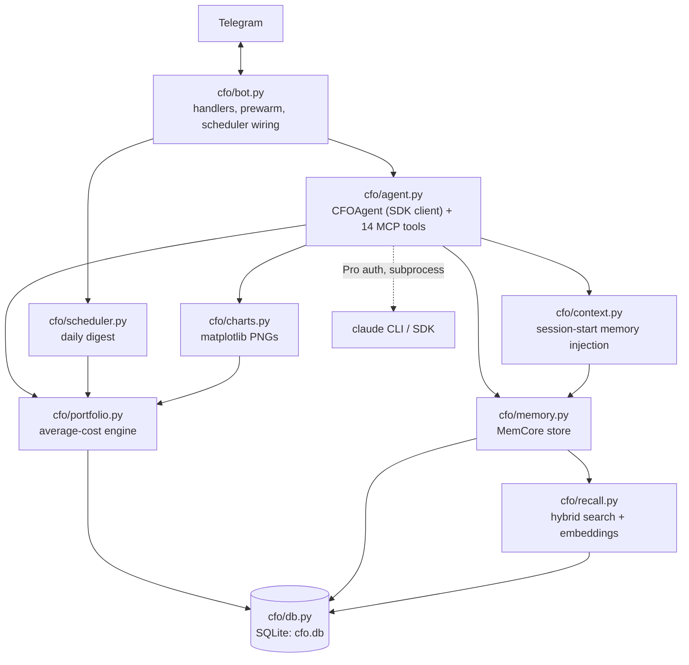
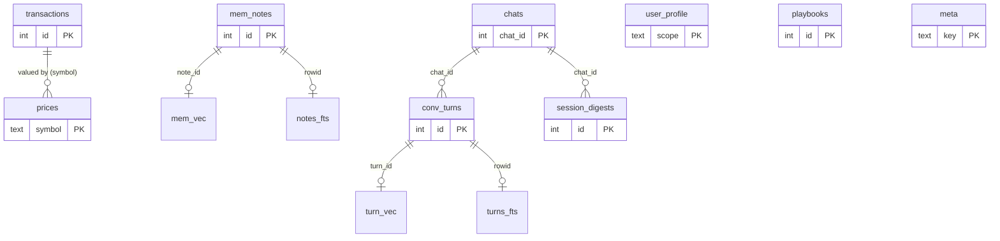
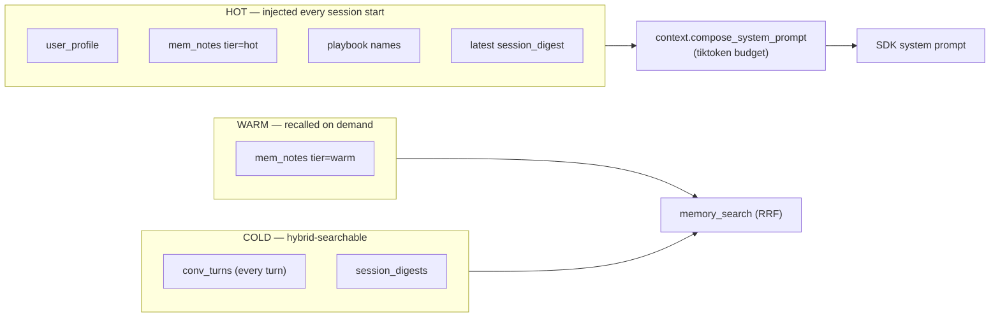
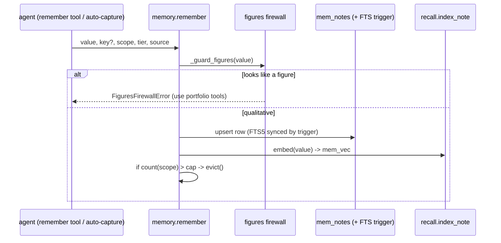
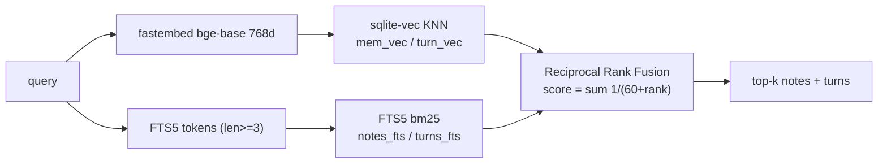
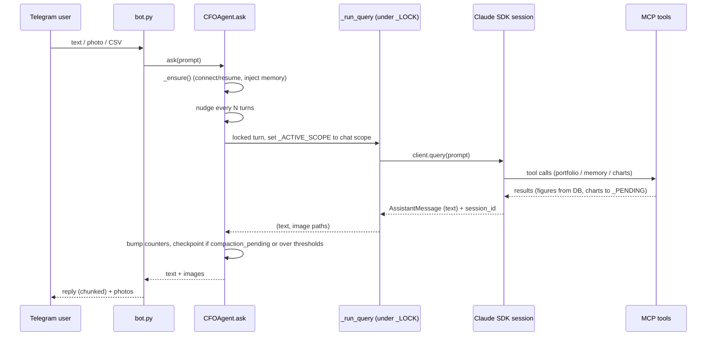
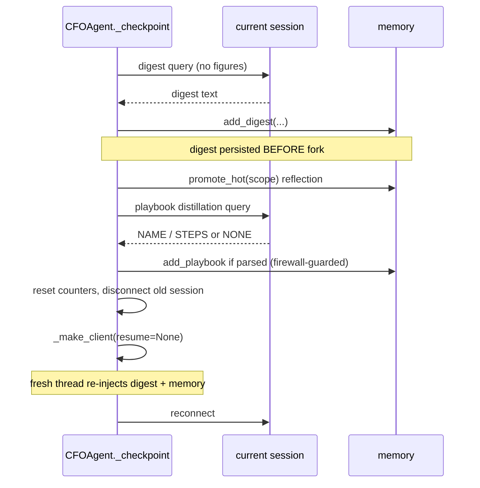
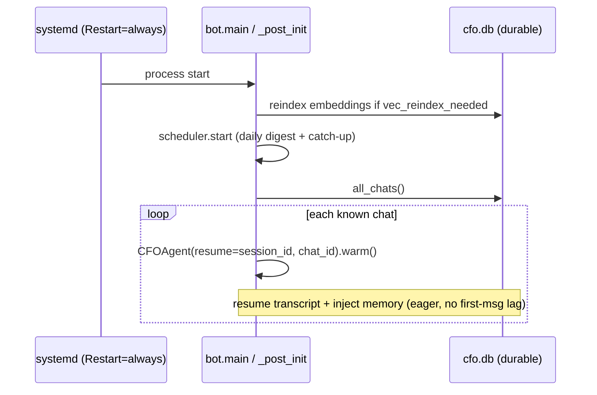
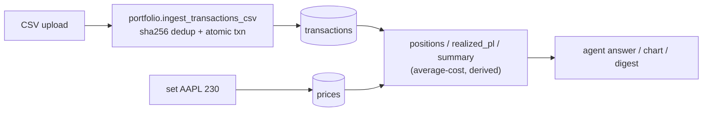

# CFO Agent — Technical Report

A personal CFO chat agent for a solo operator. It answers stock-portfolio
questions over Telegram, imports CSVs, renders charts, and runs 24/7 with a
tiered, self-improving memory layer (MemCore). It is built on
`claude-agent-sdk` using Claude Code Pro authentication — **no `ANTHROPIC_API_KEY`
and no external services** (embeddings and search are fully local).

- **Stack**: Python 3.11, `claude-agent-sdk`, `python-telegram-bot`, pandas,
  SQLite (+ `sqlite-vec`), `fastembed` (ONNX), `tiktoken`, APScheduler, matplotlib.
- **Source of truth**: the `transactions` and `prices` tables. All portfolio
  figures are *derived* and recomputed, never cached.
- **Process model**: one long-lived asyncio process (the Telegram bot) that owns
  one `CFOAgent` (SDK session) per chat.

---

## 1. Component architecture

| Module | Responsibility |
|---|---|
| `bot.py` | Telegram I/O; routes text/photo/CSV to the per-chat agent; `/subscribe`; boot-time reindex, scheduler start, eager session pre-warm |
| `agent.py` | `CFOAgent` wraps one SDK session; defines 14 in-process MCP tools; rolling sessions, PreCompact hook, nudge, reflection loop |
| `context.py` | Assembles the injected "hot" memory block within a token budget |
| `recall.py` | fastembed embeddings + `sqlite-vec` ANN + FTS5, fused with RRF; (re)indexing |
| `memory.py` | Tiered note store, profile, digests, playbooks, eviction, chat registry, figures firewall |
| `portfolio.py` | Average-cost basis, positions, realized P&L, summary; idempotent CSV ingest |
| `charts.py` | Allocation pie / P&L bar PNGs |
| `scheduler.py` | APScheduler daily digest (DB-direct, idempotent, reboot catch-up) |
| `db.py` | One SQLite file; schema, `sqlite-vec` loader, dim-migration, legacy migration |

---

## 2. Data model

Two disjoint domains share one SQLite file. The **figures firewall** is the rule
that keeps them separate: monetary numbers live only in the financial domain.

**Financial domain (figures — source of truth):**
- `transactions` — every BUY/SELL/DIV; positions and P&L derive from this.
- `prices` — latest manual close per symbol.
- `imported_files` — sha256 of each ingested CSV (idempotency ledger).

**MemCore domain (qualitative — never figures):**
- `mem_notes` — tiered notes (`scope`, `tier` hot/warm, `importance`, `hits`, `source`).
- `user_profile` — per-scope role/stack/prefs/goals (injected).
- `session_digests` — rolling-session checkpoints.
- `conv_turns` — full conversation history (cold, searchable).
- `playbooks` — distilled reusable procedures.
- `notes_fts` / `turns_fts` — FTS5 keyword indexes (kept in sync by triggers).
- `mem_vec` / `turn_vec` — `sqlite-vec` `vec0` tables, `float[768]` embeddings.

**Runtime:** `chats` (subscription + per-chat SDK `session_id`), `meta`
(bookkeeping: `embed_dim`, `vec_reindex_needed`, `last_digest_date`, migration flags).

---

## 3. Memory & context (MemCore)

Designed to be ≥ Hermes & OpenClaw (see [COMPARISON.md](COMPARISON.md)). Three
tiers by access pattern:

### 3.1 Write path

A note is rejected if its value contains a currency amount (`$123`) or a number
adjacent to a valuation keyword (`worth`, `price`, `P&L`, `value`, …). This is the
guarantee no rival has: a number can never become stale "memory".

### 3.2 Injection at session start

On every `_make_client` (init, fresh-session fallback, and rolling-session fork),
`context.build_memory_block` packs **profile → hot notes (importance × recency) →
playbook names → latest digest** into a `tiktoken`-measured budget
(`DEFAULT_BUDGET = 1000`, hard bound — the joined block is re-measured at each add).
The block is appended to the base system prompt, so the agent *knows* its context
before turn one.

### 3.3 Hybrid recall (`memory_search`)

The vector side finds matches phrased differently from how they were stored
(where keyword search alone misses); FTS catches exact terms. RRF merges both.
Both layers are required — there is no keyword-only degraded mode.

### 3.4 Bounding for 24/7

- **Eviction** (`memory.evict`): when a scope exceeds `MAX_NOTES_PER_SCOPE` (500),
  the lowest-scoring **warm, non-user** notes are dropped. Score =
  `importance × (1+log1p(hits)) × 0.5^(age_days/30)`. Hot and user notes are never
  evicted; vectors are removed in sync.
- **Rolling sessions** (`CFOAgent._checkpoint`): bounds transcript growth (see §4.2).

### 3.5 Durability (facts survive every lossy boundary)

- **PreCompact hook** (`_on_precompact`): the SDK fires it before lossy
  compaction; the agent flags a checkpoint so notable facts are durably digested.
- **Nudge**: every `NUDGE_TURNS` (8) the user prompt is augmented with a reminder
  to persist anything notable (cheap; no extra call).
- **Deterministic auto-capture**: `set_price`/`ingest` write `source=auto` event
  notes (event references, never numbers).

### 3.6 Self-improving reflection loop

At each checkpoint, while the session is still live:
- **Auto-promote**: warm notes with `hits ≥ PROMOTE_HITS` (3) become hot → injected
  next session (memory curates itself by usefulness).
- **Auto-distill**: the agent is asked whether a repeatable procedure occurred; a
  parseable `NAME:/STEPS:` reply is saved as a playbook (`source=auto`, figure-free).

---

## 4. Control flow

### 4.1 A message turn

Turns are serialized per process by `_LOCK`; `_ACTIVE_SCOPE` is set under that lock
so the module-level MCP tools read/write the correct per-chat namespace.

### 4.2 Rolling-session checkpoint

Because the digest is written **before** the fork, a crash mid-fork loses nothing.
Worst case is some un-digested conversational nuance — still recoverable from
`conv_turns` via search. Financial data is untouched (it is not in the transcript).

### 4.3 Reboot recovery

All durable state (portfolio, notes, profile, digests, subscriptions, per-chat
`session_id`) survives in SQLite. Stale `session_id` degrades gracefully to a fresh
session. Redelivered Telegram messages are safe: CSV ingest is idempotent.

---

## 5. Financial data flow

- **Average-cost**: a BUY blends into the running average; a SELL realizes P&L
  against it without changing the average; DIV adds to dividends.
- **Idempotent ingest**: identical CSV bytes are rejected (`DuplicateImport`); the
  rows and the hash commit in one transaction, so a crash rolls back both and a
  replay re-imports cleanly.
- Numbers are **always recomputed** here — never read from memory.

---

## 6. Correctness & security guarantees

| Concern | Mechanism |
|---|---|
| Stale numbers | Figures firewall: memory/playbooks refuse monetary values; figures recomputed from `transactions`/`prices` |
| Duplicate import on replay | Content-hash idempotency ledger, atomic with row inserts |
| Transcript blowup (24/7) | Rolling sessions (digest + reseed) + importance-decay eviction |
| Fact loss at compaction | PreCompact hook + nudge + auto-capture |
| Reboot data loss | All durable state in SQLite; eager resume; graceful stale-session fallback |
| Tool blast radius | `disallowed_tools`: Bash/Write/Edit/WebFetch/WebSearch off; only portfolio/memory/chart tools + Read |
| Auditability | Every note carries `source` (user/agent/auto/legacy) + timestamps + `importance`/`hits` |
| Offline / no key | Pro auth; embeddings/search fully local (fastembed + sqlite-vec) |

---

## 7. Configuration (environment)

| Var | Default | Purpose |
|---|---|---|
| `TELEGRAM_BOT_TOKEN` | — | Bot token (required) |
| `CFO_MODEL` | SDK default | Pin the Claude model |
| `CFO_DIGEST_HOUR` / `_MINUTE` | `8` / `0` | Daily digest time (`off` to disable) |
| `CFO_ROLL_TURNS` / `_TOKENS` | `40` / `16000` | Rolling-session checkpoint thresholds |
| `CFO_NUDGE_TURNS` | `8` | Persist-reminder cadence |
| `CFO_MAX_NOTES` | `500` | Per-scope note cap (eviction) |
| `CFO_PROMOTE_HITS` | `3` | Hit count that promotes a warm note to hot |

---

## 8. Verification

`tests/test_memcore.py` — 13 checks, **offline** (`HF_HUB_OFFLINE=1`): schema +
`vec0`, figures firewall, scope isolation, injection budget (hard bound), hybrid
recall (vector hit where FTS misses), eviction + protection, rolling cadence,
playbooks, parser, promote-to-hot, reflection-loop wiring, cold-boot continuity,
offline embedding. Live-verified: rolling reseed, PreCompact-hooked connect, and
playbook distillation emitting a parseable procedure.

Run: `PYTHONPATH=. .venv/bin/python tests/test_memcore.py`

---

## Appendix — embedding & search internals

- **Model**: `BAAI/bge-base-en-v1.5`, 768-dim, ONNX via fastembed, cached under
  `data/models/` (gitignored; `recall.warmup()` fetches once → offline-stable).
- **Storage**: `sqlite-vec` `vec0` virtual tables, `float[768]`; vectors serialized
  with `sqlite_vec.serialize_float32`. The extension is loaded on every `connect`.
- **Dim migration**: `db._drop_stale_vec` detects an `embed_dim` change, drops the
  `vec0` tables (schema recreates them), and flags `vec_reindex_needed`;
  `recall.reindex_all` re-embeds all notes and turns.
- **Fusion**: Reciprocal Rank Fusion, `K = 60`, over the FTS and vector rank lists
  for notes and turns independently, then merged and truncated to `k`.
