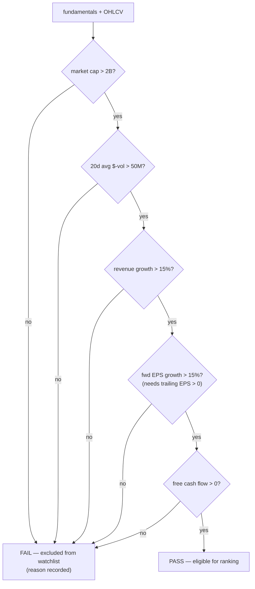
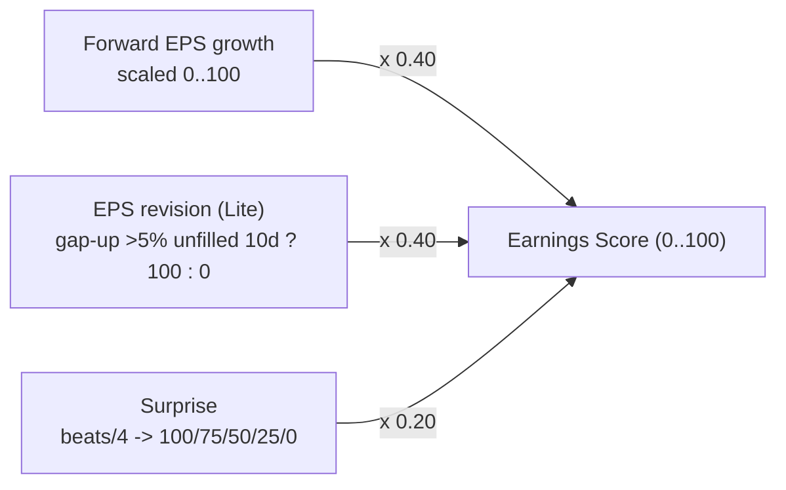

# Alpha Hunter — Activity Diagram

The end-to-end activity of a single Alpha Hunter run, from a trigger to a published
watchlist. Swimlanes show which component owns each step. Decisions show the
fail-closed / offline-safe branches.

## Full run activity (swimlanes)

```mermaid
flowchart TB
    Start([Trigger: CLI / dashboard button / /alpha / agent tool]) --> Entry

    subgraph S1["run_and_save / engine.run"]
        Entry["Resolve fetchers<br/>(live or injected)"] --> Uni["Load universe<br/>(file / env / fallback)"]
        Uni --> FetchQQQ["Fetch QQQ ~400d"]
        FetchQQQ --> QQQok{"QQQ data?"}
        QQQok -- no --> RegUnknown["regime = UNKNOWN<br/>qqq returns = None"]
        QQQok -- yes --> RegClass["Classify regime<br/>GREEN / YELLOW / RED"]
        RegUnknown --> Sect
        RegClass --> Sect["Rank sectors (L1)"]
        Sect --> LoopStart["For each ticker in universe"]
    end

    subgraph S2["Per-ticker layers (pure)"]
        LoopStart --> Ohlcv["Fetch ticker OHLCV once"]
        Ohlcv --> HasDf{"OHLCV present?"}
        HasDf -- no --> Drop["Drop ticker<br/>(no candidate)"]
        HasDf -- yes --> Fund["Fetch fundamentals<br/>(empty dict on error)"]
        Fund --> Qual["Quality gate (L2)<br/>fail-closed on missing"]
        Qual --> Surp["Fetch earnings surprises<br/>(None on error/disabled)"]
        Surp --> Earn["Earnings score (L2.5)"]
        Earn --> Mom["Momentum + trend (L3)"]
        Mom --> Score["Weighted final (L4)"]
        Score --> Build["Build candidate dict"]
        Build --> LoopEnd{"More tickers?"}
        Drop --> LoopEnd
        LoopEnd -- yes --> LoopStart
    end

    LoopEnd -- no --> Filter["Keep quality_pass only"]
    Filter --> Sort["Sort by final desc<br/>assign rank 1..n"]
    Sort --> Result["AlphaResult"]

    subgraph S3["store.save_run"]
        Result --> Publish{"publish?"}
        Publish -- no --> InsertRun
        Publish -- yes --> WlFind["Find/Create<br/>Alpha-yyyy-mm-dd"]
        WlFind --> WlSet["set_symbols = Top-20<br/>(keep ^IXIC floor)"]
        WlSet --> WlActive["set_active"]
        WlActive --> InsertRun["Insert alpha_runs +<br/>alpha_candidates rows"]
    end

    InsertRun --> Render["Render output<br/>(CLI table / dashboard / telegram)"]
    Render --> End([Watchlist live; Telegram /watchlist shows it])
```

## Quality-gate decision detail (L2)

Any missing field evaluates its guard to false → **FAIL** (fail-closed). A name only
reaches ranking when every minimum is met.

## Earnings score composition (L2.5)

