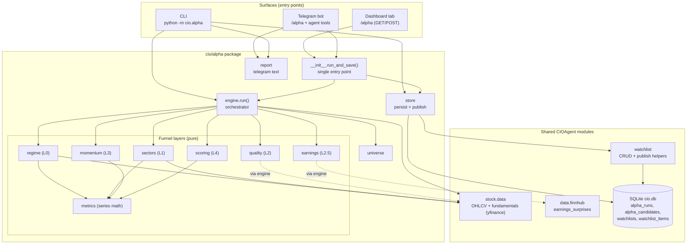
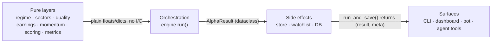

# Alpha Hunter — Architecture

How the Alpha Hunter subsystem is composed and how it sits inside CIOAgent. Alpha
Hunter is a **deterministic, zero-LLM compute layer** over data the agent already
fetches. It produces a ranked Top-20 watchlist from a five-layer funnel and exposes
that through three surfaces: a CLI, the dev dashboard, and the Telegram bot.

## C4-ish component view

## Layering rules

- **Pure layers** take in-memory data (a pandas `Close`/OHLCV frame, a fundamentals
  dict, a finnhub surprises list) and return plain numbers/dicts. No network, no DB,
  no LLM. This is what makes every layer unit-testable offline.
- **engine.run()** is the only place that fetches per-ticker data and wires the pure
  layers together. It fetches each ticker's OHLCV **once** and reuses the frame.
- **store** is the only place that writes the DB and mutates watchlists.
- **Surfaces** never call layers directly; they call `run_and_save()` (or `engine.run`
  + `store.save_run` in the CLI), keeping a single funnel definition.

## Module responsibilities

| Module | Responsibility | Inputs | Output |
|--------|----------------|--------|--------|
| `metrics` | SMA / returns / slope / 0–100 scaling | `Close` series | floats / bool |
| `regime` | L0 market light | QQQ `Close` | `{status, qqq, ma50, ma200, slope_up}` |
| `sectors` | L1 RS ranking + stock→sector tag | ETF closes | ranked list |
| `quality` | L2 fail-closed gate | fundamentals + OHLCV | `{pass, …, reasons}` |
| `earnings` | L2.5 score (fwd/revision/surprise) | fwd growth + OHLC + surprises | `{earnings_score, …}` |
| `momentum` | L3 RS vs QQQ + trend template | `Close` + QQQ returns | `{momentum_score, trend_score, rs_pass}` |
| `scoring` | L4 weighted final + sub-scores | sub-scores + OHLCV | `{final, revenue_score, volume_expansion}` |
| `universe` | candidate ticker list | file / env | `list[str]` |
| `engine` | orchestrate funnel | fetchers | `AlphaResult` |
| `store` | persist + publish watchlist | `AlphaResult` | `{run_id, watchlist_id, watchlist_name}` |
| `report` | Telegram text rendering | `AlphaResult` + meta | `str` |

## Key design properties

- **Zero LLM cost.** No model call anywhere in the funnel (same discipline as TIRF).
- **Offline-safe.** Any fetch failure degrades a ticker (dropped / low-scored) or the
  regime (`UNKNOWN`); the run never raises.
- **Fail-closed quality.** A fundamental that can't be measured fails the gate — the
  funnel never passes a name on missing data.
- **Single source of truth for the funnel.** All surfaces share `run_and_save()`.
- **Idempotent publish.** A same-day re-run refreshes the one `Alpha-yyyy-mm-dd` list
  in place (no duplicates) and keeps the `^IXIC` benchmark floor.
