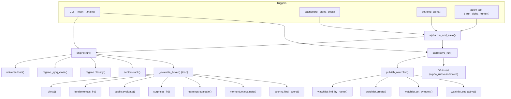
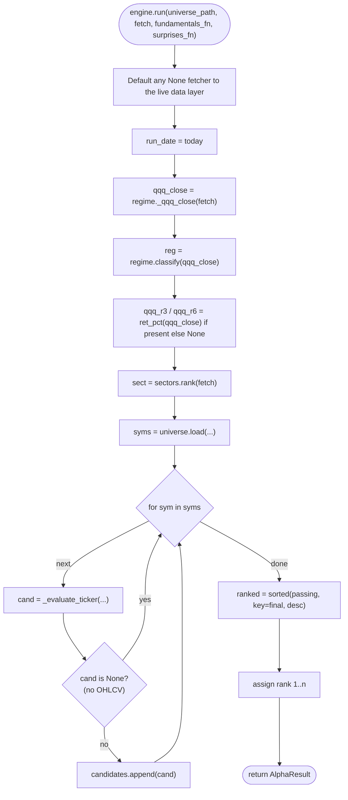
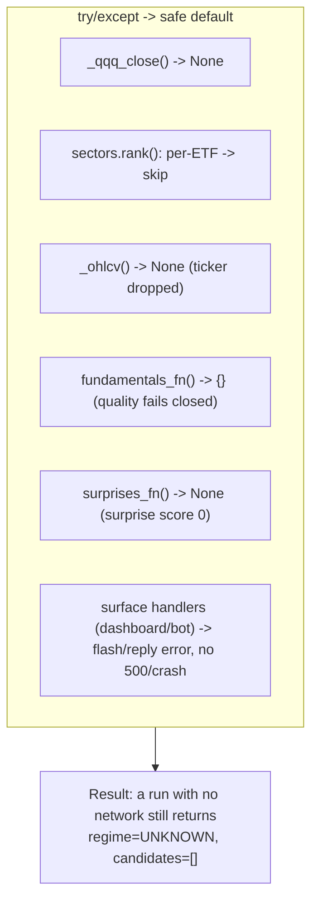
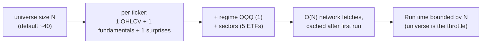

# Alpha Hunter — Control Flow

Where control goes (function calls, loops, branches) during a run. This is the
caller→callee view, complementing the data-flow doc (which tracks the values).

## Call graph (who calls whom)

## engine.run() control flow

## Exception-handling boundaries

Every external call is wrapped so the funnel never raises. Control always continues
to the next step with a degraded value.

## Loop & complexity

- The per-ticker loop is sequential and deterministic (stable rank ordering).
- Fetches are cached per symbol (`cio.stock.data`), so repeat runs are fast.
- The dashboard runs this synchronously; the bot offloads it to a worker thread
  (`asyncio.to_thread`) so the event loop stays responsive.
