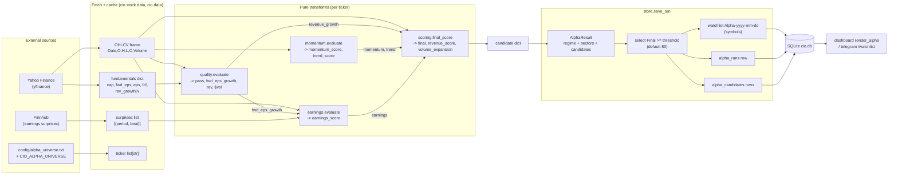
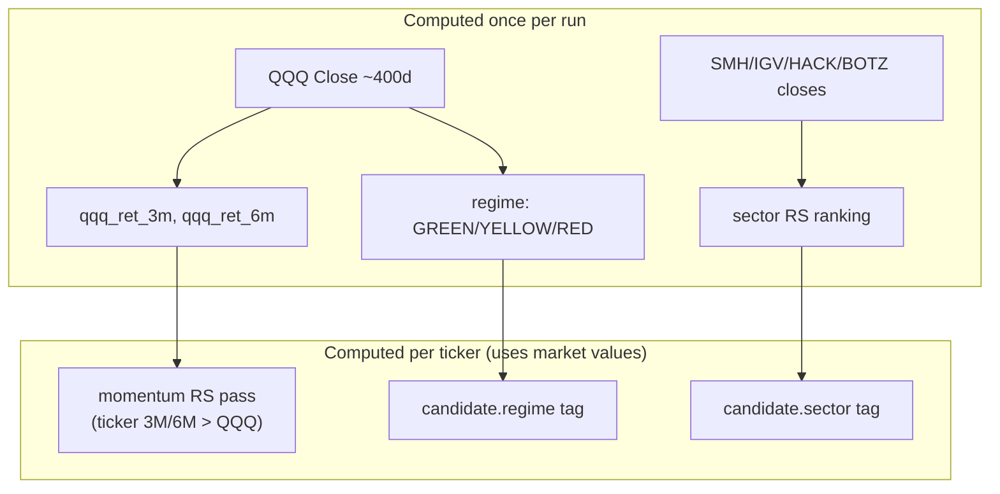
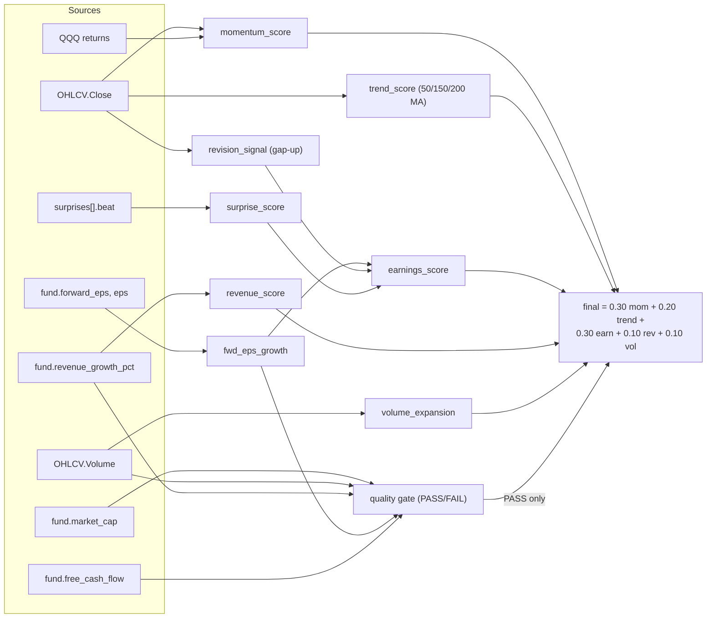
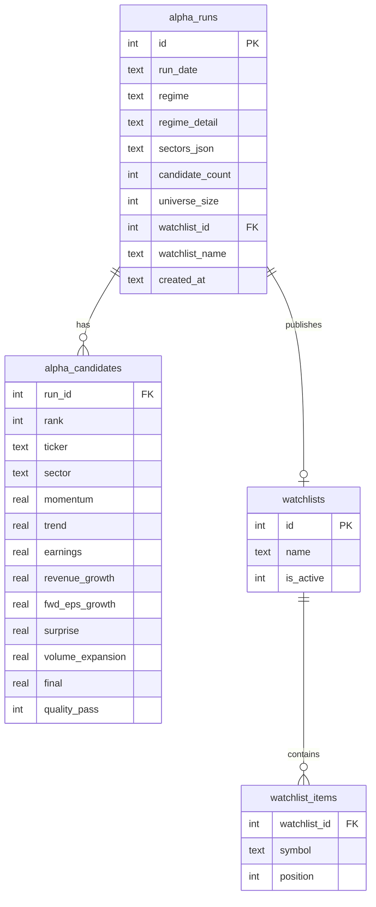

# Alpha Hunter — Data Flow

How data moves and transforms from external sources to a persisted, published
watchlist. This tracks **values** (the control-flow doc tracks calls).

## End-to-end data flow

## Market-level vs ticker-level inputs

The two QQQ return values flow **out** of the market layer **into** every ticker's
momentum evaluation — that is the only cross-ticker dependency.

## Field-level lineage of a candidate

## Persisted schema (data at rest)

## Figures-firewall note

`alpha_runs` / `alpha_candidates` store a **point-in-time snapshot** of one scan
(scores, growth rates as measured at run time). This is intentional and distinct from
the live-prices firewall: the **published watchlist holds only symbols**, and its
prices are always fetched live by the watchlist price path — never read back from
these snapshot tables.
