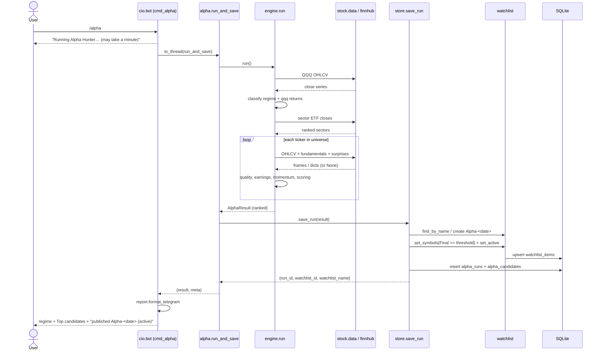
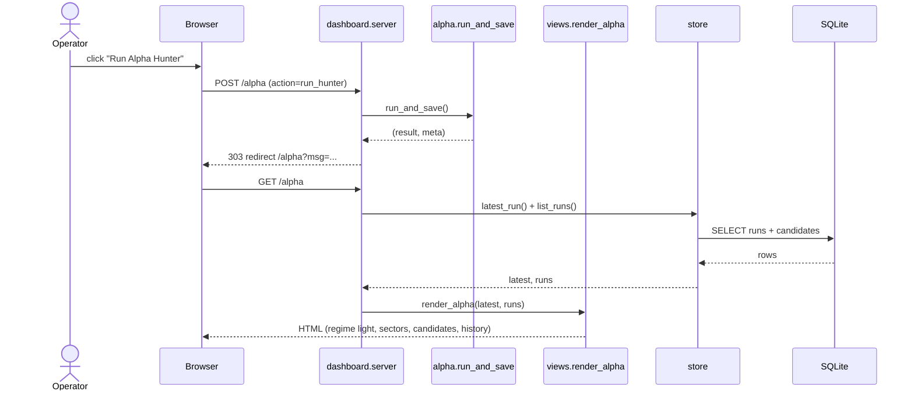
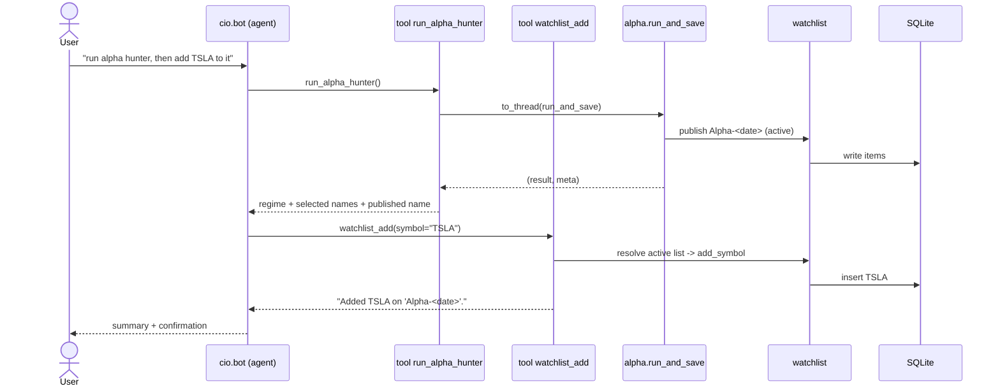
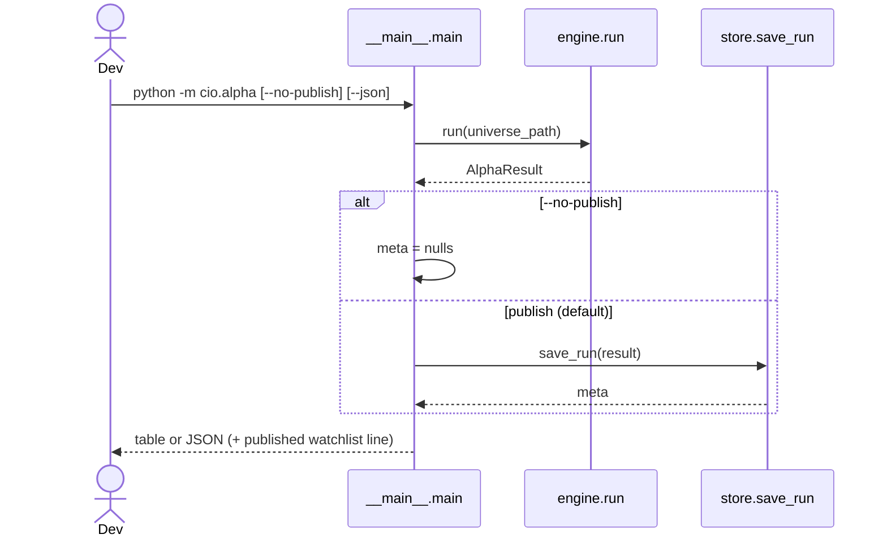
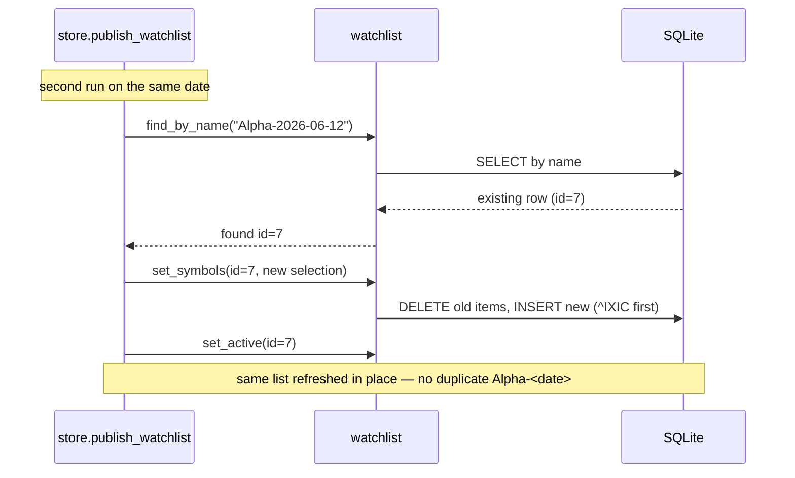

# Alpha Hunter — Sequence Diagrams

Time-ordered interaction between participants for each trigger path. Complements the
control-flow doc (static call graph) with the dynamic ordering of messages.

## 1. Telegram `/alpha` (operator-triggered run + publish)

## 2. Dashboard "Run Alpha Hunter" button

## 3. Conversational: "run alpha hunter then add TSLA"

Shows the agent tools that let Telegram **operate** on the published list, not just
read it.

## 4. CLI run

## 5. Same-day re-run (idempotency)

