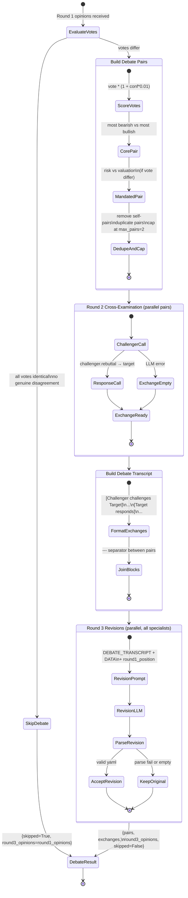

# Committee & WMA — Activity Diagrams

Activity diagrams model workflows, concurrent actions, and decision branches.

## Notation

These use Mermaid `stateDiagram-v2`. A few conventions:

- `<<choice>>` nodes are **decision branches** (an if/elif).
- `<<fork>>` / `<<join>>` mark where execution **splits into and re-merges from**
  concurrent work (the WMA does its macro snapshot and symbol scan concurrently).
- Composite states (states containing a nested `[*] → … → [*]`) represent a **sub-
  workflow** — e.g. "Build Bundle" or "Round 1 — Parallel Specialists" — expanded
  inline so the whole lifecycle reads top-to-bottom.

The four diagrams move from coarse to fine: the WMA daily run, the full committee
pipeline, the debate sub-workflow in detail, and the agent-memory lifecycle that spans
multiple runs.

---

## WMA Daily Run Activity

```mermaid
stateDiagram-v2
    [*] --> LoadWatchlist : Trigger (scheduler / bot / CLI)

    LoadWatchlist --> CheckSymbols : watchlist.active()
    CheckSymbols --> [*] : no symbols

    state CheckSymbols <<choice>>
    CheckSymbols --> MacroSnapshot : symbols found

    state ParallelInit <<fork>>
    MacroSnapshot --> ParallelInit : macro LLM call

    state "Macro Snapshot (1 LLM call)" as MacroSnapshot
    state "Symbol Scan (bounded semaphore max=4)" as SymbolScan {
        [*] --> FetchBundle
        FetchBundle --> ValidateData
        ValidateData --> SkipSymbol : no price data
        ValidateData --> FetchHeadlines : data available
        FetchHeadlines --> BuildPrompt
        BuildPrompt --> WMALLMCall : DATA + OVERNIGHT_HEADLINES
        WMALLMCall --> ParseYAML
        ParseYAML --> NormaliseFields
        NormaliseFields --> EscalateCheck
        EscalateCheck --> FlagEscalate : high/critical OR\nneg thesis OR recent 8-K
        EscalateCheck --> NoEscalate : low/medium AND\nunchanged thesis
        FlagEscalate --> AssessmentReady
        NoEscalate --> AssessmentReady
        SkipSymbol --> AssessmentReady : stub dict
        AssessmentReady --> [*]
    }

    ParallelInit --> SymbolScan

    state ParallelJoin <<join>>
    SymbolScan --> ParallelJoin
    MacroSnapshot --> ParallelJoin

    ParallelJoin --> BuildBriefing

    state "Build Briefing" as BuildBriefing {
        [*] --> ExecSummary
        ExecSummary --> GlobalIntelSection : macro dict present
        ExecSummary --> MacroAlerts : (no macro)
        GlobalIntelSection --> MacroAlerts
        MacroAlerts --> ExposureTable : per-security risk table
        ExposureTable --> PriorityAlerts : high/critical events
        PriorityAlerts --> NewRisks
        NewRisks --> Catalysts
        Catalysts --> EscalationNote : escalated symbols
        EscalationNote --> WatchlistReview : per-security blocks
        WatchlistReview --> [*]
    }

    BuildBriefing --> RenderOutput

    state RenderOutput <<choice>>
    RenderOutput --> PDFOutput : weasyprint available
    RenderOutput --> MarkdownOutput : PDF render failed

    PDFOutput --> Deliver
    MarkdownOutput --> Deliver
    Deliver --> [*]
```

---

## Committee Run Activity (Full Pipeline)

```mermaid
stateDiagram-v2
    [*] --> SetContext : run_committee(symbol)

    SetContext --> GatherData : set run_id / run_symbol / run_source

    state "Gather Bundle" as GatherData {
        [*] --> NormaliseSymbol
        NormaliseSymbol --> FetchQuote
        NormaliseSymbol --> FetchFundamentals
        NormaliseSymbol --> RunTA
        FetchQuote --> CheckData
        FetchFundamentals --> CheckData
        RunTA --> CheckData
        CheckData --> FetchExternal : data available
        CheckData --> ErrorResult : no data → abort
        FetchExternal --> BundleReady
        BundleReady --> [*]
    }

    GatherData --> FilterSpecialists : resolved ≠ None

    state FilterSpecialists <<choice>>
    FilterSpecialists --> Round1WithETF : is_etf = True
    FilterSpecialists --> Round1NoETF : is_etf = False

    state "Round 1 — Parallel Specialists" as Round1 {
        [*] --> RecallMemory
        RecallMemory --> InjectMemory
        InjectMemory --> LLMCall : system + FIGURE_RULE + memory
        LLMCall --> ParseOpinion
        ParseOpinion --> SaveMemoryNote : memory_note present
        ParseOpinion --> SkipNote : no memory_note
        SaveMemoryNote --> SanitizeNote : LLM sanitize (strip figures)
        SanitizeNote --> RegexFirewall : save_note firewall
        RegexFirewall --> OpinionReady
        SkipNote --> OpinionReady
        OpinionReady --> [*]
    }

    Round1WithETF --> Round1
    Round1NoETF --> Round1

    Round1 --> DebateGate

    state DebateGate <<choice>>
    DebateGate --> SkipDebate : CIO_DEBATE=off
    DebateGate --> CheckDisagreement : CIO_DEBATE=on

    state CheckDisagreement <<choice>>
    CheckDisagreement --> SkipDebate : all votes same
    CheckDisagreement --> SelectPairs : votes disagree

    state "Round 2 — Cross Examination" as Round2 {
        [*] --> PairSelection : most bearish vs most bullish\n+ risk vs valuation
        PairSelection --> ParallelPairs
        state "Parallel Cross-Exam Pairs" as ParallelPairs {
            [*] --> ChallengerRebuttal : ≤120 words, cite DATA
            ChallengerRebuttal --> TargetResponse : ≤120 words, defend or concede
            TargetResponse --> [*]
        }
        ParallelPairs --> BuildTranscript
        BuildTranscript --> [*]
    }

    SelectPairs --> Round2

    state "Round 3 — Revisions" as Round3 {
        [*] --> ReviseParallel
        state "Parallel Revisions (all specialists)" as ReviseParallel {
            [*] --> ReviseOpinion : debate_text + original position
            ReviseOpinion --> ParseRevised
            ParseRevised --> UseRevised : parse ok
            ParseRevised --> KeepRound1 : parse fail
            UseRevised --> [*]
            KeepRound1 --> [*]
        }
        ReviseParallel --> [*]
    }

    Round2 --> Round3
    Round3 --> ConsensusStep
    SkipDebate --> ConsensusStep

    state "Step 4 — Consensus" as ConsensusStep {
        [*] --> PythonTally : BUY/HOLD/SELL counts\nconfidence-weighted score
        PythonTally --> ModeratorCall : serial LLM call
        ModeratorCall --> ParseConsensus
        ParseConsensus --> [*]
    }

    ConsensusStep --> CIOStep

    state "Step 5 — CIO Decision" as CIOStep {
        [*] --> RecallCIOMemory
        RecallCIOMemory --> CIOChainCall
        state "Chain Fallback" as CIOChainCall {
            [*] --> TryNIM
            TryNIM --> CIODone : non-empty text
            TryNIM --> TryClaude : empty or over budget
            TryClaude --> CIODone : non-empty text
            TryClaude --> TryOpenAI : empty or over budget
            TryOpenAI --> CIODone : text
            TryOpenAI --> EmptyResult : all exhausted
            EmptyResult --> [*]
            CIODone --> [*]
        }
        CIOChainCall --> ParseCIODecision
        ParseCIODecision --> SaveCIONote
        SaveCIONote --> [*]
    }

    CIOStep --> ReflectMemory : promote hot notes per role
    ReflectMemory --> TIRFStep

    state "Step 6 — TIRF (zero LLM cost)" as TIRFStep {
        [*] --> ExtractTIRF : per-specialist evidence/assumptions\nreasoning/counterargs/sources
        ExtractTIRF --> ScoreTIRF : item-level scoring
        ScoreTIRF --> ValidateTIRF : compute metrics scorecard
        ValidateTIRF --> ReviewTIRF : cio_review
        ReviewTIRF --> PersistTIRF : 9 tables, 1 transaction
        PersistTIRF --> [*]
        ExtractTIRF --> TIRFFailed : any exception
        TIRFFailed --> [*] : tirf=None, run continues
    }

    TIRFStep --> DeliverResult

    state "Delivery" as DeliverResult {
        [*] --> BuildMarkdown
        BuildMarkdown --> TranslateCheck
        TranslateCheck --> TranslateChinese : lang=tc
        TranslateCheck --> RenderPDF : lang=en
        TranslateChinese --> RenderPDF
        RenderPDF --> PDFSuccess : weasyprint ok
        RenderPDF --> MDFallback : render error
        PDFSuccess --> SendResult
        MDFallback --> SendResult
        SendResult --> [*]
    }

    DeliverResult --> [*]
    ErrorResult --> [*]
```

---

## Debate Round Activity

---

## Agent Memory Lifecycle Activity

```mermaid
stateDiagram-v2
    [*] --> SpecialistRun : committee run starts

    state "Per-Run Memory Inject" as SpecialistRun {
        [*] --> RecallHot : agent_memory.recall_block\nrole_key + ticker
        RecallHot --> HasMemory
        state HasMemory <<choice>>
        HasMemory --> InjectBlock : hot + warm notes found
        HasMemory --> NoInject : no prior notes
        InjectBlock --> LLMPrompt : appended to system_prompt
        NoInject --> LLMPrompt
        LLMPrompt --> [*]
    }

    SpecialistRun --> ParseOutput

    state "Memory Write (after LLM response)" as ParseOutput {
        [*] --> ExtractNote : memory_note from yaml
        ExtractNote --> NotePresent
        state NotePresent <<choice>>
        NotePresent --> SanitizeCall : note non-empty
        NotePresent --> DropNote : no note / empty
        SanitizeCall --> SanitizeLLM : ask_role sanitizer\nstrip stale $ figures
        SanitizeLLM --> RegexFirewall : save_note\n(figure regex blocks bad notes)
        RegexFirewall --> StoreSQLite : agent_memory.db
        StoreSQLite --> [*]
        DropNote --> [*]
    }

    ParseOutput --> PostRunReflect

    state "Post-Run Reflect" as PostRunReflect {
        [*] --> CountRecalls : how often was each note recalled?
        CountRecalls --> PromoteHot : recall_count > threshold → hot tier
        PromoteHot --> DemoteCold : not recalled recently → cold tier
        DemoteCold --> [*]
    }

    PostRunReflect --> NextRun : memory persists across runs
    NextRun --> [*]
```

