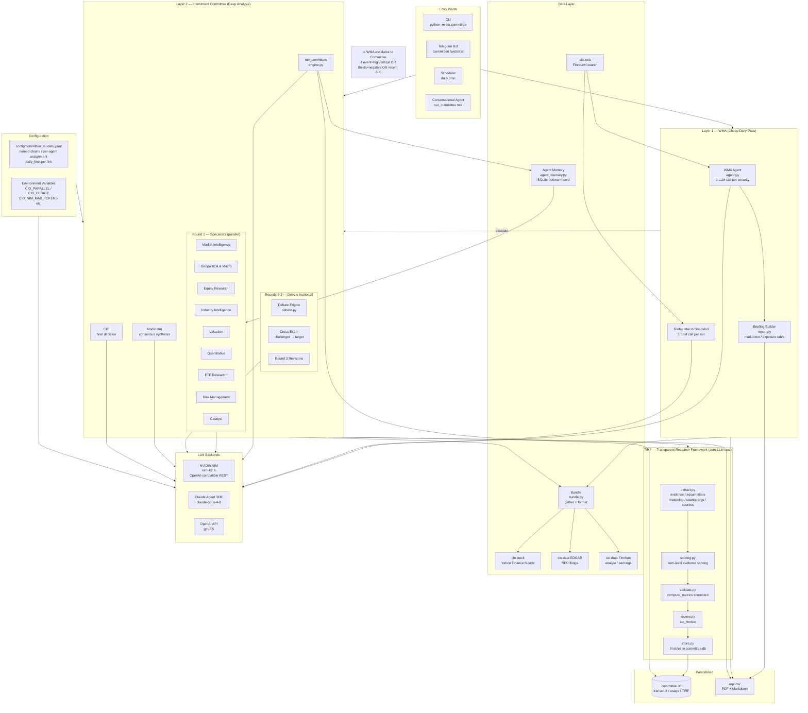
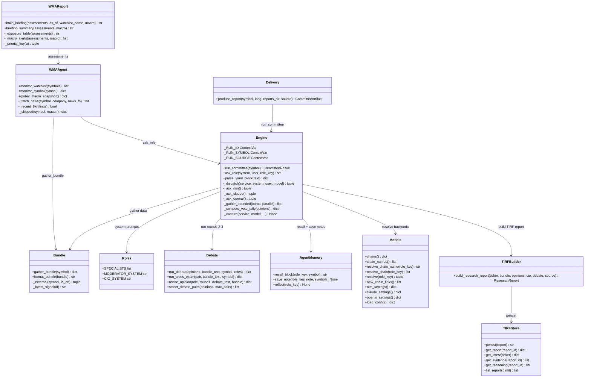
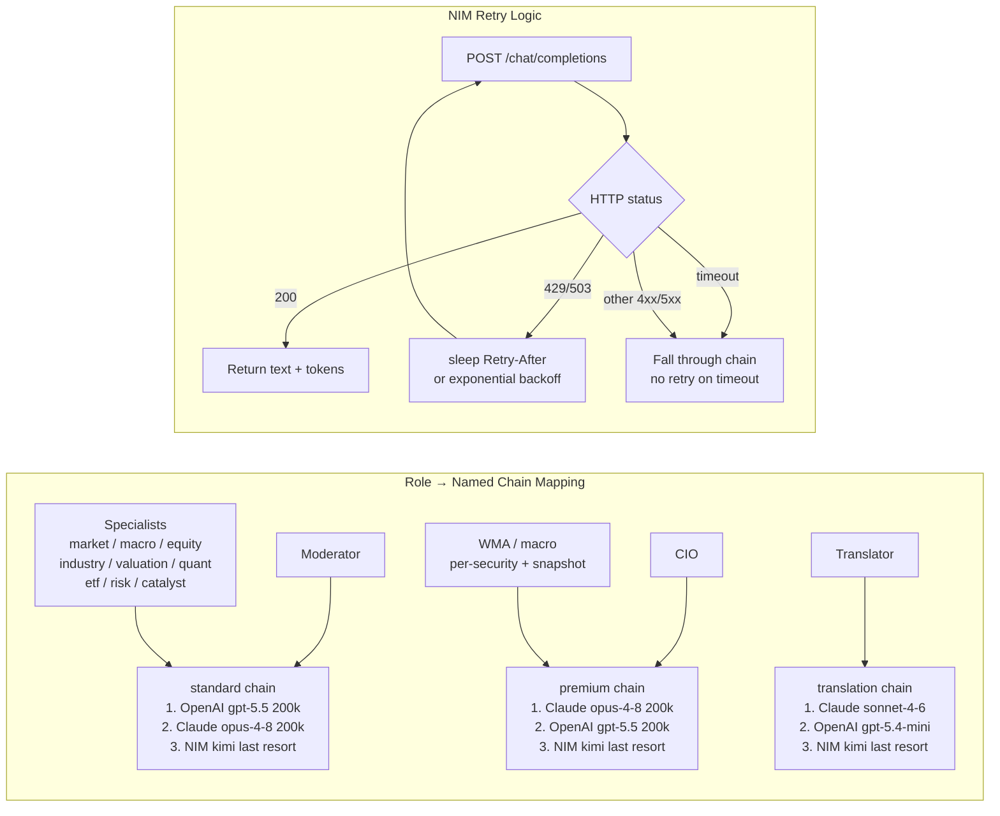
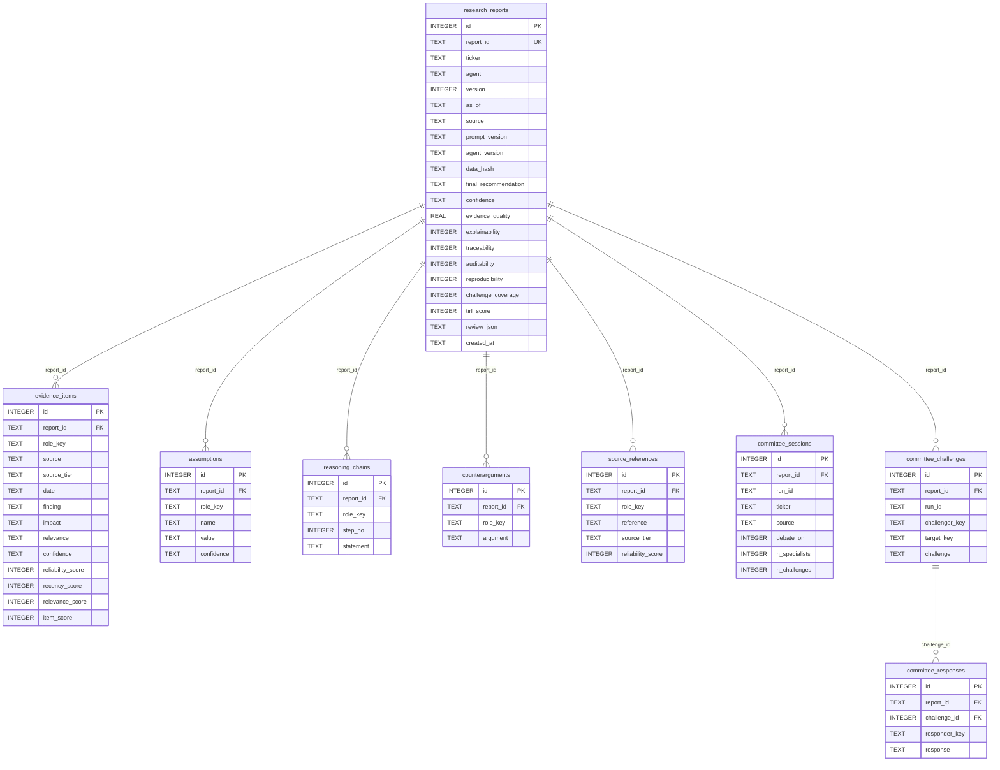
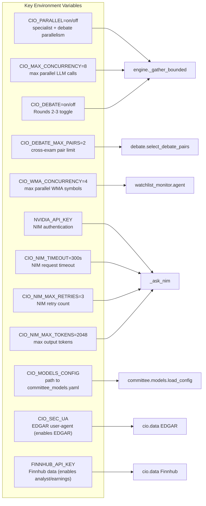

# Committee & WMA — System Design & Architecture

## Design Philosophy

The system is built for a **solo operator** on a constrained token budget, so its
architecture is shaped by three principles:

1. **Two-layer cost tiering.** A cheap daily *breadth* pass (WMA — 1 call/security)
   filters the watchlist down to the few names worth an expensive *depth* pass
   (Committee — ~20 calls/symbol). The WMA never auto-triggers the committee; it raises
   an `escalate` flag and the operator decides. This caps spend predictably.
2. **Offline-safe by construction.** Every external dependency — market data, EDGAR,
   Finnhub, Firecrawl, all three LLM backends, the PDF renderer, every DB write — is
   wrapped to degrade gracefully. Missing an API key disables a feature; it never
   crashes a run. The system is usable with *zero* optional integrations configured.
3. **Transparency without extra cost.** The TIRF layer turns each run into an auditable
   research report (evidence, assumptions, reasoning, counterarguments, sources,
   reproducibility pins, scorecards) using only the yaml the specialists already
   produced — **zero additional LLM calls**.

The model strategy reflects #1: every committee role is assigned a **named fallback chain**
— an ordered 3-link list of `{service, model, daily_limit?}` defined once in
`config/committee_models.yaml` and referenced by name per agent. Three settings ship:
`standard` (OpenAI head → Claude Opus → NIM, used by all specialists and moderator),
`premium` (Claude Opus head → OpenAI → NIM, used by CIO and WMA), and `translation`
(Claude Sonnet head → OpenAI mini → NIM, used by the translator). `ask_role` walks a
chain's links, skipping any link whose daily token budget is spent and falling through on
error/empty, so a backend outage or budget exhaustion never silences any role.

---

## Two-Layer Investment Intelligence Architecture

**The nine specialists** (`roles.py`) each carry a focused system prompt and a set of
required yaml output fields, but all share the same base rules (DATA is authoritative,
no invented figures, emit the TIRF deliverables, write a qualitative `memory_note`):

| Role key | Title | Distinct mandate |
|----------|-------|------------------|
| `market` | Market Intelligence | macro environment, capital flows |
| `macro` | Geopolitical & Macro | rates/inflation, conflicts, sanctions, commodities, FX, supply chain |
| `equity` | Equity Research | financial health, earnings quality, FWD_PE vs trailing |
| `industry` | Industry Intelligence | sector cycle, tailwinds/headwinds |
| `valuation` | Valuation | fair value, up/downside, FWD_PE as primary input |
| `quant` | Quantitative | TA signals, trend, momentum |
| `etf` | ETF Research | overlap, liquidity, tracking — **only runs for ETFs** |
| `risk` | Risk Management | designated opposition; worst-case, independent of consensus |
| `catalyst` | Catalyst | upcoming events, re-rating triggers, timelines |

Above them sit the **Moderator** (synthesises a written consensus + agreement score)
and the **CIO** (final recommendation integrating every input, with explicit
macro/geopolitical risk scores and bull/base/bear scenarios).

---

## Component Responsibilities

---

## LLM Backend Model Architecture

---

## Database Schema Overview

All committee-side state lives in **`committee.db`** (a sibling of the portfolio
`cio.db`), kept separate so the agents' accruing notes and embeddings don't bloat the
main database. It holds three families of tables: token usage, the sent/returned
transcript (dev dashboard), and the nine TIRF tables below. `research_reports` is the
parent; the other eight reference it by `report_id`. Versioning is per-ticker:
`version = MAX(version for ticker) + 1`, assigned inside the persist transaction (safe
because the runtime is single-operator — no write race). The schema is created
idempotently on every connect, and `_SCHEMA` uses `CREATE TABLE IF NOT EXISTS`, so a
fresh checkout self-initialises.

`agent_memory.py` also uses `committee.db` but for a different purpose: per-agent
persistent notes scoped `committee:{role_key}`, with 768-dim embeddings for semantic
dedup (`CIO_DEDUP_MAXDIST`, default 0.45 L2) and a tight injection budget
(`CIO_AGENT_MEM_BUDGET`, default 400 tokens). It runs in WAL mode so the parallel
specialists can write their notes near-simultaneously without blocking.

---

## Environment Configuration Map

