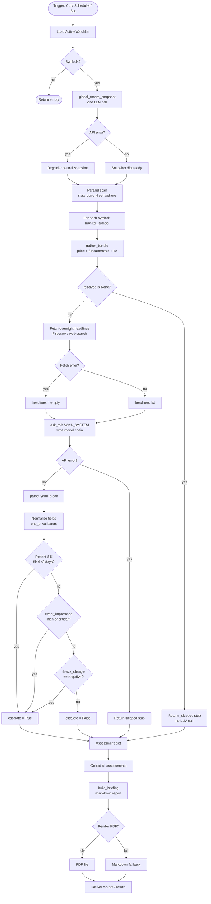
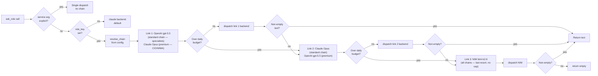

# Committee & WMA — Control Flow

Control flow covers decision points, branches, error paths, and execution routing.

## Reading This Document

The CIO Agent runs **two cooperating subsystems**:

- **WMA (Watchlist Monitoring Agent)** — `cio/watchlist_monitor/`. The *cheap daily
  pass*. Exactly **one LLM call per security** plus **one shared macro call per run**.
  Its job is breadth: scan the whole watchlist every morning, flag the few names that
  deserve deeper work. It never runs the committee itself — it sets an `escalate` flag
  and recommends `/committee SYMBOL`.
- **Committee** — `cio/committee/`. The *deep, expensive pass*. Up to ~20 LLM calls for
  a single symbol: 9 specialists, a bounded debate, a moderator, and a CIO, followed by
  a zero-cost TIRF audit layer. Invoked on demand for one symbol at a time.

Two control-flow invariants hold everywhere below and explain most of the branches:

1. **Nothing raises.** Every external touchpoint (data fetch, web search, LLM call,
   DB write, PDF render) is wrapped so a failure *degrades* to a partial/empty result
   instead of aborting the run. That is why almost every decision node has a
   "degrade / fallback" branch rather than an error exit.
2. **LLM calls are the cost unit.** Branches that avoid an LLM call (the `_skipped`
   stub, the "all votes identical → skip debate" gate, the deterministic vote tally,
   the entire TIRF layer) exist specifically to conserve the per-run call budget.

---

## WMA Control Flow

The WMA entry point is `monitor_watchlist()`. It first takes **one** global macro
snapshot for the whole run, then fans out across the watchlist under a semaphore
(`CIO_WMA_CONCURRENCY`, default 4) so a large list never stampedes the backends or
Firecrawl. Per security, the decisive branches are:

- **No price data** → return a `_skipped` stub with `escalate=False`. **No LLM call is
  spent** — there is nothing to reason about.
- **News fetch fails** → continue with an empty headline list; the LLM still produces
  an assessment from DATA alone.
- **Escalation decision** (the whole point of the layer) fires if *any* of three
  conditions hold: `event_importance ∈ {high, critical}`, `investment_thesis_change ==
  negative`, or a material-event **8-K filed within the last 3 days** (`_recent_8k`).
  The 8-K check is deterministic and catches thesis-moving events (M&A, guidance cut,
  CEO change) even when the LLM read looks calm.

---

## Committee Control Flow

`run_committee(symbol)` is the orchestrator (`engine.py`). It runs six numbered steps,
each guarded so a sub-failure never aborts the whole run:

1. **Data** — `gather_bundle`. If the symbol resolves to no data, abort early with a
   clean `CommitteeResult.error` (the *only* non-exception early exit).
2. **Round 1 specialists** — run in parallel (default) under a semaphore of
   `CIO_MAX_CONCURRENCY` (default 8). The `etf` specialist is dropped unless the symbol
   is actually an ETF. A specialist that throws is replaced by a neutral
   `vote=HOLD, confidence=0` fallback so the tally still has an entry.
3. **Debate (Rounds 2–3)** — *gated three ways*: skipped if `CIO_DEBATE=off`, skipped
   if all specialists already cast the same base vote (no genuine disagreement), and
   skipped if pair selection yields no usable pairs. This gate is a cost optimisation —
   there is no point debating unanimous opinions.
4. **Consensus** — a deterministic Python vote tally (`_compute_vote_tally`, no LLM)
   plus one serial moderator LLM call that synthesises a written consensus.
5. **CIO** — one serial call through the **chain-aware fallback** (see last diagram).
   The CIO integrates fundamentals + valuation + macro + geopolitical + risk.
6. **TIRF** — builds, scores, validates, reviews and persists the research report with
   **zero new LLM calls**. Wrapped so a TIRF failure leaves `tirf=None` and the
   committee result still returns.

Steps 2 and 3 are parallel; steps 4 and 5 are deliberately **serial** (the moderator
needs all final votes; the CIO needs the moderator's consensus).

```mermaid
flowchart TD
    ENTRY([Trigger: CLI / Bot /committee\nor WMA escalation]) --> SET_IDS[Set run_id + run_symbol\nin ContextVar]
    SET_IDS --> BUNDLE2[gather_bundle\nprice + fundamentals + TA\n+ EDGAR + Finnhub]
    BUNDLE2 --> NO_DATA2{resolved is None?}
    NO_DATA2 -- yes --> EARLY_ERR([CommitteeResult.error])
    NO_DATA2 -- no --> ETF_CHECK{is_etf?}

    ETF_CHECK -- yes --> ACTIVE_ROLES_ETF[active_roles includes etf specialist]
    ETF_CHECK -- no --> ACTIVE_ROLES_NOETF[active_roles excludes etf specialist]

    ACTIVE_ROLES_ETF --> SPECIALISTS
    ACTIVE_ROLES_NOETF --> SPECIALISTS

    SPECIALISTS[Round 1: run specialists\nin parallel\ngather_bounded] --> SPEC_EACH[For each specialist\nask_role + parse_yaml_block]
    SPEC_EACH --> SPEC_ERR{Error?}
    SPEC_ERR -- yes --> HOLD_FALLBACK[vote=HOLD conf=0\nfallback dict]
    SPEC_ERR -- no --> SPEC_OK[opinion dict with\nvote/confidence/reason/_parsed]
    HOLD_FALLBACK --> OPINIONS
    SPEC_OK --> OPINIONS

    OPINIONS[Round 1 opinions collected] --> DEBATE_GATE{CIO_DEBATE=on?}
    DEBATE_GATE -- off --> SKIP_DEBATE[debate_result.skipped=True\nuse Round 1 opinions]
    DEBATE_GATE -- on --> UNIQUE_VOTES{Unique votes > 1\ngenuine disagreement?}
    UNIQUE_VOTES -- no --> SKIP_DEBATE
    UNIQUE_VOTES -- yes --> SELECT_PAIRS[select_debate_pairs\nmax 2 pairs]

    SELECT_PAIRS --> PAIRS_EMPTY{Pairs found?}
    PAIRS_EMPTY -- no --> SKIP_DEBATE
    PAIRS_EMPTY -- yes --> R2[Round 2: cross-exam pairs\nin parallel]
    R2 --> CHALLENGE[challenger → target\nrebuttal call]
    CHALLENGE --> RESPONSE[target → responds\nserial within pair]
    RESPONSE --> TRANSCRIPT[Build debate_text transcript]
    TRANSCRIPT --> R3[Round 3: revise all specialists\nin parallel]
    R3 --> REVISE[revise_opinion per specialist\nwith debate context]
    REVISE --> REVISE_FAIL{Parse fail?}
    REVISE_FAIL -- yes --> KEEP_R1[Keep Round 1 opinion]
    REVISE_FAIL -- no --> REVISED_OP[Updated opinion]
    KEEP_R1 --> FINAL_OPINIONS
    REVISED_OP --> FINAL_OPINIONS
    SKIP_DEBATE --> FINAL_OPINIONS

    FINAL_OPINIONS[Final opinions\nRound 3 or Round 1] --> TALLY[_compute_vote_tally\ndeterministic Python]
    TALLY --> MODERATOR[Moderator LLM call\nserial]
    MODERATOR --> MOD_PARSE[parse_yaml_block → consensus]
    MOD_PARSE --> CIO_CALL[CIO LLM call\nchain-aware fallback\nserial]

    CIO_CALL --> CHAIN{Budget\nexhausted?}
    CHAIN -- "try Claude (link 1)" --> CLAUDE_CALL[claude-agent-sdk call\npremium chain link 1]
    CLAUDE_CALL --> CLAUDE_OK{Non-empty?}
    CLAUDE_OK -- yes --> CIO_DONE
    CLAUDE_OK -- no --> CHAIN
    CHAIN -- "try OpenAI (link 2)" --> OPENAI_CALL[OpenAI API call\npremium chain link 2]
    OPENAI_CALL --> OPENAI_OK{Non-empty?}
    OPENAI_OK -- yes --> CIO_DONE
    OPENAI_OK -- no --> CHAIN
    CHAIN -- "try NIM (link 3)" --> NIM_CALL[NIM API call\npremium chain link 3]
    NIM_CALL --> NIM_OK{Non-empty?}
    NIM_OK -- yes --> CIO_DONE
    NIM_OK -- no/timeout --> CHAIN
    CHAIN -- exhausted --> EMPTY_CIO["" empty result]
    EMPTY_CIO --> CIO_DONE

    CIO_DONE[CIO response parsed] --> MEM_NOTES[Save memory_note\nfor each role\nLLM-sanitized]
    MEM_NOTES --> REFLECT[agent_memory.reflect\npromote hot notes]
    REFLECT --> TIRF[TIRF layer\nbuild_research_report\nzero LLM cost]
    TIRF --> TIRF_FAIL{TIRF error?}
    TIRF_FAIL -- yes --> TIRF_NONE[tirf_report = None\nrun continues]
    TIRF_FAIL -- no --> TIRF_PERSIST[tirf.persist to committee.db]
    TIRF_NONE --> RESULT
    TIRF_PERSIST --> RESULT

    RESULT([CommitteeResult returned]) --> BUILD_REPORT[build_report markdown]
    BUILD_REPORT --> TRANSLATE{lang=tc?}
    TRANSLATE -- yes --> ZH[translate_report Chinese]
    TRANSLATE -- no --> EN_ONLY[skip translate]
    ZH --> RENDER_PDF
    EN_ONLY --> RENDER_PDF
    RENDER_PDF{Render PDF} -- ok --> PDF[PDF file]
    RENDER_PDF -- fail --> MDFB[Markdown fallback]
    PDF --> DELIVER[Deliver: Telegram / return]
    MDFB --> DELIVER
```

---

## Backend Chain Fallback (ask_role)

`ask_role` is the **single LLM entry point** for the entire system (both WMA and
committee route through it; tests monkeypatch this one function). Resolution order:

1. **Explicit `service` argument** → single dispatch, no chain (legacy/override path).
2. **`role_key` set** → `resolve_chain(role_key)` returns the role's **named 3-link chain**
   from `committee_models.yaml`. Three shipped settings: `standard` (OpenAI → Claude →
   NIM, used by all 9 specialists and moderator), `premium` (Claude → OpenAI → NIM,
   used by CIO and WMA), `translation` (Claude Sonnet → OpenAI mini → NIM, used by
   translator). Every role has a chain; none are single-service.
3. **No `role_key`** → default to the Claude backend.

For each chain link the loop applies two checks before accepting it:

- **Budget gate** — `usage.over_budget(service, daily_limit)`. If the service has
  burned through its `daily_limit` tokens today, the link is skipped (logged) and the
  next one is tried. The shipped `standard`/`premium` settings give 200k/day to their
  first two links (OpenAI + Claude), with NIM as the uncapped last resort. Limits are
  per-service across *all* chains that reference that service.
- **Non-empty result** — an empty string means "key missing / API error / limit
  notice"; the loop falls through to the next link. A non-empty string is returned
  immediately.

Every accepted call records token usage (`usage.record`) and captures the full
sent/returned transcript (`_capture` → `transcript.record`) tagged with the run's
`run_id`, `symbol`, and `source` for the dev dashboard. The whole chain returns `""`
only when every link is exhausted.

The NIM backend additionally retries HTTP **429/503** up to `CIO_NIM_MAX_RETRIES`
(default 3), honouring `Retry-After` when present else exponential backoff. A
**ReadTimeout is *not* retried** — the model is still working, so retrying just burns
another attempt; the call falls through to the next chain link instead.

