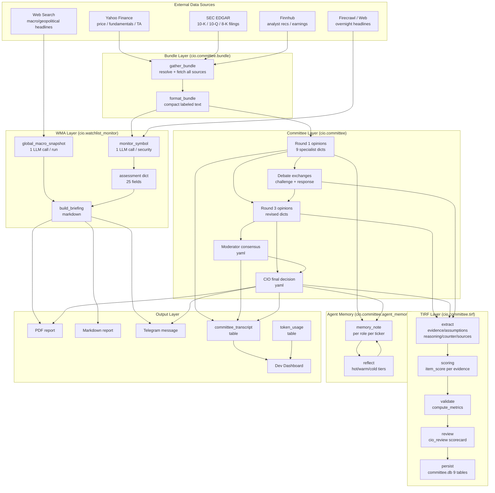
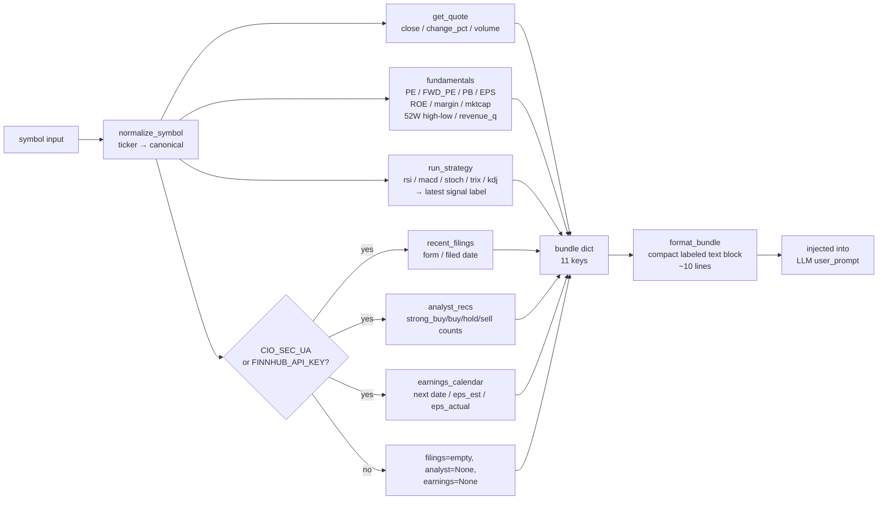
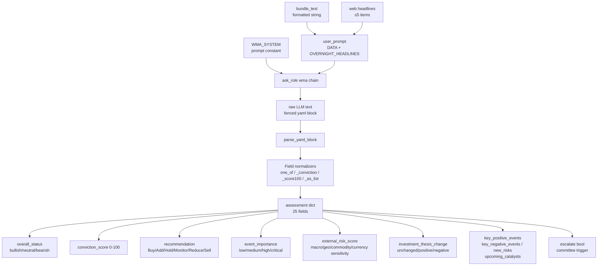
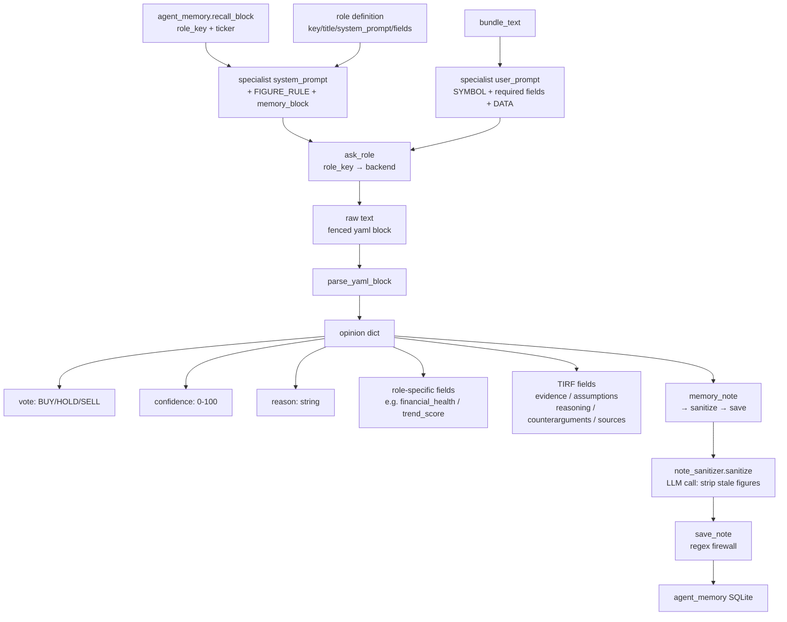
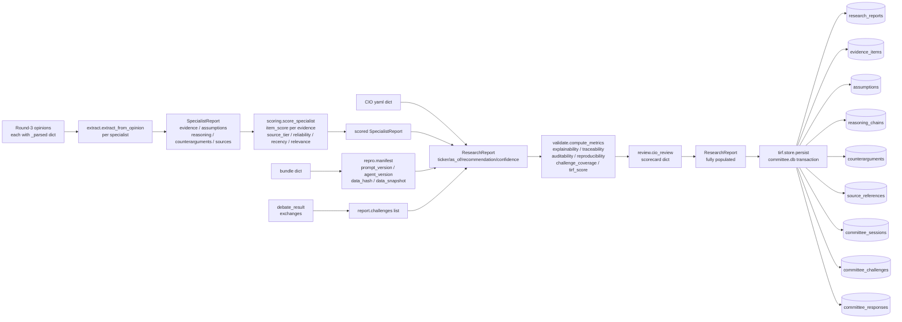

# Committee & WMA — Data Flow

Data flow tracks how information is gathered, transformed, and consumed at each stage.

## The Central Data Object: the Bundle

Almost everything starts from one structure — the **bundle** produced by
`gather_bundle(symbol)`. It is a plain dict with 11 keys:

| Key | Source | Notes |
|-----|--------|-------|
| `symbol` / `resolved` | `cio.stock.normalize_symbol` | `resolved=None` is the "no data" sentinel that aborts a run |
| `quote` | `cio.stock.get_quote` | close, change_pct, volume |
| `fundamentals` | `cio.stock.fundamentals` | PE, FWD_PE, PB, EPS, ROE, margin, market cap, 52W range, quarterly revenue; also carries `quoteType` used to set `is_etf` |
| `ta_signals` | `cio.stock.run_strategy` | latest label for rsi / macd / stoch / trix / kdj |
| `is_etf` | derived | drops the ETF specialist when false |
| `as_of` | `datetime.utcnow()` | snapshot timestamp; feeds TIRF recency scoring |
| `filings` | `cio.data` EDGAR | opt-in (`CIO_SEC_UA`); recent 10-K/10-Q/8-K |
| `analyst` | `cio.data` Finnhub | opt-in (`FINNHUB_API_KEY`); buy/hold/sell counts; skipped for ETFs |
| `earnings` | `cio.data` Finnhub | opt-in; next report date + EPS estimate/actual |

`format_bundle(bundle)` then renders this dict into a **compact ~10-line labelled text
block** that is what actually gets injected into LLM prompts. Missing fields render as
`N/A (no source)` — the prompts forbid the models from inventing numbers, so a missing
field stays missing rather than being hallucinated. The bundle is the *authoritative
source of numbers*; everything else (news, macro, catalysts) is explicitly labelled
qualitative judgement.

The bundle is shared verbatim between the WMA (`monitor_symbol`) and the committee
(`run_specialist`), which is why a single data layer serves both subsystems.

---

## Overall System Data Flow

---

## Bundle Data Flow (gather_bundle)

---

## WMA Assessment Data Flow

---

## Committee Specialist Data Flow

---

## TIRF Data Flow

TIRF (Transparent Investment Research Framework) is the audit layer. Its defining
property: it adds **zero LLM calls**. Every specialist already emits its evidence,
assumptions, reasoning, counterarguments, and sources *in the same yaml block* as its
vote (enforced by `_TIRF_RULE` in the role prompts). `run_specialist` stashes that raw
parse under `_parsed`, and TIRF reads it back out — no second model round-trip.

The pipeline is `extract → score → validate → review → persist`:

- **extract** (`extract.py`) — tolerantly coerces the messy yaml each model produces
  (list-of-dicts, list-of-strings, maps, bare scalars) into typed
  `SpecialistResearch` objects. Missing keys yield empty lists, which `validate` later
  scores as *low completeness* rather than erroring.
- **score** (`scoring.py`) — each evidence item gets a 0–100 `item_score` =
  **0.50·reliability + 0.30·relevance + 0.20·recency**.
  - *Reliability* is classified from the free-text source: SEC filing 100, earnings
    call 90, company guidance 85, industry research 80, news 60, social media 20,
    unknown 50.
  - *Recency* vs the bundle's `as_of`: <7 days 100, <30 days 80, <90 days 60, older or
    undated or future-dated 30.
  - *Relevance*: direct 100, related 70, indirect 40.
- **validate** (`validate.py`) — rolls per-specialist sub-metrics into the **five
  report-level success metrics** (each 0–100): explainability, traceability,
  auditability, reproducibility, challenge_coverage. Their mean is `tirf_score`. The
  completeness gates are 3 evidence items and 3 counterarguments per specialist.
- **review** (`review.py`) — the **CIO review scorecard**: five dimensions (evidence
  quality, assumption quality, counterargument coverage, source reliability, reasoning
  consistency) each checked against a pass threshold; verdict is `pass` only if all
  pass, else `review` with human-readable flags.
- **repro** (`repro.py`) — pins reproducibility: a canonical, key-sorted JSON snapshot
  of the decision-relevant bundle fields plus its `sha256`, and `prompt_version`
  (`tirf-1.0`) / `agent_version` (`committee-1.0`) stamps. Identical inputs ⇒ identical
  hash, so a run can be replayed and audited.
- **persist** (`store.py`) — writes the report and all children into **9 tables in
  `committee.db` in a single transaction**, assigning a per-ticker incrementing
  `version`. Never raises — a persistence failure logs and the run still completes.

