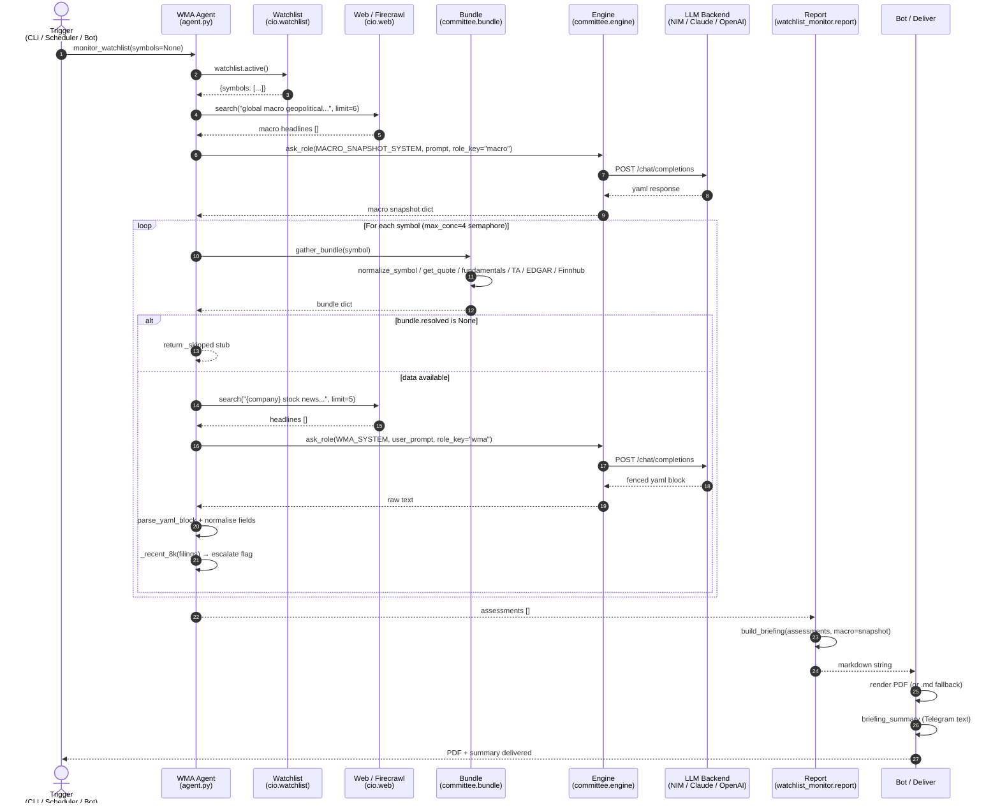
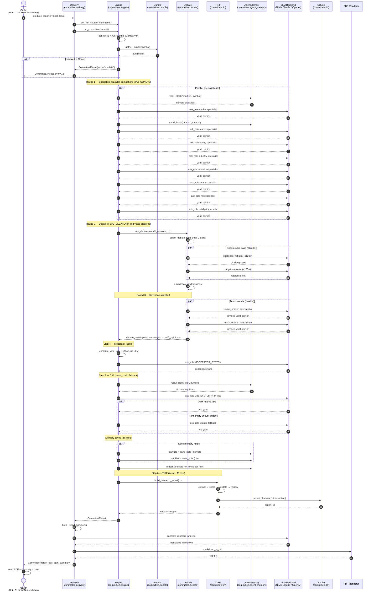
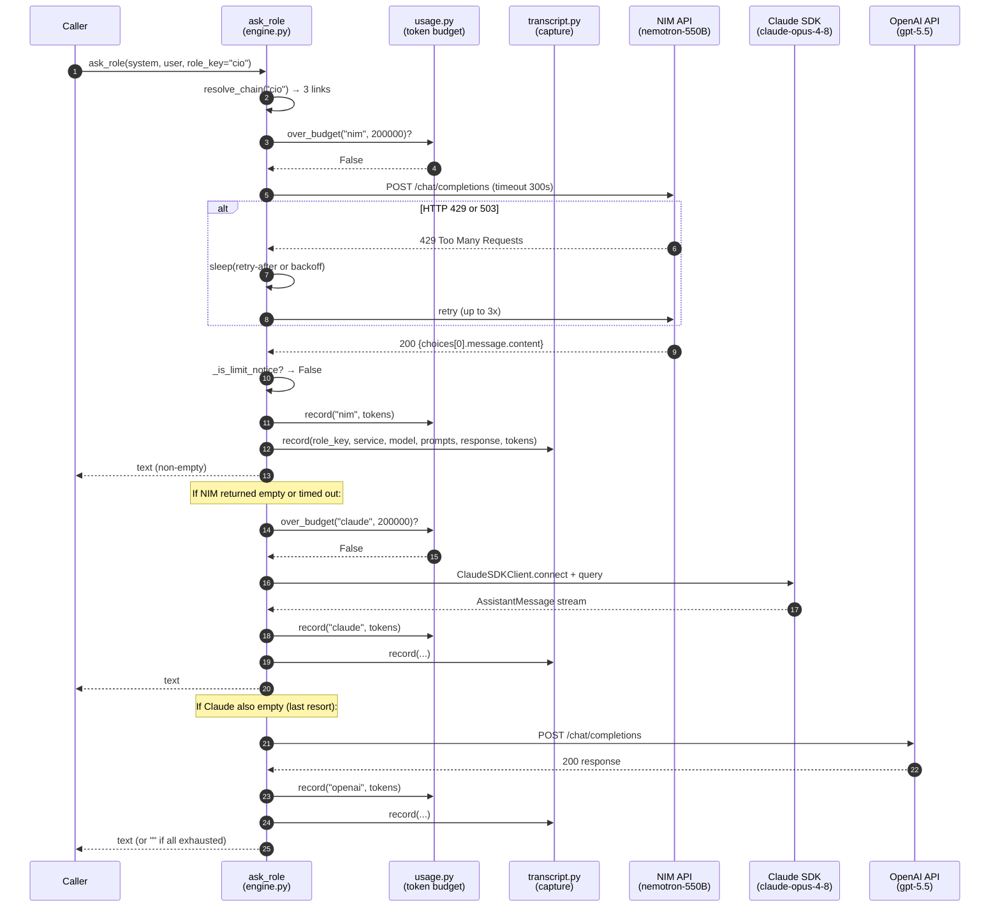

# Committee & WMA — Sequence Diagrams

Sequence diagrams show the chronological message exchange between components.

## How to Read the Parallelism

Mermaid `par` blocks below show calls that run **concurrently**, but real concurrency
is bounded by semaphores, not unlimited:

- WMA symbol scan: `CIO_WMA_CONCURRENCY` (default **4**) concurrent securities.
- Committee Round 1, debate pairs, Round 3 revisions: `CIO_MAX_CONCURRENCY` (default
  **8**) concurrent LLM calls, via `_gather_bounded` which preserves result order.
- Moderator and CIO are **always serial** — each depends on the previous step's output.

When `CIO_PARALLEL=off`, every `par` block degrades to sequential `await`s with
identical results, just slower. The diagrams show the default (parallel) timeline.

A note on the `ContextVar` set at the start of `run_committee`: `run_id`, `run_symbol`,
and `run_source` propagate automatically into the spawned parallel tasks, so every
captured transcript line is correctly grouped even though the calls interleave.

---

## WMA Full Run Sequence

**WMA timeline notes.** The macro snapshot (`global_macro_snapshot`) is taken once,
up front, and reused for the whole briefing — it is *not* per security, which keeps the
layer cheap. Each `monitor_symbol` spends at most one `wma`-chain LLM call; a symbol
with no price data short-circuits to a `_skipped` stub and spends nothing. The escalate
flag computed per security is surfaced in `briefing_summary` as a "⚠️ Consider
/committee: …" line, the hand-off point from Layer 1 to Layer 2.

---

## Committee Full Run Sequence (with Debate)

**Committee timeline notes.** The debate is conditional: `run_debate` is only reached
when Round-1 votes genuinely disagree, and even then `select_debate_pairs` caps the
cross-exam at `CIO_DEBATE_MAX_PAIRS` (default 2) pairs — typically *most-bearish vs
most-bullish* plus the PRD-mandated *risk vs valuation*. Within a pair the challenge and
response are serial (the response must see the challenge); across pairs they run
concurrently. Round 3 re-polls **every** specialist (not just the debaters) with the
full transcript so each may revise or hold. Memory writes (`sanitize → save_note`) and
`reflect` happen after the CIO call; TIRF runs last and is fully deterministic.

---

## Single ask_role Chain Fallback Sequence

