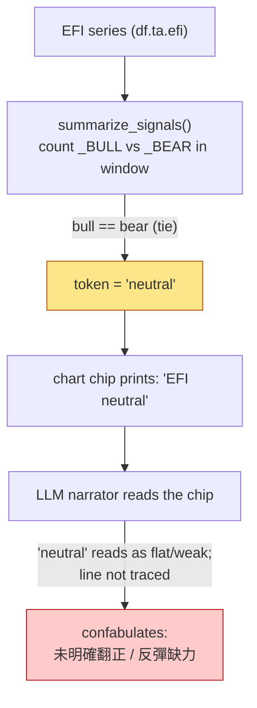
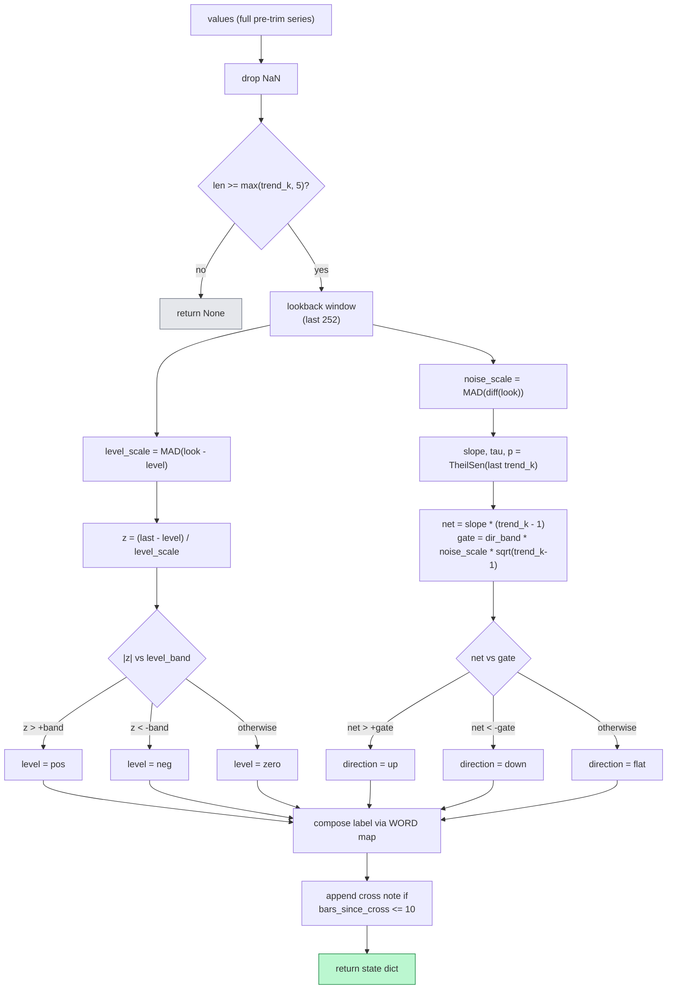
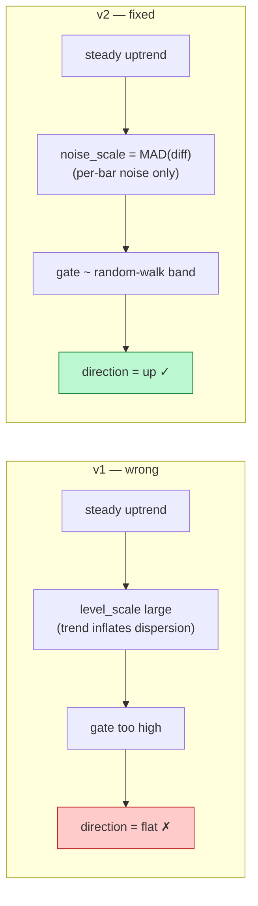
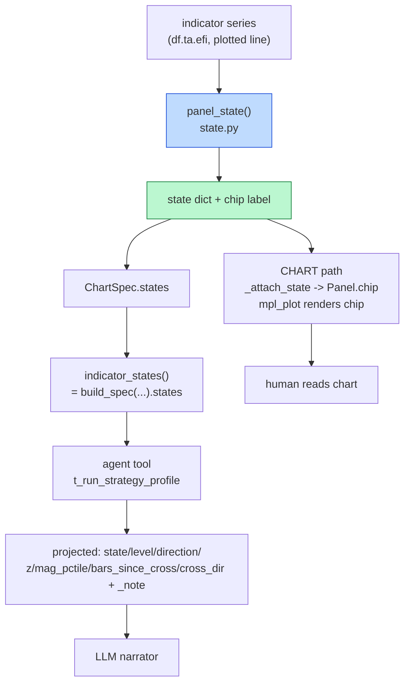
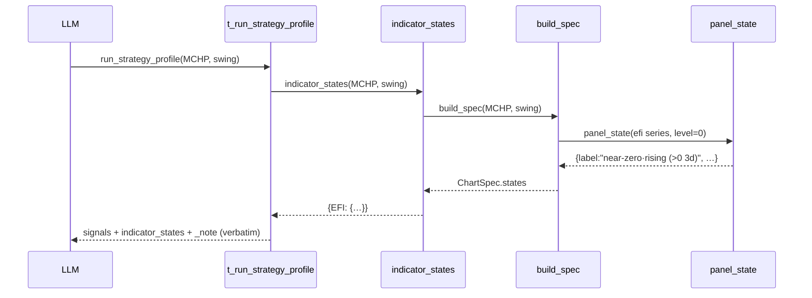

# Deterministic 2-D Oscillator State — Technical Report

**Scope:** replace the single overloaded verdict word (`bull`/`bear`/`neutral`) printed
on indicator panels — and handed to the LLM narrator — with a deterministic, two-
dimensional state (level × direction) plus provenance. Covers `cio/stock/viz/state.py`
(new), `cio/stock/viz/spec.py`, `cio/stock/viz/mpl_plot.py`, `cio/stock/viz/__init__.py`,
the agent tool in `cio/agent.py`, and `tests/test_viz_state.py`.

**Origin:** investment-committee conversation `conv_turns` 296–297 in `data/cfo.db`, a
swing-chart read of **MCHP** as of 2026-06-16 (`data/charts/indicators_MCHP_20260616_160736.png`).

**Result:** the chart chip and the agent's text tool now emit the *same* deterministic
state from one source of truth. The specific failure that motivated the work — the
narrator claiming EFI `未明確翻正 / 反彈缺力` ("never clearly turned positive / rebound
lacks force") while the plotted line had been above zero for ~3 days — is structurally
prevented. **Full suite: 1039 passed, 6 skipped** (11 new tests).

---

## 1. Background and motivation

### 1.1 The incident

The committee turn `conv_turns#297` narrated the MCHP swing chart. Its EFI paragraph read:

> **EFI — neutral** — 從負軸回到 0 附近，但**未明確翻正** … **量能未確認 = 反彈缺力**

Translated: *"returned from the negative axis to near zero, but not clearly turned
positive … volume unconfirmed = rebound lacks force."*

The plotted EFI (Elder Force Index) line told a different story. Reading the chart pixels:

| Feature (right edge of panel, 1e7 scale) | Value |
|---|---|
| Deep dip (~06/03) | ≈ −1.8e7 |
| Zero-cross up | ≈ 06/12 |
| Peak | ≈ +1.0e7 (≈ 06/14–15) |
| Last bar (06/16, the "as of") | ≈ +0.1e7 — faded, still ≥ 0 |

EFI **had** clearly crossed positive and run above zero for ~3 bars. The claim
`未明確翻正` was simply false; `反彈缺力` was supported only by the single last-bar fade.

### 1.2 Why this matters

The EFI verdict fed three downstream decisions in the same message — the "wait for a
pullback / don't chase / don't add" gate, and an explicit *"add only when EFI 翻正"*
trigger. A mis-stated indicator silently corrupted position logic.

---

## 2. Root-cause analysis

The error was **not** in the statistics engine. It was in the *handoff representation*.



Three compounding facts:

1. **The token was coarse but defensible.** `summarize_signals` counts `_BULL` vs `_BEAR`
   crossing events in a trailing window. EFI had both a bear-cross (the dip) and a bull-
   cross (the recovery) inside the window → a tie → `neutral`. As a *window-net* statement
   that is true. It says nothing about *current direction*.

2. **One token collapsed two orthogonal facts.** "Where is the line relative to zero?"
   (**level**) and "which way is it moving?" (**direction**) are independent. `neutral`
   answered neither cleanly, and the reader could not recover either.

3. **The word is overloaded.** `neutral` connotes *flat / weak / no signal*. The narrator
   anchored on that connotation instead of tracing the plotted line — exactly the failure
   mode LLMs are prone to (see §4.2). It then invented `缺力` to rationalise the word.

The bug is a **representation** bug: a lossy, ambiguous, single-token summary handed to a
consumer that fills gaps by guessing.

---

## 3. Why the naïve fixes are wrong

Two "obvious" fixes were considered and rejected on statistical grounds.

### 3.1 Count-based `mixed`/`flat` split

*"If both `_BULL` and `_BEAR` fired in the window, print `mixed` instead of `neutral`."*

- **Order-blind.** A bear-cross 18 bars ago + a bull-cross 2 bars ago is labelled `mixed`,
  but the recent bull dominates. Equal-weight counting discards recency — the same flaw
  that produced the original bug.
- **Window-length sensitive.** The verdict flips between a 20- and 30-bar window. No
  principled choice; pure researcher degrees-of-freedom.
- **No significance gate.** Zero-crossings of a noisy oscillator fire by chance; counting
  them counts noise.

### 3.2 Two-point slope + raw level

*"Send the LLM the slope `(yₜ − yₜ₋ₖ)`, the raw value, and the cross age."*

- **Two-point slope is a noise amplifier.** `Var(yₜ − yₜ₋ₖ) ≈ 2σ²`; on a quiet oscillator
  the *sign* is near a coin flip. It is the worst available slope estimator.
- **EFI is non-stationary and not scale-free.** `EFI = EMA(period) of (ΔClose × Volume)`,
  in units of shares·$. `+1.0e7` vs `+0.1e7` is meaningless without normalising against the
  ticker's own volume/price regime; values are not comparable across time or symbols.
- **Slope sign ≠ state.** EFI can rise while still deeply negative (recovering), or fall
  while still positive (fading from a peak — exactly MCHP 06/16). One arrow collapses the
  2-D fact again.
- **No hysteresis.** Bar-to-bar sign flips make any single arrow chatter.

---

## 4. Design principles

### 4.1 Do the statistics in code; let the LLM narrate

The fix inverts the data flow: **all numeric reasoning is deterministic Python; the model
receives a finished categorical state and is told not to re-derive it.**

### 4.2 Evidence base

This is not stylistic preference — it is what the literature supports.

- LLMs read raw numeric series poorly: tokenisation splits numbers, "lost-in-the-middle"
  degrades long sequences, and pretraining contains little time-series data, so models
  capture only coarse patterns (arXiv 2502.01477; arXiv 2510.01111).
- Removing the LLM from time-series forecasters, or replacing it with a single attention
  layer, does not degrade — and often improves — accuracy: the models do not actually
  represent the sequence (NeurIPS 2024, arXiv 2406.16964).
- Where LLMs *do* add value in finance, it is as **narrators over pre-computed, discretised
  signals**, not as number crunchers (Frontiers/PMC survey; multi-agent TA, arXiv 2506.16813).

Conclusion: handing the model *more raw numbers* (slope, level) would re-introduce the same
class of failure. The correct handoff is a **single discrete label + minimal provenance**.

### 4.3 Robust estimators

- **Scale** — Median Absolute Deviation (MAD), robust to the volume-spike outliers EFI is
  full of, and scale-free across regimes.
- **Trend** — Theil-Sen slope (median of pairwise slopes; barely moved by outliers) rather
  than OLS or two-point. Kendall τ / p reported as a Mann-Kendall trend-existence proxy.
- **Hysteresis** — dead-bands in MAD units on both axes, so a value resting on the line
  reads `near-zero` and a sub-noise drift reads `flat`, instead of chattering.

---

## 5. The 2-D state model

A level-centred oscillator is described by two independent axes, composed into one word
plus an optional zero-cross note.

### 5.1 The state matrix

|              | **direction = up** | **direction = flat** | **direction = down** |
|--------------|--------------------|----------------------|----------------------|
| **level = pos**  | positive·building   | positive·steady       | positive·fading       |
| **level = zero** | near-zero·rising    | neutral·flat          | near-zero·falling     |
| **level = neg**  | negative·recovering | negative·steady       | negative·deepening    |

MCHP 06/16 lands at **near-zero·rising** with a cross note → `near-zero·rising (>0 3d)`.
That label cannot be read as `未明確翻正`: it explicitly states the line crossed above zero
3 bars ago.

### 5.2 Field contract

`panel_state(values, level=0.0, …)` returns:

| field | meaning |
|---|---|
| `level` | `pos` / `neg` / `zero` (MAD dead-band around the line) |
| `direction` | `up` / `down` / `flat` (Theil-Sen, gated vs noise) |
| `z` | `(last − level) / level_scale` — robust standardised distance from the line |
| `mag_pctile` | percentile of `|last − level|` within the lookback |
| `slope`, `tau`, `mk_p` | Theil-Sen slope; Kendall τ and p (trend-existence provenance) |
| `bars_since_cross`, `cross_dir` | bars since the last sign-vs-level cross, and its direction |
| `peak`, `peak_bars_ago` | extreme since the cross, and how long ago |
| `label`, `color_key` | composed chip string; `pos`/`neg`/`zero` for colour |

Note the deliberate omission from the *projected* handoff (§7): the raw `slope` and `peak`
floats are **not** sent to the LLM — they are exactly the unbounded magnitudes the model
misreads. The label and bounded provenance go; the raw numbers stay in code.

---

## 6. Algorithm

### 6.1 Pipeline



### 6.2 Level — dead-banded sign

```
level_scale = MAD(look − level)          # dispersion of the LEVEL
z           = (last − level) / level_scale
pos  if z >  level_band                   # default 0.5 MAD
neg  if z < −level_band
zero otherwise                            # the hysteresis dead-band
```

### 6.3 Direction — Theil-Sen vs a random-walk band

```
slope = TheilSen(last trend_k bars)       # robust; default trend_k = 7
net   = slope · (trend_k − 1)             # modeled change across the window
gate  = dir_band · noise_scale · √(trend_k − 1)
up   if net >  gate
down if net < −gate
flat otherwise
```

`net` is the Theil-Sen *modeled change* over the window; `gate` is `dir_band` random-walk
standard deviations of that change. A drift counts as a trend only if it exceeds what noise
alone would produce — a built-in significance gate that needs no clean monotonicity.

`_scale()` degrades gracefully: MAD → std → 1.0, so a constant series never divides by zero.

---

## 7. The mid-build design bug (and its fix)

The first implementation gated **direction** against `level_scale` (dispersion of the
*level*). A unit test of a clean positive ramp failed: it was classified `flat`.

**Why:** for a trending series the level dispersion is dominated by the trend itself, so the
threshold scales with the very signal it is meant to detect. The trend inflates its own
gate and hides.



**Fix:** gate against **per-bar noise** = `MAD(diff(look))`, comparing the window's modeled
drift to a random-walk displacement band (`noise_scale · √(trend_k−1)`). The test caught
this before it shipped; it became `test_clearly_positive_building` (with a realistic noisy
ramp, since a perfectly noiseless ramp is a degenerate `noise_scale = 0` case handled by the
`_scale` fallback).

---

## 8. Integration — one source of truth, two consumers



### 8.1 Chart path

`_attach_state(panel)` in `spec.py` computes the state on the **full, pre-trim** series (so
the MAD lookback has history) and stores `panel.chip` / `panel.state`. `mpl_plot.py` prefers
the chip over the bare verdict and colours it by level (`_state_color`). The chip the human
sees and the line are guaranteed consistent because the state is computed from the *plotted*
series.

### 8.2 Text path

`indicator_states(symbol_or_df, profile)` is a thin wrapper that returns
`build_spec(...).states` — literally the chart's own states, so the text tool and the chart
**cannot diverge**. `t_run_strategy_profile` projects each state to a compact, LLM-safe set
of fields and attaches a `_note`:

> *indicator_states are computed deterministically in code … Use each 'state' label
> verbatim; do NOT re-infer an indicator's direction from raw numbers.*

The prompt constraint travels *with the data* rather than living in a distant system prompt.



### 8.3 Scope guard (fail-closed)

State is attached **only** to zero-centred single-line panels: `len(panel.lines) == 1` and
`0.0` in the panel's hlines. EFI and CMF qualify; KDJ (multi-line), Fisher (two-line),
Squeeze and MACD are untouched and keep their existing verdict. Every entry point is wrapped
so any failure degrades to "no chip / empty states" — never a broken chart or a broken tool.

---

## 9. Before / after (MCHP)

| | Before | After |
|---|---|---|
| Chart chip | `EFI  neutral` | `EFI  near-zero·rising (>0 3d)` |
| Tool output | `"EFI": "neutral"` | `{state:"near-zero·rising (>0 3d)", level:zero, direction:up, cross_dir:up, bars_since_zero_cross:3}` + verbatim-use note |
| Narrator can say `未明確翻正`? | yes (word invited it) | no (label states the cross) |

---

## 10. Testing

`tests/test_viz_state.py` — 11 tests:

- **Unit:** clearly-positive-building, clearly-negative-deepening, MCHP-shape (cross-up then
  fade), too-short → None, NaN/flat safety, determinism.
- **Wiring:** EFI panel gets a chip that is not a bare verdict word; multi-line panel (KDJ)
  gets no state (scope guard); `indicator_states` equals the chart's `states` (single-source
  invariant); `indicator_states` fail-safe on an empty frame; render-with-chip does not raise.

Full repository suite: **1039 passed, 6 skipped** — no regressions.

---

## 11. Files changed

| File | Change |
|---|---|
| `cio/stock/viz/state.py` | **new** — `panel_state()` + robust helpers (`_scale`, `_theil_sen`, `_WORD`) |
| `cio/stock/viz/spec.py` | `Panel.chip/.state`, `ChartSpec.states`, `_attach_state()`, `indicator_states()` |
| `cio/stock/viz/mpl_plot.py` | `_state_color()`; render chip in preference to the verdict word |
| `cio/stock/viz/__init__.py` | export `indicator_states` |
| `cio/agent.py` | `t_run_strategy_profile` emits `indicator_states` + `_note` |
| `tests/test_viz_state.py` | **new** — 11 tests |

---

## 12. Limitations and future work

- **Zero-centred single-line panels only.** Bounded oscillators (KDJ, RSI) and two-line
  panels (Fisher, MACD) still use the verdict word. Extending the model to a band-centred
  variant (e.g. RSI around 50, ER around 0.5) is straightforward but deferred.
- **Fixed parameters.** `trend_k=7`, `level_band=dir_band=0.5`, `lookback=252` are sensible
  defaults, not tuned per indicator. A small calibration pass could set per-indicator bands.
- **EFI normalisation tension.** Normalising preserves comparability but, per Elder, dilutes
  raw "force" intensity. Resolved here by classifying on the normalised view while plotting
  the raw line — two representations, one truth — but worth revisiting if raw magnitude ever
  needs to drive a decision.
- **Cross-bar identity.** The text tool reloads data via `build_spec`; if the chart and the
  tool are run against different history windows the labels are *algorithmically* identical
  but not guaranteed bar-identical. Passing a shared frame would close that gap.

---

## 13. References

1. *Achieving Time Series Reasoning Requires Rethinking Model Design, Tasks Formulation, and Evaluation* — arXiv 2502.01477.
2. *TsLLM: Augmenting LLMs for General Time Series Understanding and Prediction* — arXiv 2510.01111.
3. *Are Language Models Actually Useful for Time Series Forecasting?* — NeurIPS 2024, arXiv 2406.16964.
4. *Large Language Models in equity markets: applications, techniques, and insights* — Frontiers / PMC12421730.
5. *Integrating Traditional Technical Analysis with AI: A Multi-Agent LLM-Based Approach* — arXiv 2506.16813.
6. Theil-Sen estimator — robustness to outliers (James Howard, 2025); `pyMannKendall` (non-parametric trend tests).
7. Elder Force Index — normalisation trade-offs (Enlightened Stock Trading).

---

*Source incident: `conv_turns` 296–297, `data/cfo.db`. Chart: `data/charts/indicators_MCHP_20260616_160736.png`.*
