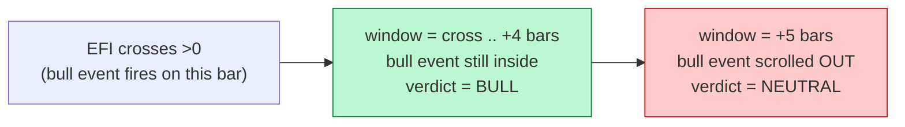
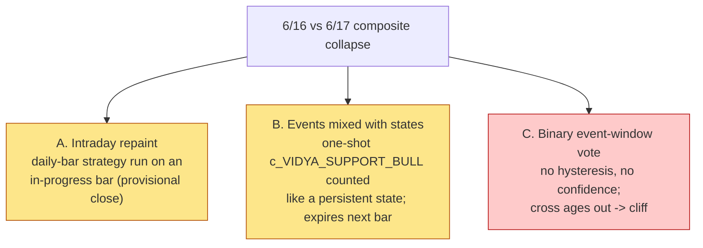
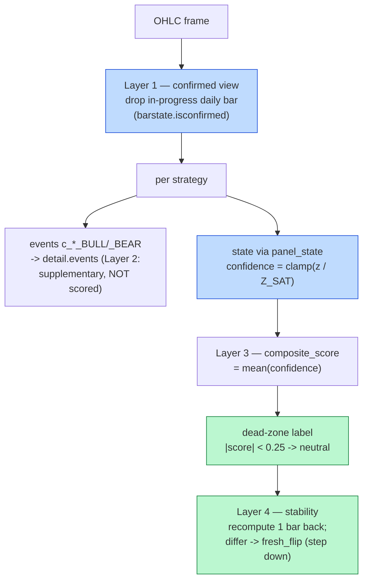
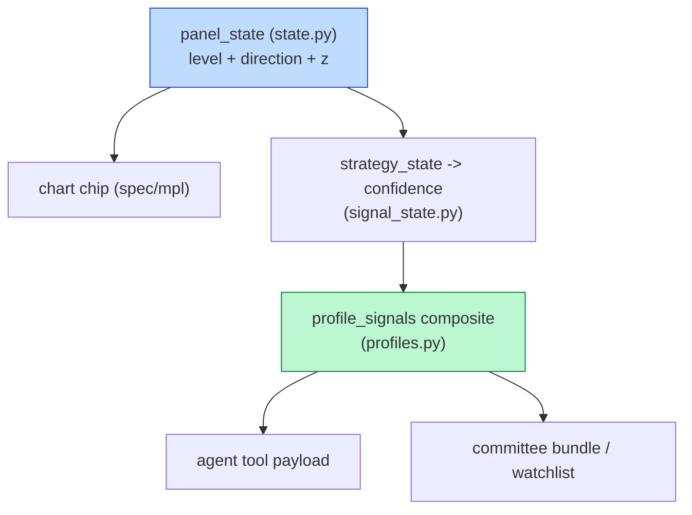
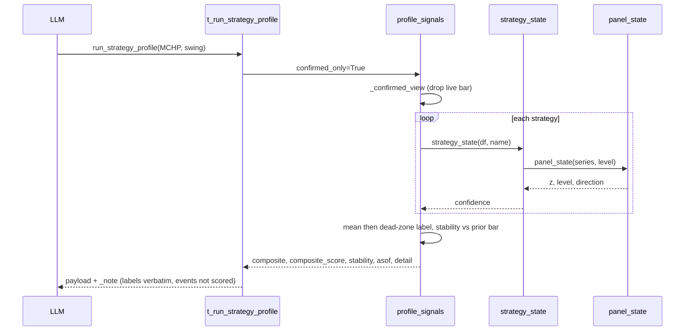

# Continuous State-Based Composite — Technical Report

**Scope:** replace the strategy-profile composite's binary **event-window vote** with a
**continuous, state-based, dead-zoned** score, evaluated on **confirmed bars only**, with
events demoted to supplementary triggers and a stability flag on regime flips. Covers
`cio/stock/signal_state.py` (new), `cio/stock/profiles.py`, `cio/stock/__init__.py`,
`cio/stock/viz/spec.py`, the agent tool in `cio/agent.py`, and `tests/test_signal_state.py`.

**Origin:** committee conversation `conv_turns` 304–311 in `data/cfo.db`. The MCHP swing
thesis was run twice — 6/16 post-close and 6/17 intraday — and the composite collapsed from
"4/5 bull" to "1/5 bull" with **no market news**. The user asked whether the market moved or
the tool was broken.

**Result:** the collapse was ~2/3 tooling artifact. This work removes the three artifact
sources. The continuous composite no longer cliffs, intraday re-runs are stable, and event
expiry can no longer crater the score. **Full suite: 1049 passed, 6 skipped** (10 new tests).

**Relationship to prior work:** the earlier *2-D Oscillator State* report fixed the chart
chip and the tool's display field. It left the **decision-driving composite** on the old
path. This round finishes that — the composite is now driven by the same `panel_state`
engine the chip uses.

---

## 1. The incident

`run_strategy_profile("MCHP", "swing")` was run twice within 24h:

| signal | 6/16 post-close | 6/17 intraday | "meaning" claimed |
|---|---|---|---|
| Fisher | bull | bull | — |
| Squeeze | neutral | neutral | — |
| KDJ | bull | neutral | cooled |
| EFI | bull | neutral | "unconfirmed" |
| VIDYA | bull | neutral | "anchor lost" |
| **Composite** | **4/5 bull** | **1/5 bull** | **collapse** |

Nothing happened in the world: no news, no downgrade, no guidance. One real datum — the 6/17
session low dipped below the 6/16 low — but that alone cannot move three signals.

---

## 2. Root-cause analysis

### 2.1 Correcting the in-chat diagnosis

The committee turn (`conv_turns#311`) attributed the EFI flip to a hard cutoff:
`z 0.25→0.22, mag_pctile 19→17 crossed a mag_pctile>18 threshold`. **That mechanism does
not exist in the code.** `z` and `mag_pctile` are provenance fields of the *chip*
(`panel_state`), which never flipped — it read `near-zero·rising` on both runs. They feed no
label decision. The in-chat answer pattern-matched a plausible "cliff near a round number"
without reading the path that actually produces the composite verdict.

### 2.2 The real mechanism

The composite verdict per strategy came from `summarize_signals`, which counts
`c_*_BULL`/`c_*_BEAR` **event** columns inside an N-bar window. Empirically, for the EFI
zero-cross:



Verified directly: same data, verdict `bull` at +4 bars, `neutral` at +5. The label flips
because the event **ages out of the window**, not because the market changed. The flip is a
window-edge cliff.

### 2.3 The tell

The strategies that stayed stable across the two runs (Fisher) are the **feature/STATE**
ones; the ones that flipped (EFI, KDJ, VIDYA) are the **event-counted** ones. That split is
the fingerprint of the bug.

| strategy | columns | scored by old composite via | 6/16→6/17 |
|---|---|---|---|
| Fisher | `f_FISHER_CSLS` (feature) | feature sign (STATE) | stable |
| EFI | `c_EFI_ZEROCROSS_*` (event only) | event count | flipped |
| KDJ | `c_KDJ_CROSSOVER_*` (event only) | event count | flipped |
| VIDYA | `c_VIDYA_SUPPORT_*` + `f_LEVEL` | event count | flipped |
| Squeeze | `c_SQZ_*` + `f_SQZ_*` | event count | (neutral both) |

### 2.4 Three root causes



---

## 3. Best practice (researched)

- **Repaint:** evaluate only **confirmed/closed bars** (TradingView `barstate.isconfirmed`,
  reference `close[1]`, alerts "once per bar close"). Intrabar signals flicker by design.
- **Hysteresis / Schmitt trigger:** two thresholds + a **dead-zone** + memory eliminate
  flapping near a single cutoff.
- **Regime stability:** shift only on moves beyond a band; **step size down / pause after a
  flip** — "transitions are where traders lose money to whipsaws."
- **Continuous over discrete:** use a **confidence score**, not buy/sell/neutral, for nuanced
  sizing.

---

## 4. The fix — four layers



### 4.1 Layer 1 — confirmed-bar gate (fixes A)

`_confirmed_view(df, now_et)` drops the last bar when it is an in-progress session
(`date == today ET` and `now < 16:00 ET`). The predicate `_is_unconfirmed(last_date, now_et)`
is pure and unit-tested. `now_et` is injectable for deterministic tests; production passes the
real ET clock. `profile_signals(..., confirmed_only=True)` is the default; the result carries
`asof` = the confirmed bar actually scored.

Effect: two intraday re-runs evaluate the **same settled bar**, so they return identical
verdicts instead of repainting. After the close, today's bar is confirmed and kept.

### 4.2 Layer 2 — events are not scored (fixes B)

The composite is built only from **state confidence**. Event columns (`c_*_BULL/_BEAR`,
including the one-shot `c_VIDYA_SUPPORT_BULL`) are reported in `detail[*].events` /
`recent_events` as supplementary triggers. A support event expiring next bar can no longer
drop VIDYA's contribution — its confidence still reflects price sitting above the VIDYA line.

### 4.3 Layer 3 — continuous confidence + dead-zone (fixes C)

`signal_state.strategy_state(df, name)` maps each strategy to its plotted line and level, then
runs `panel_state` (the chip engine) and returns a signed confidence:

```
confidence = clamp(z / Z_SAT, -1, +1)        # z = robust MAD distance from the level
composite_score = mean(confidence over strategies)
label: |score| < DEAD_ZONE -> neutral ; >= +DEAD_ZONE -> bull ; <= -DEAD_ZONE -> bear
```

Strategy → (series, level) map (the same `df.ta.*` lines the chart plots):

| strategy | series | level |
|---|---|---|
| EFI / CMF | EFI / CMF line | 0 |
| VIDYA | Close − VIDYA | 0 |
| Fisher | Fisher − trigger | 0 |
| KDJ | J line | 50 |
| Squeeze | momentum histogram | 0 |
| TRIX / KST / MACD / PVO | main line | 0 |
| RSI / Stoch %K | line | 50 |
| ER | line | 0.5 |

`DEAD_ZONE = 0.25 = panel_state.level_band (0.5) / Z_SAT (2.0)`, so the verdict word
"neutral" lines up exactly with the chip's "near-zero" level — one threshold, no chip-vs-tool
disagreement. A weak signal (e.g. EFI `z ≈ 0.22`) reads "neutral" as a word **but still
contributes its small confidence (+0.11)** to the continuous score — the "persistent weak
positive ≈ half a vote" the committee wanted, instead of a 0/1 cliff.

### 4.4 Layer 4 — stability guard

`profile_signals` recomputes the composite one confirmed bar back. If the label differs,
`stability = "fresh_flip"` and the tool advises stepping size down (the regime-transition
whipsaw guard). Memoryless: derived from history, so two same-day runs agree.

---

## 5. One engine, three consumers



The chip, the composite, and the agent tool now derive from the **same** `panel_state`
computation. The chart deliberately scores the live bar (`confirmed_only=False`, it visualises
the latest bar); the agent and committee paths use `confirmed_only=True` (decisions read
confirmed bars).



---

## 6. Before / after (the EFI flip)

| | Before | After |
|---|---|---|
| EFI verdict source | count `c_EFI_ZEROCROSS` in 5-bar window | mean state confidence, dead-zoned |
| 6/16 → 6/17 | bull → neutral (event aged out) | weak-positive → weak-positive (stable) |
| Intraday re-run | repaints (live bar) | identical (`asof` = confirmed bar) |
| VIDYA event expiry | craters VIDYA vote | irrelevant (event not scored) |
| Score granularity | 0/1 per strategy | continuous −1…+1 |
| Flip warning | none | `stability = fresh_flip` |

---

## 7. Testing

`tests/test_signal_state.py` — 10 tests:

- **L3:** dead-zone thresholds; `composite_score` = mean of confidences; per-strategy
  confidence in range; score matches `detail` confidences.
- **L1:** `_is_unconfirmed` predicate; `_confirmed_view` drops the live bar intraday and keeps
  it post-close; **no-repaint** across two intraday ticks.
- **L2:** events present in `detail` but the score equals the confidence mean (events
  excluded).
- **L4:** `stability` matches a recomputation one bar back.
- **contract:** new keys present; `detail[*]` shape; composite in the valid set.

`summarize_signals` is unchanged (kept as the event summarizer), so its existing tests still
pass. **Full repository suite: 1049 passed, 6 skipped** — no regressions.

---

## 8. Files changed

| File | Change |
|---|---|
| `cio/stock/signal_state.py` | **new** — `strategy_state`, `verdict_from_confidence`, `composite_score`, strategy→(series, level) map |
| `cio/stock/profiles.py` | `profile_signals` rewrite (L1–L4) + `_confirmed_view` / `_is_unconfirmed` / `_resolve_ohlc` / `_composite_label`; `summarize_signals` kept for events |
| `cio/stock/__init__.py` | `run_strategy_profile(confirmed_only=…)` passthrough |
| `cio/stock/viz/spec.py` | chart calls `profile_signals(confirmed_only=False)` (scores the live bar) |
| `cio/agent.py` | tool emits `asof`, `composite_score`, `stability`, `indicator_states`, separated `recent_events`, `_note` |
| `tests/test_signal_state.py` | **new** — 10 tests |

---

## 9. Limitations and future work

- **Confidence mapping is linear in z.** `clamp(z / Z_SAT)` is simple and robust; a
  per-strategy calibration (or a saturating `tanh`) could weight categories differently.
- **Confirmed-bar gate is a heuristic, not a market calendar.** It keys on "today (ET) before
  16:00"; holidays and half-days are not modelled. A real exchange calendar would be exact.
- **Hysteresis is a memoryless dead-zone, not a full Schmitt.** True asymmetric enter/exit
  thresholds (and the "require a flip to persist 2 bars" debounce) would need persisted prior
  state; deferred — the dead-zone plus the fresh-flip flag already remove the observed
  whipsaw.
- **Equal weighting.** All strategies contribute equally to the mean; an Elder-style weighting
  (trend > momentum > volume) is a natural next step.

---

## 10. References

1. Pine Script repainting & confirmed bars — TradingView docs; `barstate.isconfirmed` (TradingCode).
2. Schmitt trigger & hysteresis for debounce / anti-flapping — GeeksforGeeks.
3. Market-regime hysteresis & whipsaw avoidance — Macrosynergy; Aron Groups.
4. Measuring trading-signal quality (continuous vs discrete) — Macrosynergy.

---

*Source incident: `conv_turns` 304–311, `data/cfo.db`. Companion: `2D-OSCILLATOR-STATE-TECHNICAL-REPORT.md`.*
