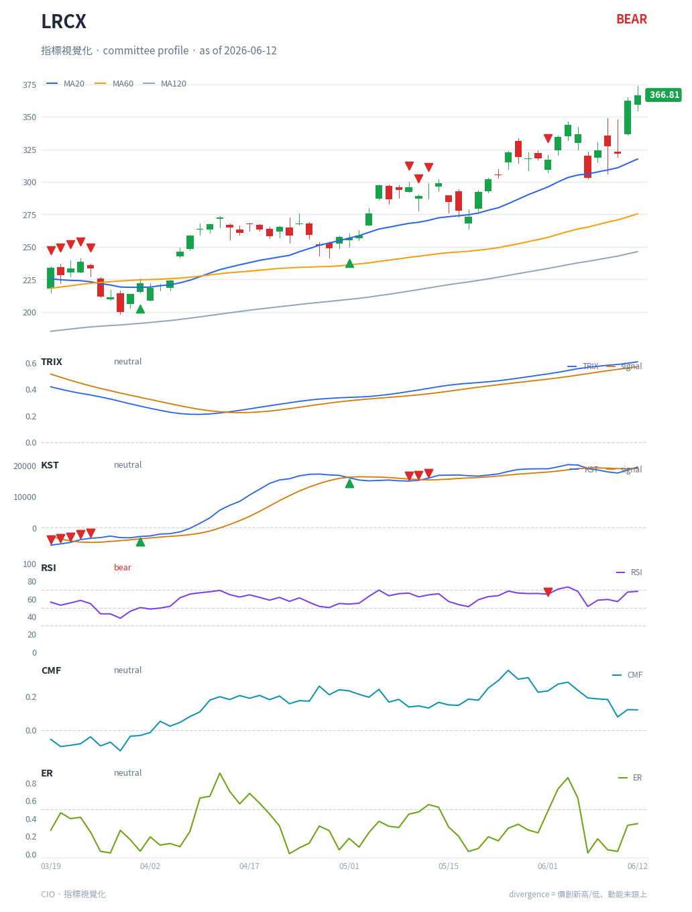
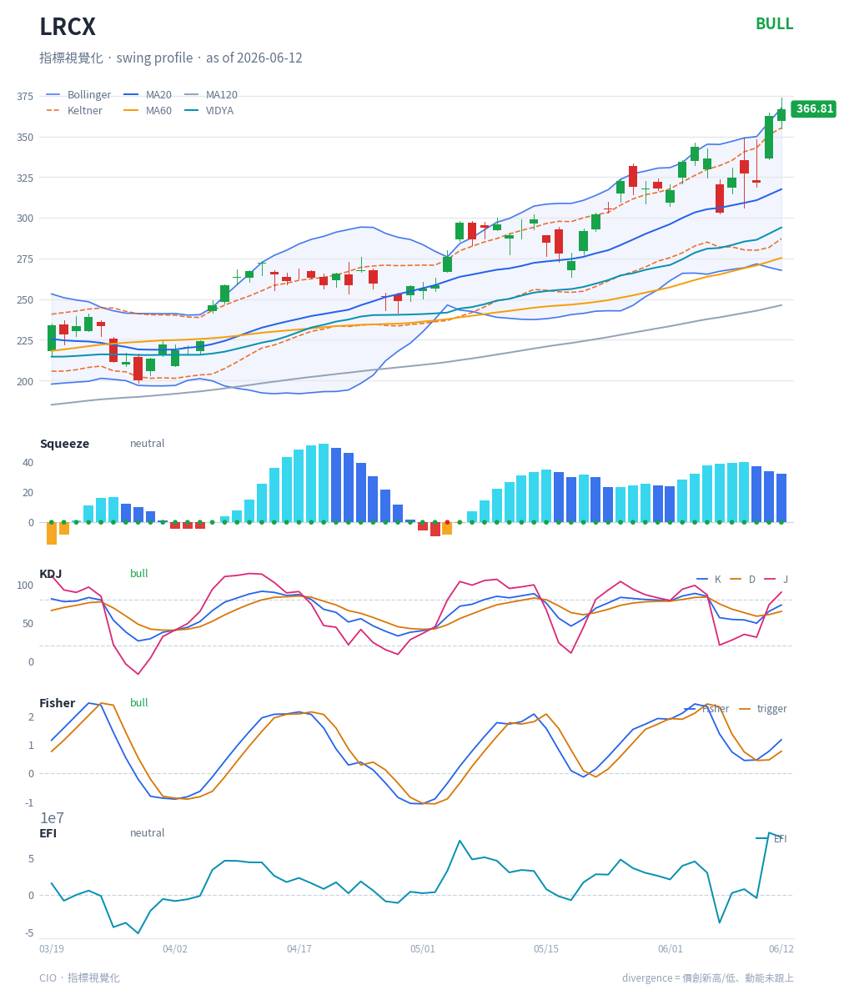

# Indicator Visualization (指標視覺化) — Technical Report

Documentation set for the `cio/stock/viz` package: the in-house technical-indicator
chart renderer that closes the `conv_turns#210` gap (the stock panel had no
indicator overlay). It renders profile-specific indicator panels — with divergence,
swing, and TTM-Squeeze markers, plus Bollinger/Keltner overlays — as a PNG for chat
and the committee PDF, and as interactive bokeh HTML for the dashboard.

## System reports

| Report | Contents |
|---|---|
| [Architecture](architecture.md) | Components, one-core/two-adapter design, `ChartSpec` data model, the indicators-dict contract |
| [Activity diagram](activity-diagram.md) | End-to-end activity from request to delivered chart |
| [Control flow](control-flow.md) | Function call graph, branch/guard table, failure isolation |
| [Data flow](data-flow.md) | OHLCV-to-pixels pipeline, data shapes, warm-up/trim, alignment |
| [Sequence diagram](sequence-diagram.md) | Runtime interaction for agent-tool, dashboard, and committee-PDF scenarios |

## Per-indicator chart-reading guides

Each guide shows a real render result (LRCX), explains exactly how this renderer
draws the indicator, and how to read it. Every guide cites a reference source.

### Overlays (drawn on the price panel)

| Guide | What it shows |
|---|---|
| [Moving Averages](indicators/ma.md) | MA20 / MA60 / MA120 trend overlays |
| [Bollinger Bands](indicators/bollinger.md) | Volatility envelope, SMA20 ± 2σ |
| [Keltner Channels](indicators/keltner.md) | ATR envelope, EMA20 ± 1.5·ATR |
| [VIDYA](indicators/vidya.md) | Volatility-adaptive moving average |

### Oscillator / momentum panels (drawn below price)

| Guide | Profile(s) | What it shows |
|---|---|---|
| [MACD](indicators/macd.md) | monitor | Trend-momentum, signal cross, histogram, divergence |
| [RSI](indicators/rsi.md) | committee | Momentum 0-100, overbought/oversold, divergence |
| [KDJ](indicators/kdj.md) | swing | Stochastic-derived K/D/J turn detection |
| [Stochastic](indicators/stoch.md) | monitor | %K/%D overbought-oversold |
| [PVO](indicators/pvo.md) | monitor | Volume momentum oscillator |
| [TRIX](indicators/trix.md) | committee | Triple-smoothed momentum, zero-line + signal |
| [KST](indicators/kst.md) | committee | Know Sure Thing rate-of-change composite |
| [Fisher Transform](indicators/fisher.md) | swing | Gaussian-ized turning points |
| [CMF](indicators/cmf.md) | committee | Chaikin Money Flow, volume pressure |
| [EFI](indicators/efi.md) | swing | Elder Force Index, price·volume thrust |
| [ER](indicators/er.md) | committee | Kaufman Efficiency Ratio, trend-vs-chop |
| [TTM Squeeze](indicators/squeeze.md) | swing, monitor | Volatility compression + momentum histogram |

### Shared markers

| Guide | What it shows |
|---|---|
| [Markers: divergence + swings](indicators/markers.md) | ▼/▲ divergence flags and HH/HL/LH/LL swing labels |

## Profile presets

The default chart for a profile draws that profile's own strategy set:

| Profile | Indicators rendered |
|---|---|
| `committee` | TRIX, KST, RSI, CMF, ER (+ MA overlays) |
| `swing` | Squeeze, KDJ, Fisher, EFI (+ VIDYA, MA, Bollinger, Keltner overlays) |
| `monitor` | MACD, Stochastic, PVO, Squeeze (+ MA, Bollinger, Keltner overlays) |

Full committee and swing overviews:

## How to regenerate the images

All render results under `img/` are produced from cached LRCX data via
`cio.stock.render_indicators` (PNG) — see the render block in the project history.
The charts are reproducible: same symbol + profile + cached window yields the same
panels.
