# Indicator Visualization — Activity Diagram

End-to-end activity from a render request to a delivered chart. The diagram covers
the three input forms of the `indicators` argument (None → profile preset, a list
of names, or a full dict), the data/series computation, and the two output
backends.

```mermaid
flowchart TD
    START([render_indicators called]) --> INPUT{"symbol_or_df type?"}

    INPUT -->|"ticker string"| FETCH["load_or_download_stock_data<br/>fetch + cache OHLCV"]
    INPUT -->|"DataFrame"| COERCE
    FETCH --> COERCE["_coerce_ohlc<br/>validate columns, flatten MultiIndex"]
    COERCE --> EMPTY{"valid OHLC?"}
    EMPTY -->|"no"| ERR([raise ValueError])
    EMPTY -->|"yes"| RESOLVE{"indicators arg?"}

    RESOLVE -->|"None"| PROF["resolve profile<br/>read PROFILES strategy list"]
    RESOLVE -->|"list of names"| NAMES["use names as-is"]
    RESOLVE -->|"dict"| USERDICT["use dict verbatim<br/>auto_divergence OFF"]

    PROF --> BUILD["default_indicator_dict<br/>registry builds series per name"]
    NAMES --> BUILD
    BUILD --> SQZCHK{"squeeze in names?"}
    SQZCHK -->|"yes"| BBKC["add Bollinger + Keltner<br/>band overlays"]
    SQZCHK -->|"no"| VERD
    BBKC --> VERD
    USERDICT --> VERD["profile_signals<br/>verdicts + composite (best-effort)"]

    VERD --> TRANSLATE["_spec_from_dict<br/>translate dict to overlays/bands/panels/flags"]
    TRANSLATE --> CAP{"over_cap / below_cap<br/>reached?"}
    CAP -->|"over limit"| SKIP["skip extra entries"]
    CAP -->|"within limit"| AUTODIV
    SKIP --> AUTODIV

    AUTODIV{"auto_divergence<br/>and preset?"}
    AUTODIV -->|"yes"| DIVRUN["_strategy_divergence<br/>engine.run per strategy<br/>read DIVERGENCE_BULL/BEAR"]
    AUTODIV -->|"no (user dict)"| SWINGS
    DIVRUN --> ATTACH["attach flags to panels + price"]
    ATTACH --> SWINGS["_swing_anchors<br/>HH/HL/LH/LL pivots"]

    SWINGS --> TRIM["trailing-window trim<br/>keep last N bars"]
    TRIM --> GEO["geometric divergence<br/>price vs RSI (presets)"]
    GEO --> SPEC["assemble ChartSpec"]

    SPEC --> BACKEND{"html flag?"}
    BACKEND -->|"false"| MPL["mpl_plot.render<br/>candles + bands + overlays<br/>+ panels + markers + dots"]
    BACKEND -->|"true"| BOKEH["bokeh_plot.render_html<br/>same spec, interactive"]
    MPL --> PNG["write PNG to data/charts"]
    BOKEH --> HTMLOUT["write standalone HTML"]
    PNG --> DELIVER
    HTMLOUT --> DELIVER["return file path to caller"]

    DELIVER --> SURFACE{"caller surface"}
    SURFACE -->|"agent tool"| TELE["queue to _PENDING (Telegram)<br/>+ return image block to model"]
    SURFACE -->|"committee"| PDF["embed as PDF appendix figure"]
    SURFACE -->|"dashboard"| SERVE["serve HTML page"]
    TELE --> END([done])
    PDF --> END
    SERVE --> END
```

## Notes on key decisions

- **Profile drives the panels.** With `indicators=None` the default preset is the
  *profile's own* strategy set, so `committee` draws trix/kst/rsi/cmf/er while
  `swing` draws squeeze/kdj/fisher/efi + a VIDYA overlay. An invalid profile falls
  back to MACD/RSI/KDJ.
- **Squeeze pulls in its context.** Because TTM Squeeze is defined as "Bollinger
  Bands inside Keltner Channels", whenever a squeeze panel is present the preset
  also overlays BB + KC on price so the compression is visible structurally.
- **User dicts are authoritative.** When a caller passes a full dict, the core
  renders it verbatim and disables auto divergence; explicit `flags` entries are
  the way to add event markers.
- **Everything is best-effort below the data layer.** Verdicts, divergence, and
  swings each fail closed (empty) rather than breaking the picture; only missing
  OHLC raises.
