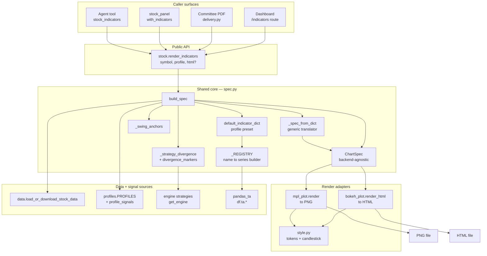
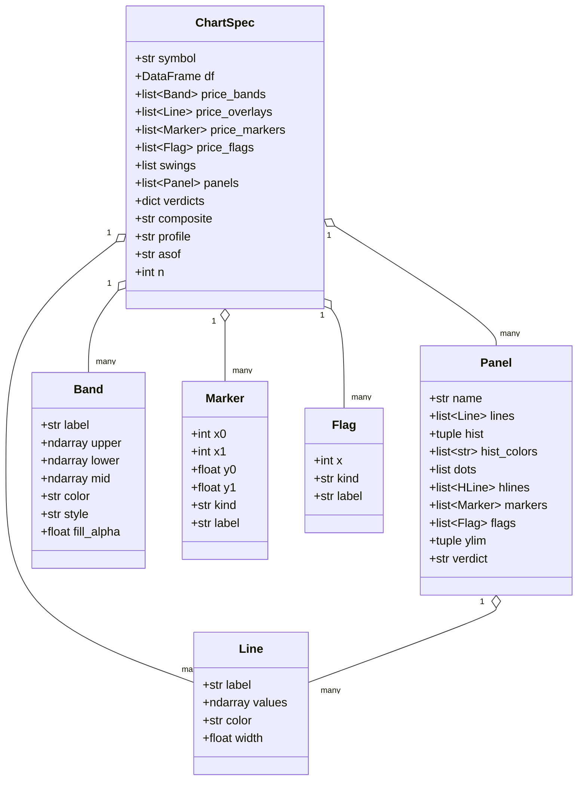

# Indicator Visualization — Architecture

Technical report for the `cio/stock/viz` package (指標視覺化). The module closes
the gap recorded in `conv_turns#210`: the stock panel showed price + fundamentals
but no indicator overlay, so users were sent to TradingView to apply RSI / MACD /
KDJ and read divergence by hand. The viz package renders those indicators — with
divergence, swing, and squeeze markers — as an image for chat + PDF, and as an
interactive HTML page for the dashboard.

## Design principle — one core, two adapters

The package follows the old AI4StockMarket `AutoPlot` contract but refactored for
KISS/DRY: a single backend-agnostic **core** builds a `ChartSpec` from a generic,
typed `indicators` dict; two thin **render adapters** turn that spec into a PNG
(matplotlib) or interactive HTML (bokeh). No indicator is special-cased in the
engine — RSI/MACD/KDJ/Squeeze/etc. are just entries in the dict, produced by a
registry. The two backends share everything upstream of drawing; only the final
draw layer differs (inherent to wanting both a static image and an interactive
page).

## Component responsibilities

| Component | File | Responsibility |
|---|---|---|
| Public facade | `stock/__init__.py` `render_indicators` | PNG by default, HTML when `html=True`; documents the dict contract |
| Package facade | `viz/__init__.py` | `render_indicator_png` / `render_indicator_html` / `build_spec` / `bokeh_available` |
| Shared core | `viz/spec.py` | Resolve data + indicators dict, compute series, divergence, swings, trim, emit `ChartSpec` |
| Indicator registry | `viz/spec.py` `_REGISTRY` | Map each strategy name to a pandas_ta series builder expressed in the dict contract |
| Translator | `viz/spec.py` `_spec_from_dict` | Generic dict to overlays / bands / panels / flags, honoring `over_cap` / `below_cap` |
| PNG adapter | `viz/mpl_plot.py` | Draw `ChartSpec` with matplotlib (Agg, headless) |
| HTML adapter | `viz/bokeh_plot.py` | Draw `ChartSpec` with bokeh (interactive, optional dep) |
| Style | `viz/style.py` | Design tokens (mirrors `panel.py`) + candlestick helper |

## Data model — ChartSpec

`ChartSpec` is the contract between core and adapters. Both adapters read it; neither
recomputes anything.

## The indicators dict contract

Placement is decided by an entry's `type`:

| Group | Types | Drawn |
|---|---|---|
| Over-chart | `over`, `MA`, `bands`, `Swings`, `flags` | On the price panel |
| Below-chart | `below`, `RSI`, `MACD`, `multi`, `Crossover`, `threshold`, `squeeze` | In a stacked sub-panel |

`default_indicator_dict` produces this dict from a profile's strategy list; callers
may also pass any dict of their own (full AutoPlot-style flexibility).

## Dependencies

Required: `matplotlib`, `pandas`, `pandas_ta`. Optional: `bokeh` (HTML only — no
selenium; PNG export is matplotlib's job). The engine strategies and `profiles`
are reused for divergence flags and verdicts.
