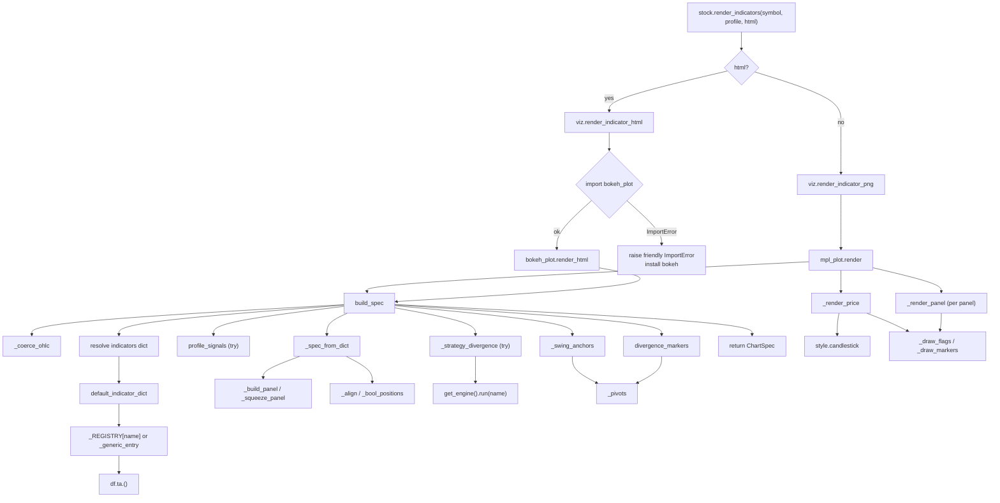
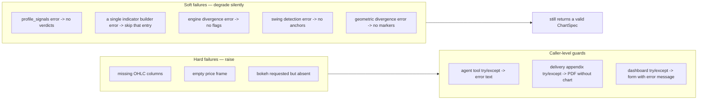

# Indicator Visualization — Control Flow

Function-level control flow through `build_spec` and the render adapters. Where the
activity diagram shows *what happens*, this shows *which function calls which*, with
the branch conditions and the guards that keep a render from failing.

## Call graph

## Branch + guard table

| Location | Condition | True branch | False branch |
|---|---|---|---|
| `render_indicators` | `html` | `render_indicator_html` | `render_indicator_png` |
| `render_indicator_html` | `import bokeh_plot` fails | raise friendly `ImportError` | call `render_html` |
| `build_spec` | `isinstance(symbol_or_df, DataFrame)` | use frame directly | `load_or_download_stock_data` |
| `_coerce_ohlc` | OHLC columns missing / empty | `raise ValueError` | continue |
| `build_spec` | `indicators is None` | profile preset from `PROFILES` | next branch |
| `build_spec` | `isinstance(indicators, dict)` | verbatim, `auto_divergence=False` | names-list preset |
| `default_indicator_dict` | name in `_REGISTRY` | registry builder | `_generic_entry` fallback |
| `default_indicator_dict` | `squeeze` in names | add Bollinger + Keltner | skip |
| `_spec_from_dict` | `type in _OVER_TYPES` | overlay / band / flag / swing | sub-panel |
| `_spec_from_dict` | `n_over/n_below >= cap` | skip entry | render entry |
| `build_spec` | `auto_divergence and not user dict` | run strategy + geometric divergence | skip both |
| `_render_panel` | `panel.lines` empty | no legend (histogram-only) | draw legend |

## Failure isolation

The renderer must never crash a chat turn or a committee PDF. Failure handling is
layered:

Only the three hard failures propagate; every signal-layer step is wrapped so a bad
indicator degrades the chart rather than breaking it. Each caller surface adds its
own try/except so even a hard failure becomes a graceful message, not a crash.
