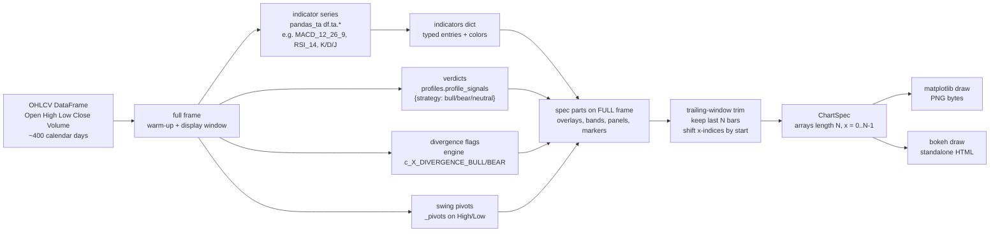
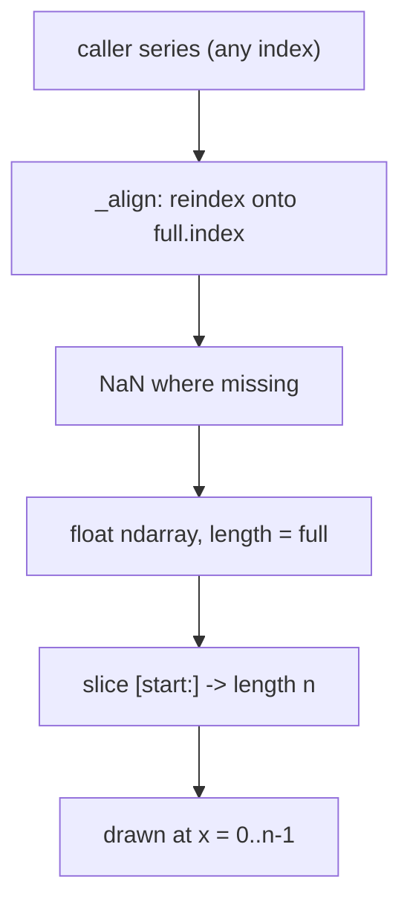

# Indicator Visualization — Data Flow

How data moves and transforms from raw OHLCV to a pixel/HTML chart. The emphasis is
on *what each stage produces*, the shape of the data, and where the trailing-window
trim happens.

## Stage pipeline

## Why compute on the full frame, then trim

Indicators need warm-up: a 120-period MA, a 26-period MACD, or RSI divergence
across pivots can only be correct with history *before* the displayed window. So
every series, flag, and pivot is computed on the full ~400-day frame, then the last
`window` (default 60) bars are sliced for display and all x-indices are shifted to
`0..N-1`. Markers and flags that fall before the window start are dropped; those
that straddle it are clamped.

## Data shapes at each stage

| Stage | Type | Shape / keys |
|---|---|---|
| Raw fetch | `DataFrame` | index = trading days; cols = OHLC + Adj Close + Volume |
| Indicator series | `DataFrame` / `Series` | e.g. `MACD_12_26_9`, `MACDh_…`, `MACDs_…`; `RSI_14`; `K_9_3`/`D_9_3`/`J_9_3` |
| Verdicts | `dict[str,str]` | `{"rsi":"bear", "kdj":"bull", ...}` + `composite` |
| Divergence flags | `dict[str,list]` | `{"RSI":[Flag(x,kind)], "MACD":[…]}` |
| Swing anchors | `list[tuple]` | `[(x, price, "HH"/"HL"/"LH"/"LL")]`, capped 4+4 |
| indicators dict | `dict[str,dict]` | `{label: {"type": …, "data"/"macd"/…: Series, "color": …}}` |
| ChartSpec arrays | `np.ndarray` | length `n` (= trimmed window) |

## Alignment

Every Series referenced by a dict entry is projected onto the full frame index by
`_align` (reindex, NaN-fill), so a caller may pass series that are shorter than the
price frame and they still line up bar-for-bar. Boolean event series for `flags`
are converted to integer bar positions by `_bool_positions`.

## Outputs

- **PNG** — written under `data/charts/` (or a caller-supplied dir). Consumed by
  the Telegram bot (sent as a photo) and embedded base64 in the committee PDF.
- **HTML** — standalone bokeh document, served by the dashboard `/indicators`
  route.
- **ChartSpec** — also returned by `build_spec` for callers that want the
  structured data without drawing (e.g. tests, future tools).
