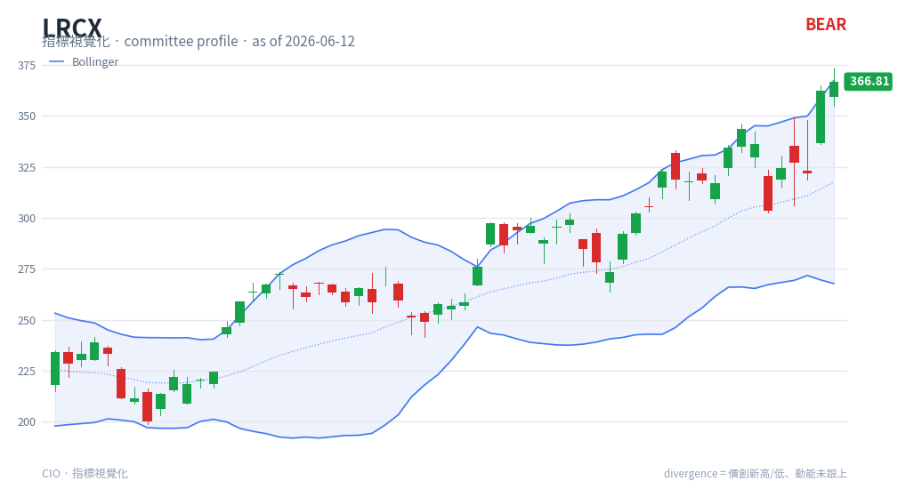

# Bollinger Bands — chart reading

**Type**: price-panel overlay (band) · Auto-added when a Squeeze panel is shown

## What it is

Bollinger Bands (John Bollinger) wrap price in a volatility envelope: a 20-period SMA
**basis** with an upper and lower band set **2 standard deviations** away. The bands
widen when volatility rises and contract when it falls, so the band width itself is a
volatility reading.

## How this renderer draws it

A blue channel on the price panel:

- **Upper / lower bands** — blue solid lines (`#2563eb`).
- **Basis (SMA20)** — blue **dotted** middle line.
- **Fill** — a faint blue tint between the bands.

Computed with `df.ta.bbands(length=20, std=2.0)`. Drawn together with Keltner
Channels so the TTM Squeeze (BB inside KC) is visible — see [Squeeze](squeeze.md).

## Render result

## How to read it

- **Width = volatility** — narrow bands ("the squeeze") signal low volatility and
  often precede a strong move; wide bands signal high volatility, frequently near the
  end of a move.
- **Touches / rides** — in a strong trend price can *walk the band* (repeatedly tag
  the upper band in an up-trend); a band touch is **not** an automatic reversal.
- **Basis as support/resistance** — the dotted SMA20 basis often acts as dynamic
  support in up-trends and resistance in down-trends.
- **%B context** — where price sits within the bands (near upper vs lower) gauges
  relative position; combine with an oscillator for confirmation rather than fading a
  touch outright.

## Reference

- StockCharts ChartSchool — Bollinger Bands:
  <https://chartschool.stockcharts.com/table-of-contents/technical-indicators-and-overlays/technical-overlays/bollinger-bands>
