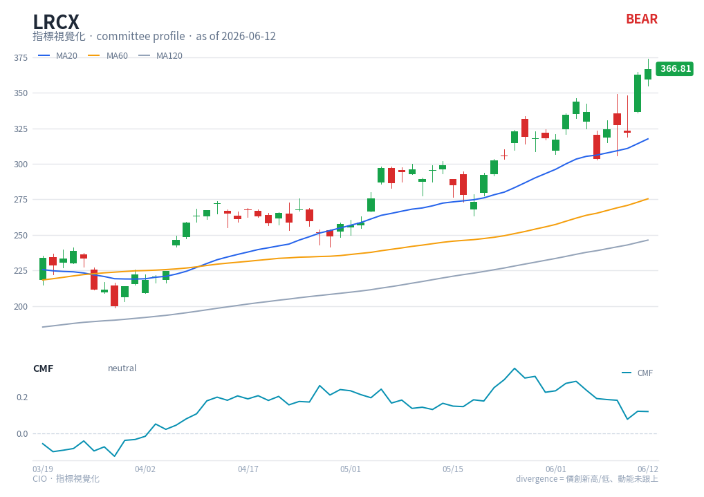

# CMF — chart reading

**Type**: below-chart oscillator · **Engine key**: `cmf` · **Profile**: committee

## What it is

Chaikin Money Flow (Marc Chaikin). Sums Money Flow Volume over 20 periods to gauge
buying versus selling pressure. It oscillates between −1 and +1 (typically −0.5 to
+0.5) around a zero centreline.

## How this renderer draws it

A single-line sub-panel:

- **CMF line** — cyan (`#0891b2`).
- **Zero line** — grey reference (the buying/selling pressure boundary).

Computed with `df.ta.cmf()` (length 20).

## Render result

## How to read it

- **Above / below zero** — CMF above zero indicates net **buying** pressure
  (accumulation); below zero indicates net **selling** pressure (distribution). The
  zero-line cross is the primary signal — a shift in who is in control.
- **Magnitude** — readings stretched toward +0.5 / −0.5 indicate strong, sustained
  pressure; values hugging zero indicate balance.
- **Use a buffer** — StockCharts recommends treating only moves beyond about **+0.05 /
  −0.05** as meaningful, to filter whipsaws in choppy or flattening trends.
- **Price/flow agreement** — price rising with CMF holding above zero confirms the
  advance is volume-backed; price rising while CMF slips below zero is a distribution
  warning (the committee uses CMF exactly as this volume-flow confirm).

## Reference

- StockCharts ChartSchool — Chaikin Money Flow (CMF):
  <https://chartschool.stockcharts.com/table-of-contents/technical-indicators-and-overlays/technical-indicators/chaikin-money-flow-cmf>
  (source found via web search; the `engine/strategies/docs/cmf.md` link pointed to a
  lower-quality page, so the canonical ChartSchool reference is used here.)
