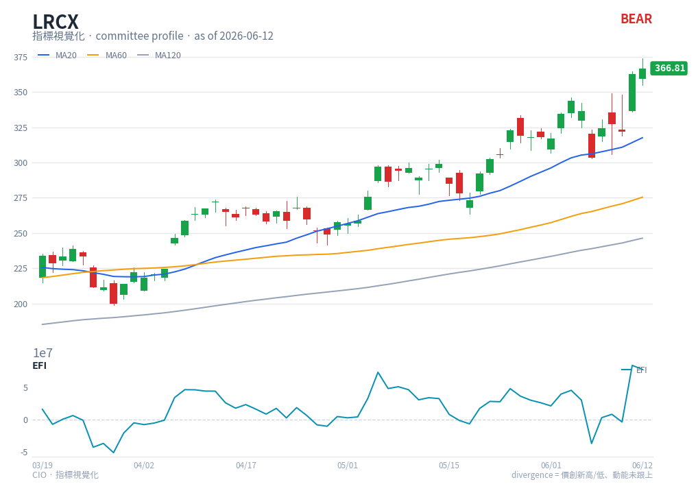

# EFI — chart reading

**Type**: below-chart oscillator · **Engine key**: `efi` · **Profile**: swing

## What it is

Elder Force Index (Alexander Elder). Force = (today's close − yesterday's close) ×
volume, then smoothed with a 13-period EMA. It combines **direction, extent, and
volume** of a move into one thrust gauge, oscillating around zero.

## How this renderer draws it

A single-line sub-panel:

- **EFI line** — cyan (`#0891b2`).
- **Zero line** — grey reference.

Computed with `df.ta.efi()` (length 13). Note the y-axis can be large (price ×
volume), so the panel often shows a `1e7`-style scale label.

## Render result

## How to read it

- **Above / below zero** — EFI above zero means buyers are in control with volume
  behind them; below zero means sellers dominate. Zero crosses mark shifts in who is
  driving the move.
- **Spikes** — a large positive spike is a strong, volume-backed up-thrust; a large
  negative spike is heavy selling. Spikes often mark climaxes.
- **Divergence** — a new price high with a lower EFI high warns the thrust behind the
  move is weakening (the swing profile reads EFI for volume confirmation; a
  zero-cross tug-of-war = unconfirmed conviction).
- **Smoothing** — the 13-EMA version (used here) is for trend confirmation; it
  deliberately suppresses single-bar noise.

## Reference

- StockCharts ChartSchool — Force Index:
  <https://chartschool.stockcharts.com/table-of-contents/technical-indicators-and-overlays/technical-indicators/force-index>
  (source found via web search; supplements the vendor link in
  `engine/strategies/docs/efi.md`.)
