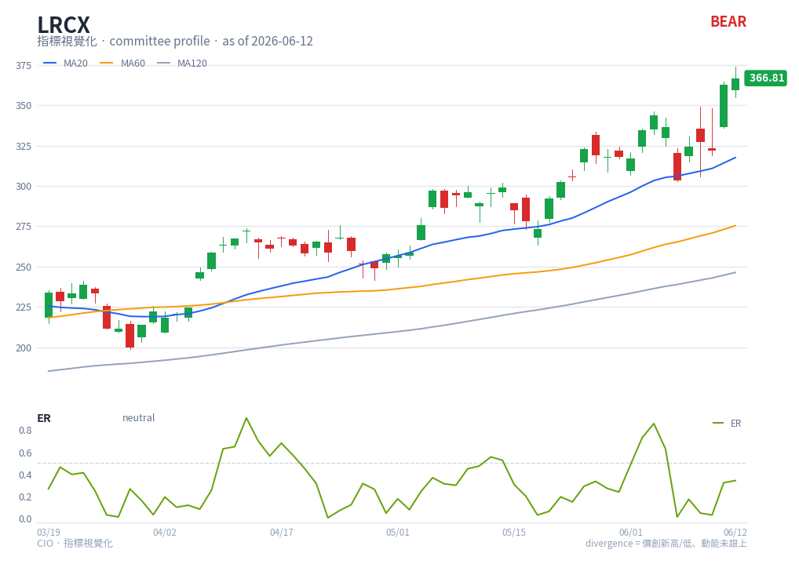

# ER — chart reading

**Type**: below-chart oscillator · **Engine key**: `er` · **Profile**: committee

## What it is

Kaufman Efficiency Ratio. ER = |net price change over N| ÷ (sum of absolute bar-to-bar
changes over N). It ranges 0 to 1 and measures how *efficient*, or trendy, price
movement is: **1 = a clean directional trend, 0 = pure chop/noise**.

## How this renderer draws it

A single-line sub-panel:

- **ER line** — green (`#65a30d`).
- **Guide line** — dashed at **0.5**, the rough trend-vs-chop divider.

Computed with `df.ta.er()` (length 10).

## Render result

## How to read it

- **High ER (toward 1)** — price is moving in a straight, low-noise trend.
  Trend-following logic is appropriate and the committee can trust directional
  evidence more.
- **Low ER (toward 0)** — price is choppy/range-bound; high noise. Trend signals are
  unreliable and mean-reversion behaviour dominates.
- **The 0.5 guide** — a practical regime switch: above it, weight trend indicators;
  below it, discount them. ER is a **context** gauge, not a buy/sell trigger — it
  tells you *which other signals to trust*.
- **Rising ER** — noise is falling and a trend is organising; falling ER — a trend is
  decaying into chop.

The committee uses ER precisely as a trend-vs-chop regime filter for weighting the
other evidence.

## Reference

- Corporate Finance Institute — Kaufman's Adaptive Moving Average (KAMA), which
  defines the Efficiency Ratio:
  <https://corporatefinanceinstitute.com/resources/career-map/sell-side/capital-markets/kaufmans-adaptive-moving-average-kama/>
- TradingView — Kaufman Efficiency Ratio (KER):
  <https://www.tradingview.com/script/7imltc5K-Kaufman-Efficiency-Ratio-KER/>
  (sources found via web search; supplement the vendor link in
  `engine/strategies/docs/er.md`.)
