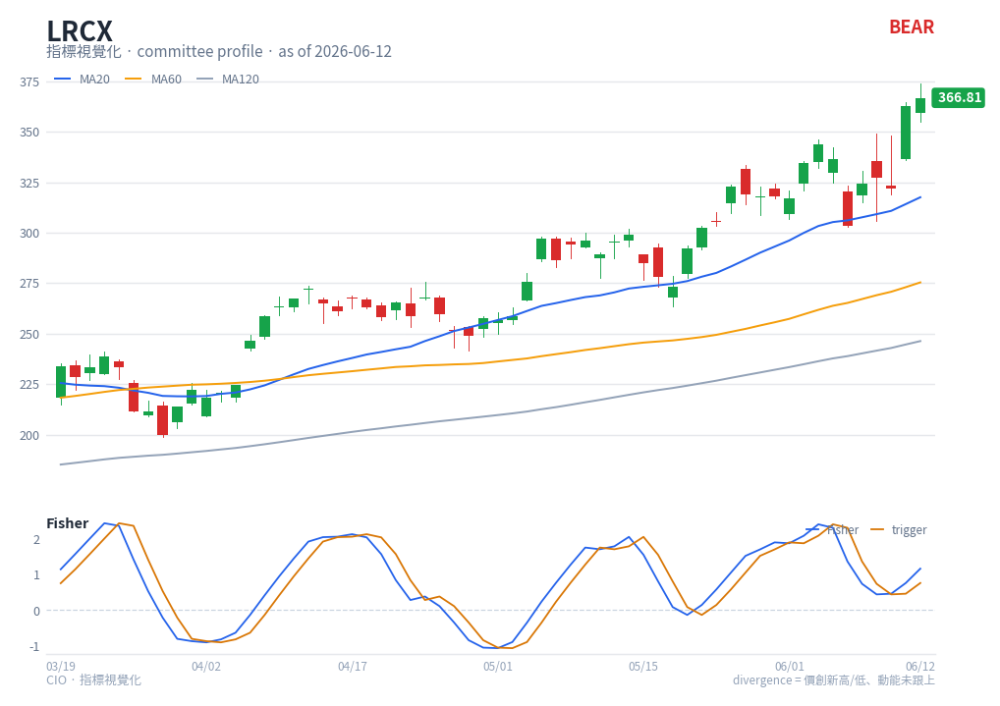

# Fisher Transform — chart reading

**Type**: below-chart oscillator (multi-line) · **Engine key**: `fisher` · **Profile**: swing

## What it is

The Fisher Transform (Ehlers) remaps price into a roughly **Gaussian** distribution.
Normal price moves are not normally distributed, so extremes are blurred; after the
transform, turning points become sharp, distinct peaks and troughs — making reversals
much easier to spot.

## How this renderer draws it

A sub-panel with two lines plus a zero reference:

- **Fisher** — blue (`#2563eb`).
- **Trigger** — orange (`#d97706`), the Fisher line lagged by one bar.
- **Zero line** — grey reference.

Computed with `df.ta.fisher()` (9/1).

## Render result

## How to read it

- **Sharp peaks/troughs** — unlike most oscillators, Fisher produces pointed extremes.
  A reversal at a tall spike is a high-conviction turning point — one of the most
  reliable swing-entry confirmations.
- **Fisher / trigger cross** — Fisher crossing **above** the trigger after a trough is
  a bullish turn; crossing **below** after a peak is bearish.
- **Zero cross** — moving above zero confirms the swing has turned up; below zero,
  down. The swing profile treats a Fisher bull turn as a key entry confirmation.
- **Magnitude** — a larger spike implies a more stretched move and a more significant
  expected reversal.

Fisher answers "has the swing turned?"; pair it with KDJ for fine entry timing.

## Reference

- TradingView — Fisher Transform:
  <https://www.tradingview.com/support/solutions/43000589141-fisher-transform/>
  (reference carried in `engine/strategies/docs/fisher.md`).
