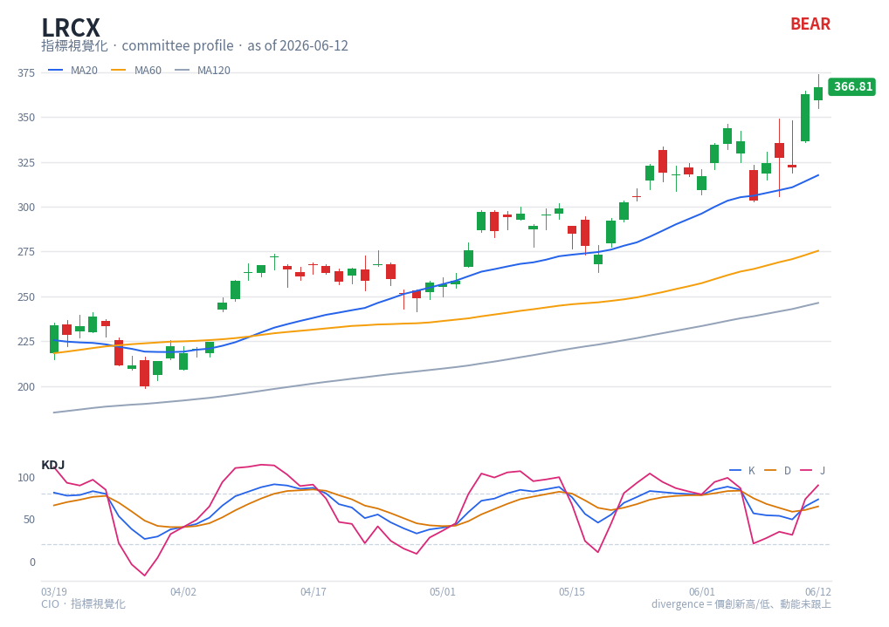

# KDJ — chart reading

**Type**: below-chart oscillator (multi-line) · **Engine key**: `kdj` · **Profile**: swing

## What it is

A Stochastic-derived oscillator popular in Asian markets. %K and %D are the standard
Stochastic lines; **J = 3·K − 2·D** extends beyond 0-100 to exaggerate turns, making
it a sensitive timing tool for swing entries.

## How this renderer draws it

A sub-panel with three lines:

- **K** — blue (`#2563eb`).
- **D** — orange (`#d97706`).
- **J** — pink (`#db2777`), the fast, overshooting line.
- **Guide lines** — dashed at **20** and **80**.

Computed with `df.ta.kdj()` (9/3).

## Render result

## How to read it

- **K/D crossover** — K crossing **above** D is a bullish golden cross (short-term
  momentum turning up); K below D is a death cross. The committee referenced this as
  `c_KDJ_CROSSOVER_BULL` for LRCX.
- **J overshoot** — because J amplifies, it spikes past 100 at tops and below 0 at
  bottoms. A J extreme that snaps back is an early reversal alert, often leading the
  K/D cross.
- **20/80 zones** — crossovers that fire from below 20 (oversold) or above 80
  (overbought) carry more weight than mid-range crosses.
- **All three converging then fanning out** — a tight cluster of K/D/J that suddenly
  spreads marks the start of a fresh swing.

Use KDJ for *timing* a swing entry once a higher-level setup (e.g. Squeeze, Fisher)
says a move is likely.

## Reference

- Market Bulls — KDJ indicator guide:
  <https://market-bulls.com/kdj-indicator/>
  (reference carried in `engine/strategies/docs/kdj.md`). KDJ extends the classic
  Stochastic oscillator — see also [Stochastic](stoch.md).
