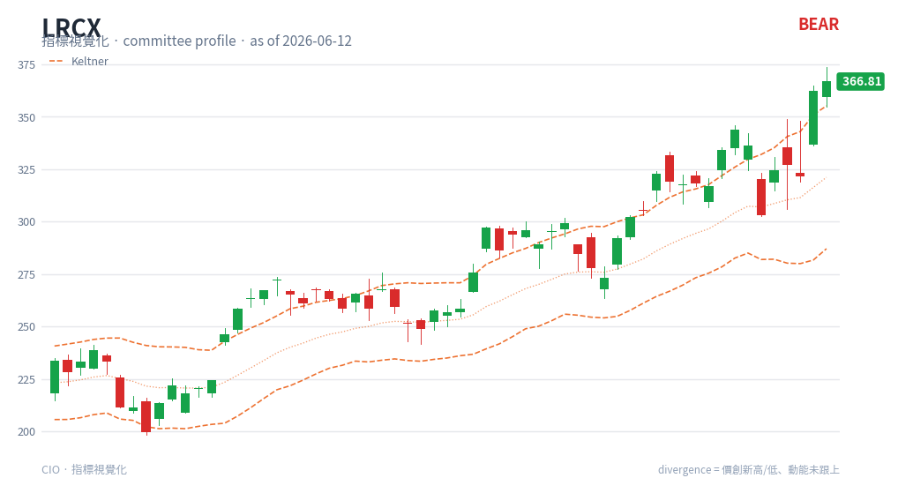

# Keltner Channels — chart reading

**Type**: price-panel overlay (band) · Auto-added when a Squeeze panel is shown

## What it is

Keltner Channels wrap price in an **ATR-based** envelope: an EMA basis with upper and
lower lines set a multiple of Average True Range away (here EMA20 ± 1.5·ATR). Because
they use ATR rather than standard deviation, Keltner Channels are smoother and less
spiky than Bollinger Bands.

## How this renderer draws it

An orange channel on the price panel:

- **Upper / lower channels** — orange **dashed** lines (`#ea580c`).

Computed with `df.ta.kc(length=20, scalar=1.5)`. Drawn together with Bollinger Bands
so the TTM Squeeze relationship is visible — see [Squeeze](squeeze.md).

## Render result

## How to read it

- **Trend channel** — in a trend, price tends to ride between the EMA basis and the
  channel edge in the trend direction; closing **outside** the upper channel signals
  strong bullish momentum (a breakout), outside the lower channel strong bearish
  momentum.
- **Slope** — the channel's overall tilt confirms trend direction; a flat channel
  marks range conditions.
- **Pullback entries** — in an up-trend, pullbacks toward the EMA basis that hold are
  continuation entries.
- **The Squeeze relationship (key use here)** — compare against Bollinger Bands: when
  the **Bollinger Bands contract inside these Keltner Channels**, a TTM Squeeze is ON
  (volatility compressed); when Bollinger pushes back outside, the squeeze fires. This
  is exactly what the red/green dots in the [Squeeze](squeeze.md) panel encode.

## Reference

- StockCharts ChartSchool — Keltner Channels:
  <https://chartschool.stockcharts.com/table-of-contents/technical-indicators-and-overlays/technical-overlays/keltner-channels>
