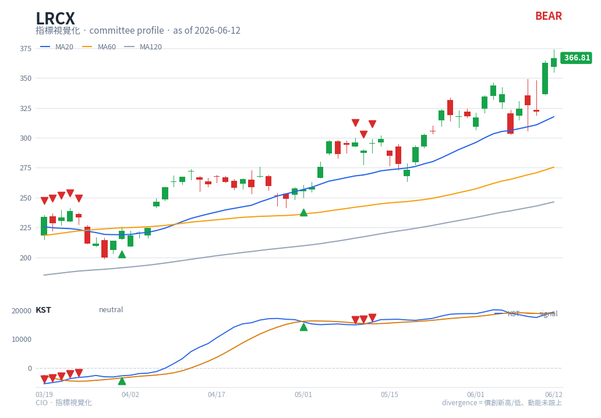

# KST — chart reading

**Type**: below-chart oscillator (multi-line) · **Engine key**: `kst` · **Profile**: committee

## What it is

Know Sure Thing (Martin Pring). A momentum oscillator that sums four smoothed
Rate-of-Change values across different look-backs, weighting the longer ones more.
The result captures momentum across several cycles in a single line, with a signal
line for triggers.

## How this renderer draws it

A sub-panel with two lines plus a zero reference:

- **KST** — blue (`#2563eb`).
- **Signal** — orange (`#d97706`).
- **Zero line** — grey reference.

Computed with `df.ta.kst()`.

## Render result

## How to read it

- **Signal cross** — KST crossing above its signal line is the primary bullish
  trigger; below is bearish. These are the most actionable KST signals.
- **Zero-line cross** — KST above zero indicates net positive momentum across the
  blended cycles; below zero, net negative.
- **Direction + level** — a KST that is rising and above zero confirms a healthy
  uptrend; rising but still below zero is an early recovery.
- **Divergence** — KST failing to confirm a new price extreme warns of a multi-cycle
  momentum shift (committee-grade caution).

KST is a smooth, multi-cycle confirmation tool — slower than MACD, steadier than
single-period ROC.

## Reference

- TradingView — Know Sure Thing (KST):
  <https://www.tradingview.com/support/solutions/43000502329-know-sure-thing-kst/>
  (reference carried in `engine/strategies/docs/kst.md`).
