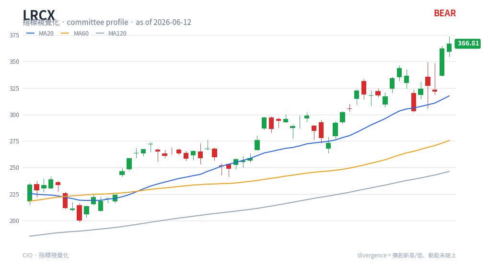

# Moving Averages (MA20 / MA60 / MA120) — chart reading

**Type**: price-panel overlays · Always drawn (default overlays)

## What it is

Simple moving averages of the close over 20, 60, and 120 trading days — roughly one
month, one quarter, and half a year. They smooth price into short-, medium-, and
long-term trend lines.

## How this renderer draws it

Three lines on the price panel:

- **MA20** — blue (`#2563eb`), short-term.
- **MA60** — orange (`#f59e0b`), medium-term.
- **MA120** — grey (`#94a3b8`), long-term.

Computed with a rolling mean on close. These overlays are present in every chart so
the indicator panels always have price-trend context.

## Render result

## How to read it

- **Stacking / ribbon order** — MA20 > MA60 > MA120 with all rising is a clean,
  healthy up-trend; the reverse stack is a down-trend. The wider the fan, the
  stronger the trend.
- **Price vs MA20** — price holding above MA20 = short-term strength; losing MA20 is
  the first sign of a pullback.
- **Crosses** — MA20 crossing above MA60 is a medium-term bullish shift; crossing
  below is bearish. MA120 acts as the major trend line and a common support/resistance
  level.
- **Slope** — flattening MAs warn a trend is stalling even before a cross.

Moving averages are the trend backbone the oscillators are read against (e.g. a
bullish RSI cross carries more weight when price is above a rising MA20).

## Reference

- StockCharts ChartSchool — Moving Averages:
  <https://chartschool.stockcharts.com/table-of-contents/technical-indicators-and-overlays/technical-overlays/moving-averages>
  (canonical reference; MA overlays are a renderer feature, not a single engine
  strategy.)
