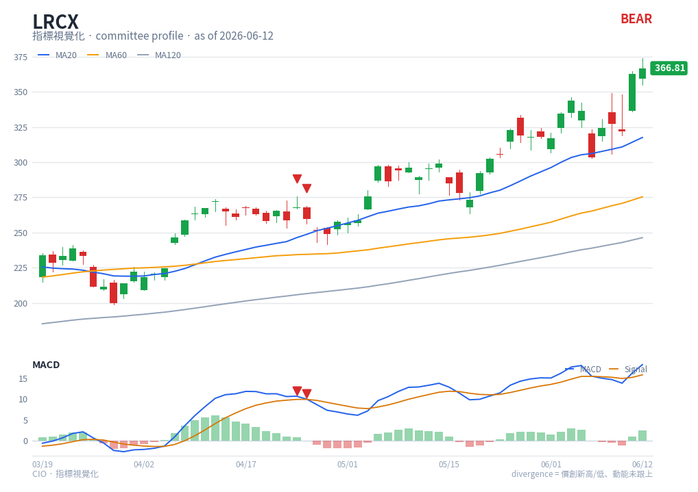

# MACD — chart reading

**Type**: below-chart oscillator · **Engine key**: `macd` · **Profile**: monitor

## What it is

Moving Average Convergence/Divergence. The MACD line is the difference between the
12- and 26-period EMAs of close; the signal line is a 9-period EMA of the MACD line.
The histogram is MACD minus signal. It measures trend momentum and the timing of
momentum shifts.

## How this renderer draws it

A sub-panel below price containing:

- **MACD line** — blue (`#2563eb`).
- **Signal line** — orange (`#d97706`).
- **Histogram** — bars (green when ≥ 0, red when < 0) behind the lines.
- **Zero line** — solid grey reference.
- **Divergence markers** — red ▼ (bear) / green ▲ (bull) triangles where the
  engine flags `c_MACD_DIVERGENCE_*` (see [markers](markers.md)).

Computed with pandas_ta `df.ta.macd()` (12/26/9). Panel verdict (bull/bear/neutral)
prints next to the title when the active profile includes MACD.

## Render result

## How to read it

- **Signal cross** — MACD crossing **above** the signal line is a bullish momentum
  trigger; crossing **below** is bearish. The histogram makes this visible: it
  flips sign exactly at the cross.
- **Zero-line cross** — MACD above zero means the fast EMA is above the slow EMA
  (uptrend bias); below zero is downtrend bias. Zero crosses are slower, trend-level
  signals.
- **Histogram slope** — rising bars = momentum accelerating in that direction;
  shrinking bars = momentum fading (often precedes a cross).
- **Divergence** — price makes a higher high while MACD makes a lower high → bearish
  divergence (▼): the move is running on weakening momentum. The mirror (price lower
  low, MACD higher low) is bullish (▲). This is the headline signal from
  `conv_turns#210`.

Read momentum first (histogram + signal cross), then confirm with the zero-line
trend bias; treat divergence as a warning that the current leg is tiring.

## Reference

- OANDA — Determining entry and exit points with MACD:
  <https://www.oanda.com/us-en/learn/indicators-oscillators/determining-entry-and-exit-points-with-macd/>
  (reference carried in `engine/strategies/docs/macd.md`).
