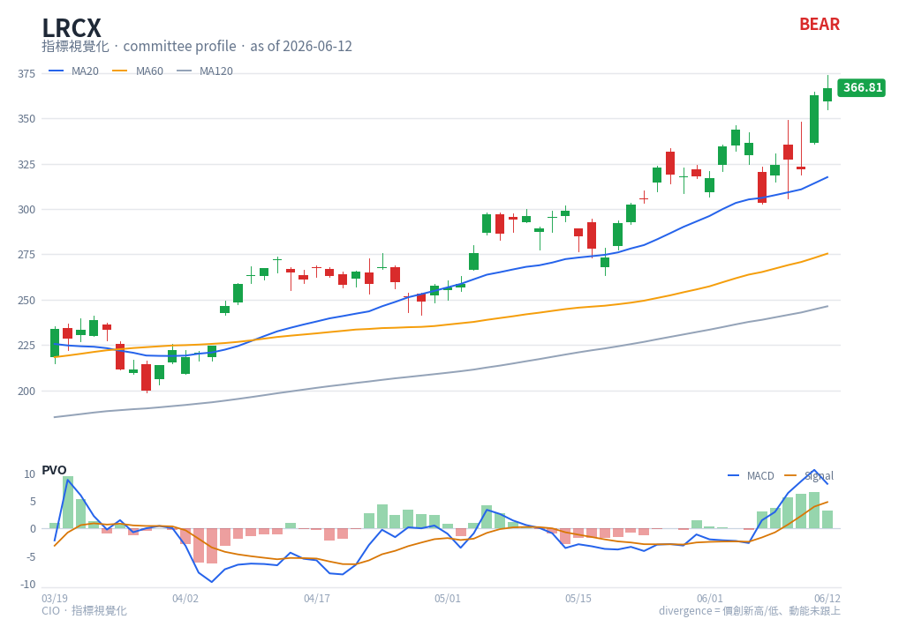

# PVO — chart reading

**Type**: below-chart oscillator · **Engine key**: `pvo` · **Profile**: monitor

## What it is

Percentage Volume Oscillator. The same construction as MACD but applied to
**volume**: the percentage difference between the 12- and 26-period EMAs of volume,
with a 9-period signal line and a histogram. It measures whether volume is expanding
or contracting and how fast.

## How this renderer draws it

Drawn with the same template as MACD (it is a MACD-type entry):

- **PVO line** — blue (`#2563eb`).
- **Signal line** — orange (`#d97706`).
- **Histogram** — green/red bars around the zero line.
- **Zero line** — grey reference.

Computed with `df.ta.pvo()` (12/26/9).

## Render result

## How to read it

- **Above / below zero** — PVO above zero means short-term volume is running hotter
  than the longer average (expanding participation); below zero means volume is
  contracting.
- **Signal cross + histogram** — a cross up with a rising histogram says a volume
  surge is building; a cross down says participation is draining.
- **Confirmation tool** — PVO says nothing about price *direction*. Use it to confirm
  price moves: a breakout with PVO turning up and crossing zero has real
  participation behind it; a breakout while PVO falls is suspect.
- **Monitor use** — a daily health check flags when a watchlist name is moving on
  thinning volume (price up, PVO down).

## Reference

- StockCharts ChartSchool — Percentage Volume Oscillator (PVO):
  <https://school.stockcharts.com/doku.php?id=technical_indicators:percentage_volume_oscillator_pvo>
  (reference carried in `engine/strategies/docs/pvo.md`).
