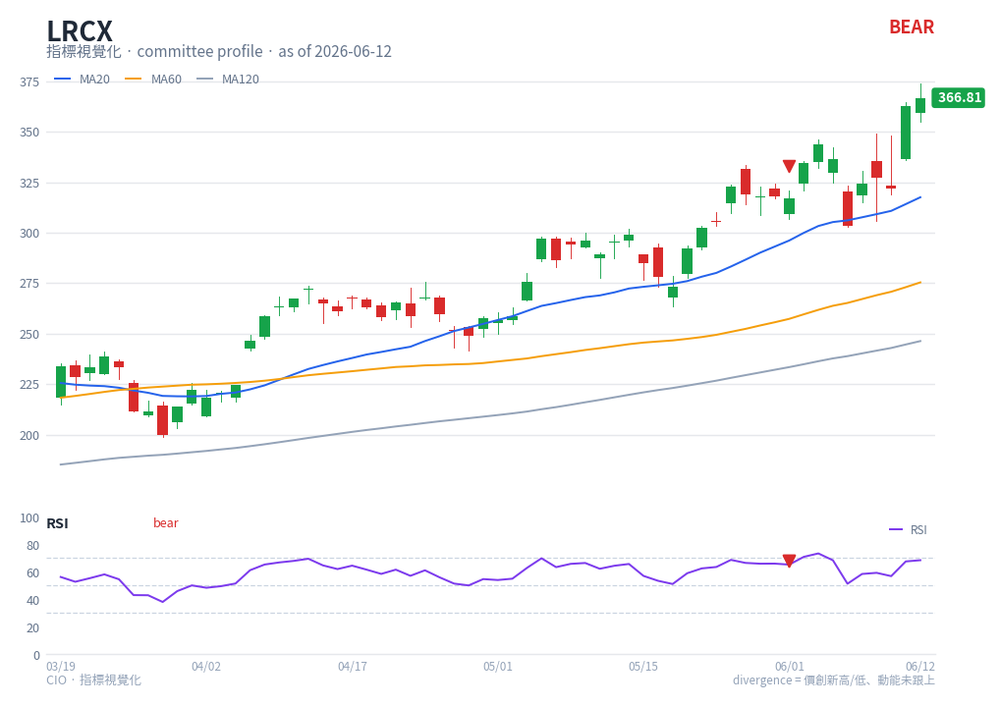

# RSI — chart reading

**Type**: below-chart oscillator · **Engine key**: `rsi` · **Profile**: committee

## What it is

Relative Strength Index (Wilder). A bounded 0-100 momentum oscillator comparing the
magnitude of recent gains to recent losses over 14 periods.

## How this renderer draws it

A sub-panel below price, fixed to a 0-100 y-axis:

- **RSI line** — purple (`#7c3aed`).
- **Guide lines** — dashed at **70** (overbought) and **30** (oversold), plus a
  faint dotted **50** centreline.
- **Divergence markers** — red ▼ / green ▲ where the engine flags
  `c_RSI_DIVERGENCE_*`. This is the canonical divergence drawn on the price panel
  as well.

Computed with `df.ta.rsi()` (length 14).

## Render result

## How to read it

- **Overbought / oversold** — above 70 the asset is stretched to the upside; below
  30 to the downside. In a strong trend RSI can sit in the extreme zone for a long
  time, so treat 70/30 as *context*, not automatic reversal triggers.
- **50 centreline** — staying above 50 confirms bullish momentum; below 50 confirms
  bearish. A 50 cross is a simple momentum-regime flip.
- **Divergence (the key signal)** — price prints a higher high while RSI prints a
  lower high → bearish divergence (▼): "價創新高、動能未跟上". The mirror is bullish
  (▲). This is what the committee profile watches and what `conv_turns#210`
  highlighted for LRCX.
- **Failure swings** — RSI turning back from near an extreme without price
  confirming often precedes the divergence signal.

## Reference

- TradingView — Relative Strength Index (RSI):
  <https://www.tradingview.com/support/solutions/43000502338-relative-strength-index-rsi/>
  (reference carried in `engine/strategies/docs/rsi.md`).
