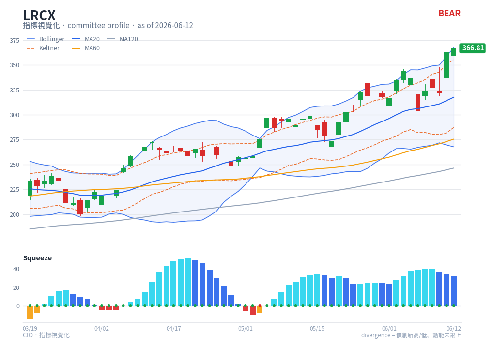

# TTM Squeeze — chart reading

**Type**: below-chart momentum histogram + price overlays · **Engine key**: `squeeze`
· **Profiles**: swing, monitor

## What it is

John Carter's TTM Squeeze detects **volatility compression**: a *squeeze is ON* when
the Bollinger Bands contract **inside** the Keltner Channels — volatility is unusually
low and energy is coiling. When the squeeze releases (turns OFF), price tends to
expand directionally. A momentum histogram indicates the likely breakout direction.

## How this renderer draws it

This indicator renders in two coordinated places.

**Sub-panel (the momentum histogram):**

- **Histogram bars**, coloured 4 ways by sign and slope (the thinkorswim TTM scheme):
  - cyan — positive and **rising** (bullish acceleration)
  - blue — positive and **falling** (bullish deceleration)
  - yellow — negative and **rising** (bearish deceleration)
  - red — negative and **falling** (bearish acceleration)
- **Zero-line dots** — one per bar: **red = squeeze ON** (compressed/coiling),
  **green = squeeze OFF** (fired/expanding). Sourced from pandas_ta `SQZ_ON`.
- **Zero line** — grey reference.

**Price panel overlays (added automatically whenever a Squeeze panel is shown):**

- **Bollinger Bands** — blue solid upper/lower + dotted basis, faint fill
  (SMA20 ± 2σ). See [Bollinger](bollinger.md).
- **Keltner Channels** — orange dashed upper/lower (EMA20 ± 1.5·ATR). See
  [Keltner](keltner.md).

Computed with `df.ta.squeeze()`, `df.ta.bbands(20, 2.0)`, `df.ta.kc(20, 1.5)`.

## Render result

## How to read it

1. **Find the squeeze (on the price panel)** — where the **blue Bollinger band sits
   inside the orange Keltner band**, the market is coiling. On the histogram panel,
   those bars carry **red zero-line dots**.
2. **Wait for the release** — when the dots turn **green** (BB pushes back outside
   KC), the squeeze has fired: expect a directional expansion.
3. **Read direction from the histogram** — the bar colour at and after the release
   gives the expected direction: cyan/blue (above zero) → up; yellow/red (below zero)
   → down. Carter's play: enter on the first green-dot bar in the histogram's
   direction.
4. **Manage with the histogram slope** — exit/trim when the histogram **decelerates**
   (cyan fading to blue for longs, red fading to yellow for shorts) — momentum is
   draining even if price is still moving.

"Squeeze tells you *when*; momentum tells you *which way*." Never trade a release with
a flat histogram.

## Reference

- thinkorswim — TTM_Squeeze study:
  <https://tlc.thinkorswim.com/center/reference/Tech-Indicators/studies-library/T-U/TTM-Squeeze>
  (reference carried in `engine/strategies/docs/squeeze.md`).
- StockCharts ChartSchool — Bollinger Band Squeeze (the BB-inside-KC concept):
  <https://chartschool.stockcharts.com/table-of-contents/trading-strategies-and-models/trading-strategies/bollinger-band-squeeze>
