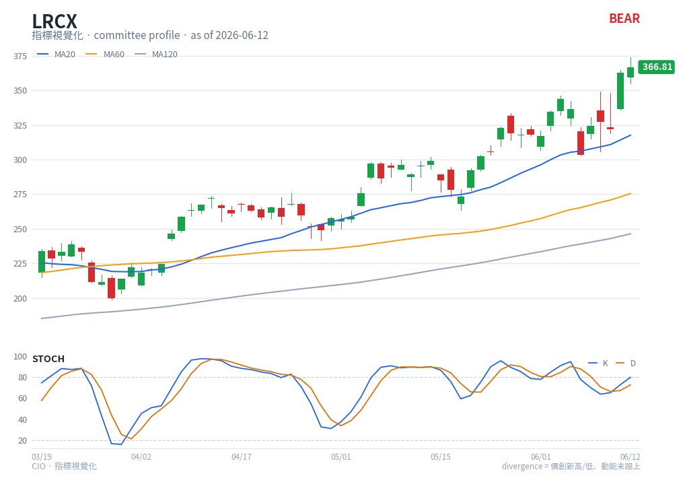

# Stochastic — chart reading

**Type**: below-chart oscillator (multi-line) · **Engine key**: `stoch` · **Profile**: monitor

## What it is

The Stochastic Oscillator (Lane) locates the close within its recent high-low range
over 14 periods. %K is the raw position; %D is a 3-period smoothing of %K. It is a
bounded 0-100 momentum/overbought-oversold gauge.

## How this renderer draws it

A sub-panel with two lines:

- **%K** — blue (`#2563eb`).
- **%D** — orange (`#d97706`).
- **Guide lines** — dashed at **20** (oversold) and **80** (overbought).

Computed with `df.ta.stoch()` (14/3/3).

## Render result

## How to read it

- **%K/%D crossover** — %K crossing above %D signals upward momentum; below signals
  downward. The signal is strongest when it occurs in an extreme zone.
- **Overbought/oversold** — above 80 the close is pinned near the top of its range;
  below 20 near the bottom. As with RSI, in a trend the line can stay extreme.
- **Divergence** — a higher price high with a lower %K high warns of fading momentum.
- **Failure to reach an extreme** — in `monitor` use, a %K that stops short of 80 on
  a new price high is an early health-check warning that buying pressure is thinning.

## Reference

- TradingView — Stochastic (STOCH):
  <https://www.tradingview.com/support/solutions/43000502332-stochastic-stoch/>
  (reference carried in `engine/strategies/docs/stoch.md`).
