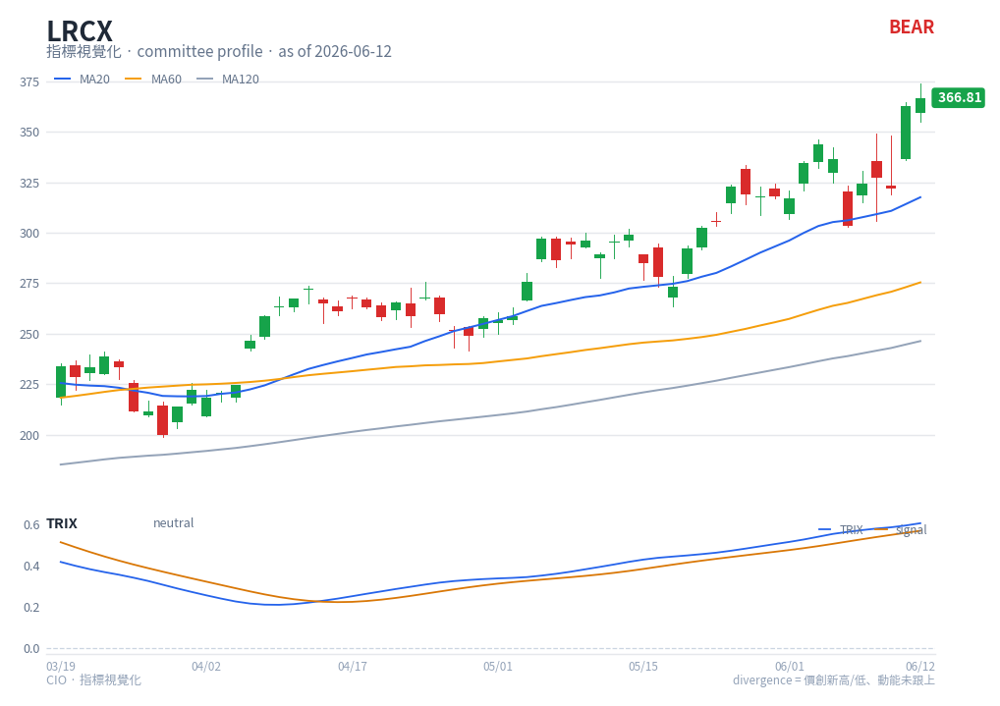

# TRIX — chart reading

**Type**: below-chart oscillator (multi-line) · **Engine key**: `trix` · **Profile**: committee

## What it is

TRIX is the rate of change of a **triple-smoothed** EMA of close. The triple
smoothing filters out moves shorter than the EMA length, so TRIX isolates the
dominant, slower trend momentum and is largely immune to insignificant whipsaws.

## How this renderer draws it

A sub-panel with two lines plus a zero reference:

- **TRIX** — blue (`#2563eb`).
- **Signal** — orange (`#d97706`), a smoothing of TRIX.
- **Zero line** — grey reference.

Computed with `df.ta.trix()` (30/9).

## Render result

## How to read it

- **Zero-line cross** — TRIX crossing **above** zero marks the slow trend turning up;
  below zero, turning down. Because of the triple smoothing these are deliberate,
  low-noise signals.
- **Signal cross** — TRIX crossing its signal line is a faster trigger within the
  prevailing trend.
- **Slope** — the steepness of TRIX shows how strongly the trend is accelerating; a
  flattening TRIX warns the trend is maturing.
- **Divergence** — TRIX making a lower high against a higher price high flags
  weakening trend momentum (a committee caution signal).

TRIX is a slow, confirmation-grade momentum gauge — read it for trend *quality*, not
fast entries.

## Reference

- StockCharts ChartSchool — TRIX:
  <https://school.stockcharts.com/doku.php?id=technical_indicators:trix>
  (reference carried in `engine/strategies/docs/trix.md`).
