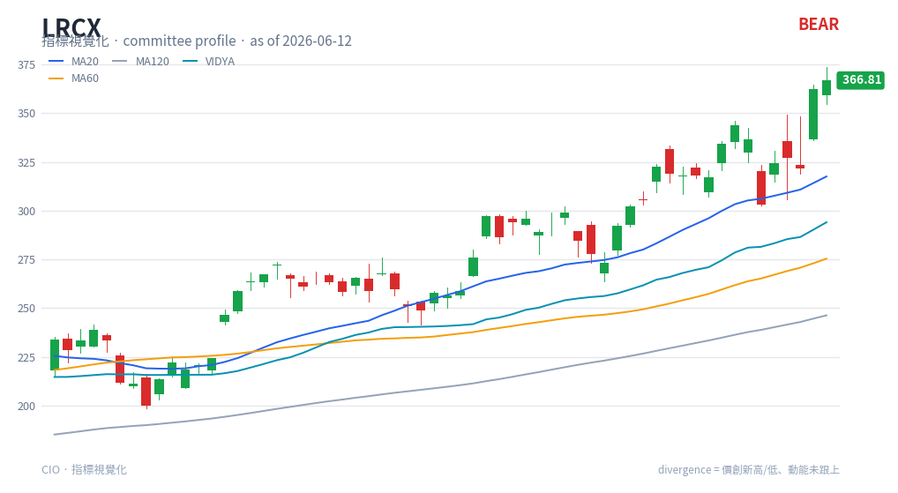

# VIDYA — chart reading

**Type**: price-panel overlay · **Engine key**: `vidya` · **Profile**: swing

## What it is

Variable Index Dynamic Average (Tushar Chande). A moving average whose smoothing
**adapts to volatility**: it speeds up (hugs price) when volatility/momentum is high
and slows down (flattens) when the market is quiet. It tracks trend turns faster than
a fixed-length EMA while avoiding chop-driven whipsaws.

## How this renderer draws it

A single line **on the price panel** (it is an overlay, not a sub-panel):

- **VIDYA line** — cyan (`#0891b2`), drawn alongside the MA20/60/120 overlays.

Computed with `df.ta.vidya()` (length 14).

## Render result

## How to read it

- **Price vs VIDYA** — price holding above a rising VIDYA confirms an up-trend; price
  below a falling VIDYA confirms a down-trend. A decisive cross of price through VIDYA
  is a trend-change cue.
- **Slope = adaptation** — a **steep** VIDYA means the average has sped up because
  volatility/trend is strong; a **flat** VIDYA means it has slowed in a quiet or
  maturing market. In the swing profile, a flat VIDYA reads as "trend mature but not
  accelerating".
- **Versus fixed MAs** — compare VIDYA against MA20/60: VIDYA turning before the
  fixed MAs is the adaptive early-warning; VIDYA flattening while price extends warns
  the move is running out of fuel.

## Reference

- TradingView — Variable Index Dynamic Average (VIDYA):
  <https://www.tradingview.com/script/hdrf0fXV-Variable-Index-Dynamic-Average-VIDYA/>
  (reference carried in `engine/strategies/docs/vidya.md`).
