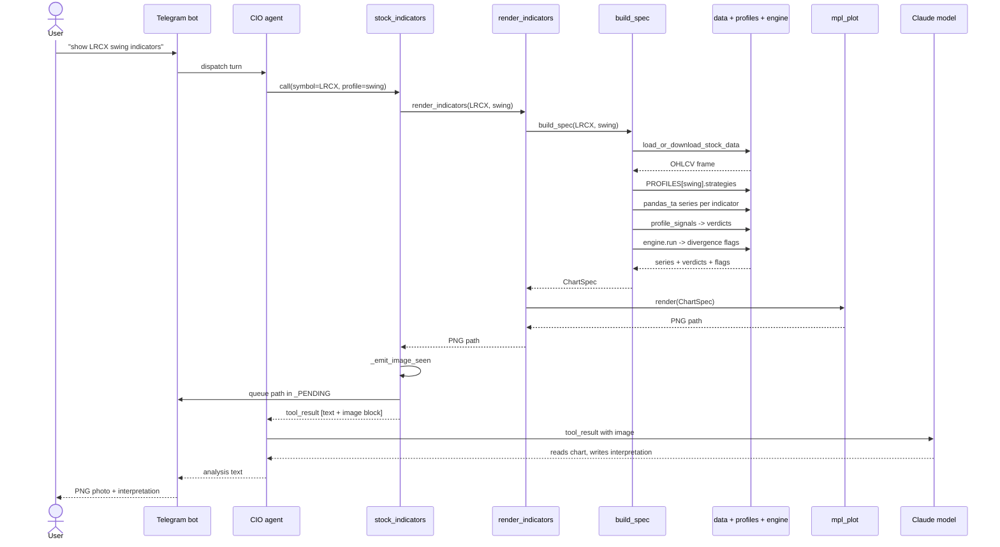
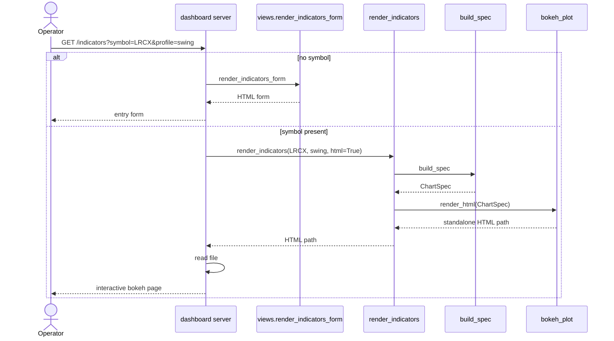
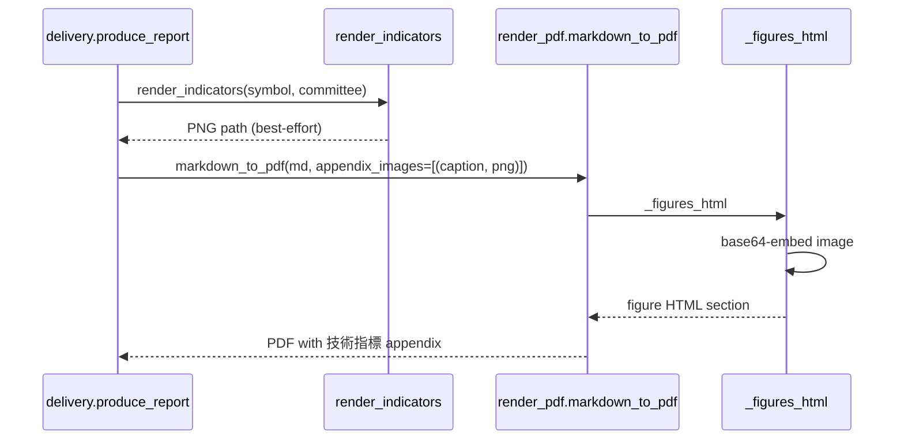

# Indicator Visualization — Sequence Diagram

Runtime interaction between participants for the two primary scenarios: the agent
tool rendering a PNG (and returning it to both the user and the model), and the
dashboard rendering interactive HTML.

## Scenario A — agent tool renders a PNG and the model sees it

This is the path fixed in `conv_turns#229-232`: before the fix the tool returned
only success text, so the model was blind to its own chart. Now it returns the
image to the model AND queues it for Telegram.

## Scenario B — dashboard renders interactive HTML

## Scenario C — committee PDF appendix

## Participant notes

- **build_spec** is the only component that talks to data/profiles/engine; the
  adapters are pure functions of `ChartSpec`.
- **`_emit_image_seen`** is what makes the model able to interpret its own output:
  the SDK forwards the MCP image block as a vision tool-result.
- **bokeh** is imported lazily; if absent, Scenario B's `render_html` raises a
  friendly `ImportError` while Scenario A (PNG) is unaffected.
